# OMS Core Architecture Specification

**Version:** 2.0
**Last Updated:** August 17, 2026
**Status:** Living document
**Author:** OMS Architecture Team

> **How to read this document.** Sections 1–14 describe the system **as built**. Section 15 describes
> the **target architecture** — capabilities that are designed but not implemented. Anything in
> section 15 is a plan, not a description; do not rely on it when reasoning about current behaviour.
>
> Where the two differ materially, sections 1–14 carry an explicit *Not yet implemented* note.

---

## Table of Contents

1. [Executive Summary](#1-executive-summary)
2. [System Overview](#2-system-overview)
3. [Architecture Principles](#3-architecture-principles)
4. [High-Level Architecture](#4-high-level-architecture)
5. [Core Components](#5-core-components)
6. [CQRS and Event Sourcing](#6-cqrs-and-event-sourcing)
7. [Domain Model](#7-domain-model)
8. [State Management](#8-state-management)
9. [Task Orchestration](#9-task-orchestration)
10. [Real-Time Streaming](#10-real-time-streaming)
11. [API Architecture](#11-api-architecture)
12. [Data Flow Patterns](#12-data-flow-patterns)
13. [Technology Stack](#13-technology-stack)
14. [Development Methodology](#14-development-methodology)
15. [Improvement Recommendations](#15-improvement-recommendations)

---

## 1. Executive Summary

The Order Management System (OMS) is a securities trading platform built using modern architectural patterns including **Event Sourcing**, **CQRS (Command Query Responsibility Segregation)**, and **Event-Driven Architecture**. The system is designed for high throughput, low latency, and horizontal scalability.

### Key Characteristics

- **Event-Driven**: Every state change is appended to an event log with a per-order sequence, and
  published to Kafka through a transactional outbox
- **CQRS**: Separate command and query APIs and models. *Not yet implemented:* a separate
  materialized read store — both sides currently read and write the same `orders` table
- **Spec-Driven**: OpenAPI and Avro schemas define all contracts
- **AI-Assisted Development**: GitHub Copilot and Claude integration via the MCP server
- **Reactive**: RSocket over WebSocket for real-time streaming — provided by
  **oms-streaming-service**, not by oms-core, which is a servlet application
- *Not yet implemented:* **Cloud-Native** Azure deployment. The repository ships Docker Compose only

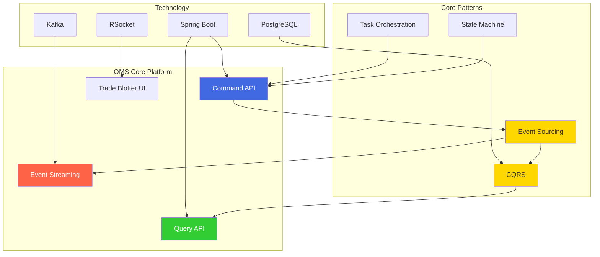
```mermaid
graph TB
    subgraph "OMS Core Platform"
        direction TB
        CMD[Command API]
        QRY[Query API]
        EVT[Event Streaming]
        UI[Trade Blotter UI]
    end
    
    subgraph "Core Patterns"
        ES[Event Sourcing]
        CQ[CQRS]
        SM[State Machine]
        TO[Task Orchestration]
    end
    
    subgraph "Technology"
        SB[Spring Boot]
        KF[Kafka]
        PG[PostgreSQL]
        RS[RSocket]
    end
    
    CMD --> ES
    ES --> CQ
    CQ --> QRY
    ES --> EVT
    SM --> CMD
    TO --> CMD
    
    SB --> CMD
    SB --> QRY
    KF --> EVT
    PG --> CQ
    RS --> UI
    
    style CMD fill:#4169E1,color:#FFF
    style QRY fill:#32CD32,color:#FFF
    style EVT fill:#FF6347,color:#FFF
    style ES fill:#FFD700
    style CQ fill:#FFD700
```

---

## 2. System Overview

### 2.1 Business Context

The OMS manages the complete lifecycle of securities trading orders across multiple asset classes:

- **Equity** orders
- **Exchange-traded derivatives**
- **Funds** (subscribe/redeem)
- **Structured products**
- **FX and Money Market**
- **Digital Assets**

### 2.2 Core Domain Objects

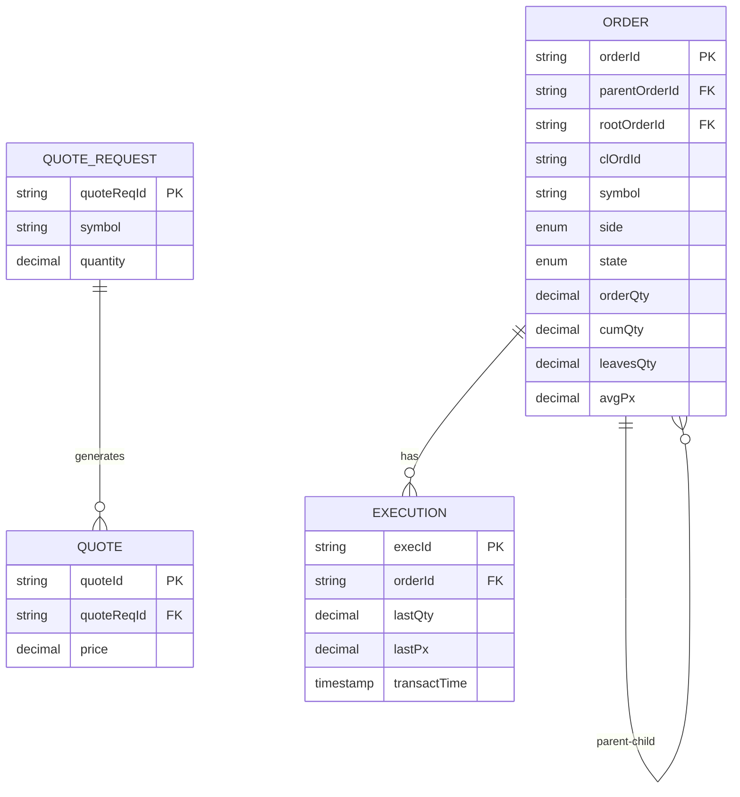
```mermaid
erDiagram
    ORDER ||--o{ EXECUTION : has
    ORDER ||--o{ ORDER : "parent-child"
    QUOTE_REQUEST ||--o{ QUOTE : generates
    ORDER {
        string orderId PK
        string parentOrderId FK
        string rootOrderId FK
        string clOrdId
        string symbol
        enum side
        enum state
        decimal orderQty
        decimal cumQty
        decimal leavesQty
        decimal avgPx
    }
    EXECUTION {
        string execId PK
        string orderId FK
        decimal lastQty
        decimal lastPx
        timestamp transactTime
    }
    QUOTE_REQUEST {
        string quoteReqId PK
        string symbol
        decimal quantity
    }
    QUOTE {
        string quoteId PK
        string quoteReqId FK
        decimal price
    }
```

---

## 3. Architecture Principles

### 3.1 Core Values

The OMS architecture follows these guiding principles from the team manifesto:

| Principle | Description |
|-----------|-------------|
| **Specification-Driven** | OpenAPI/Avro schemas are the source of truth |
| **Event Sourcing** | All state changes persisted as events |
| **CQRS** | Separate command and query models |
| **Test-Driven** | TDD/BDD for quality assurance |
| **Simplicity** | Clear, maintainable code |
| **Data-Driven** | Metrics inform decisions |

### 3.2 Design Principles

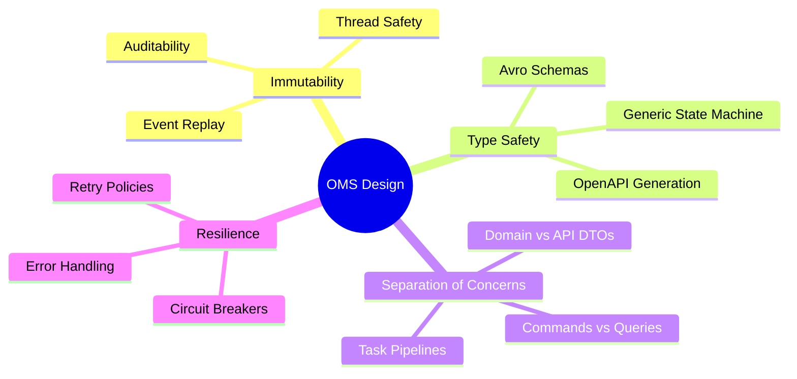
```mermaid
mindmap
  root((OMS Design))
    Immutability
      Thread Safety
      Auditability
      Event Replay
    Type Safety
      OpenAPI Generation
      Avro Schemas
      Generic State Machine
    Separation of Concerns
      Commands vs Queries
      Domain vs API DTOs
      Task Pipelines
    Resilience
      Circuit Breakers
      Retry Policies
      Error Handling
```

---

## 4. High-Level Architecture

### 4.1 System Architecture

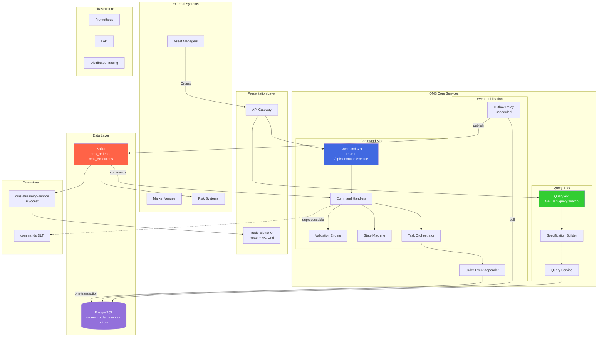
```mermaid
graph TB
    subgraph "External Systems"
        AM[Asset Managers]
        MKT[Market Venues]
        RISK[Risk Systems]
    end
    
    subgraph "Presentation Layer"
        TB[Trade Blotter UI<br/>React + AG Grid]
        API_GW[API Gateway]
    end
    
    subgraph "OMS Core Services"
        direction TB
        
        subgraph "Command Side"
            CMD_API[Command API<br/>POST /api/command/execute]
            CMD_HANDLER[Command Handlers]
            VALIDATOR[Validation Engine]
            SM[State Machine]
            ORCH[Task Orchestrator]
        end
        
        subgraph "Query Side"
            QRY_API[Query API<br/>GET /api/query/search]
            SPEC_BUILDER[Specification Builder]
            QRY_SVC[Query Service]
        end
        
        subgraph "Event Publication"
            APPENDER[Order Event Appender]
            RELAY[Outbox Relay<br/>scheduled]
        end
    end

    subgraph "Data Layer"
        direction LR
        DB[(PostgreSQL<br/>orders · order_events · outbox)]
        KAFKA[Kafka<br/>oms_orders · oms_executions]
    end

    subgraph "Downstream"
        STREAM[oms-streaming-service<br/>RSocket]
        DLT[commands.DLT]
    end

    subgraph "Infrastructure"
        PROM[Prometheus]
        LOKI[Loki]
        TRACE[Distributed Tracing]
    end

    AM -->|Orders| API_GW
    API_GW --> CMD_API
    API_GW --> QRY_API
    KAFKA -->|commands| CMD_HANDLER
    CMD_HANDLER -.->|unprocessable| DLT

    CMD_API --> CMD_HANDLER
    CMD_HANDLER --> VALIDATOR
    CMD_HANDLER --> SM
    CMD_HANDLER --> ORCH
    ORCH --> APPENDER

    APPENDER -->|one transaction| DB
    RELAY -->|poll| DB
    RELAY -->|publish| KAFKA

    QRY_API --> SPEC_BUILDER
    SPEC_BUILDER --> QRY_SVC
    QRY_SVC --> DB

    KAFKA --> STREAM
    STREAM --> TB
    KAFKA --> RISK
    
    style CMD_API fill:#4169E1,color:#FFF
    style QRY_API fill:#32CD32,color:#FFF
    style KAFKA fill:#FF6347,color:#FFF
    style DB fill:#9370DB,color:#FFF
```

### 4.2 Module Structure

```
oms/
├── oms-core/                 # Core OMS functionality
│   ├── src/main/java/
│   │   ├── org.example.common/    # Shared libraries
│   │   │   ├── model/             # Base entities
│   │   │   ├── orchestration/     # Task framework
│   │   │   ├── state/             # State machine
│   │   │   └── util/              # Utilities
│   │   └── org.example.oms/       # OMS application
│   │       ├── api/               # Controllers
│   │       ├── config/            # Configuration
│   │       ├── model/             # Domain entities
│   │       └── service/           # Business services
│   └── src/main/openapi/          # API specifications
│
├── oms-mcp-server/           # Model Context Protocol server
│   └── AI-assisted documentation & tools
│
├── oms-ui/                   # Trade Blotter UI
│   └── frontend/             # React application
│
└── oms-knowledge-base/       # Domain documentation
    ├── oms-concepts/         # Business concepts
    ├── oms-framework/        # Technical specs
    └── illustrations/        # Diagrams
```

---

## 5. Core Components

### 5.1 Component Overview

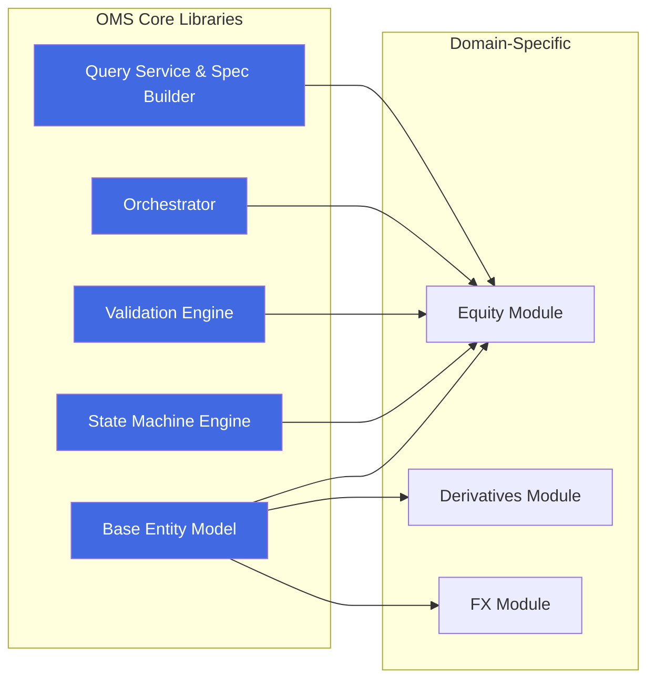
```mermaid
graph LR
    subgraph "OMS Core Libraries"
        BEM[Base Entity Model]
        SME[State Machine Engine]
        VE[Validation Engine]
        ORCH[Orchestrator]
        QSS[Query Service & Spec Builder]
    end
    
    subgraph "Domain-Specific"
        EQ[Equity Module]
        DER[Derivatives Module]
        FX[FX Module]
    end
    
    BEM --> EQ
    BEM --> DER
    BEM --> FX
    SME --> EQ
    VE --> EQ
    ORCH --> EQ
    QSS --> EQ
    
    style BEM fill:#4169E1,color:#FFF
    style SME fill:#4169E1,color:#FFF
    style VE fill:#4169E1,color:#FFF
    style ORCH fill:#4169E1,color:#FFF
    style QSS fill:#4169E1,color:#FFF
```

### 5.2 Component Responsibilities

| Component | Responsibility |
|-----------|---------------|
| **Base Entity Model** | Core domain objects: Order, Execution, Quote, QuoteRequest |
| **State Machine Engine** | Generic, type-safe state transition validation |
| **Validation Engine** | Predicate-based business rule enforcement |
| **Orchestrator** | Task pipeline execution and workflow management |
| **Query Service** | Specification-based dynamic queries |

---

## 6. CQRS and Event Sourcing

### 6.1 Write Path (Command Side)

Commands arrive at `POST /api/command/execute` or on the `commands` Kafka topic. Both routes converge
on the same processors.

The command transaction covers four writes — the order row, the event row, the outbox row, and (for
fills) the execution row. Kafka is deliberately *outside* that transaction: the command commits to
Postgres only, and `OutboxRelay` publishes afterwards. This is what avoids the dual-write problem,
and it means a command can never report success for an event that was never durably recorded.

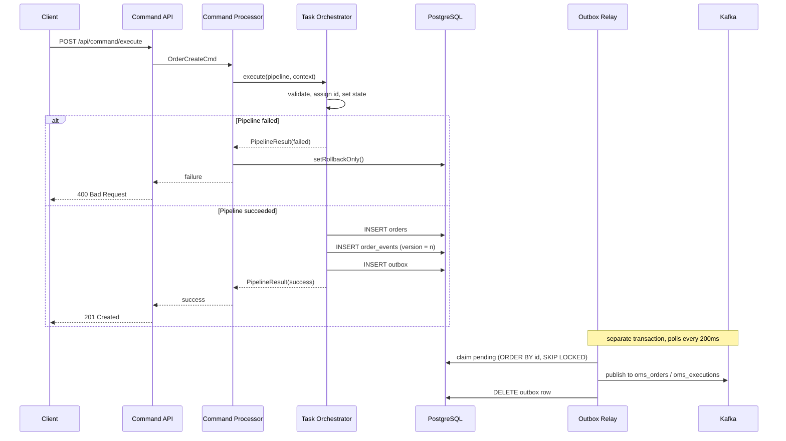
```mermaid
sequenceDiagram
    participant Client
    participant CmdAPI as Command API
    participant Proc as Command Processor
    participant Orch as Task Orchestrator
    participant DB as PostgreSQL
    participant Relay as Outbox Relay
    participant Kafka

    Client->>CmdAPI: POST /api/command/execute
    CmdAPI->>Proc: OrderCreateCmd
    Proc->>Orch: execute(pipeline, context)
    Orch->>Orch: validate, assign id, set state

    alt Pipeline failed
        Orch-->>Proc: PipelineResult(failed)
        Proc->>DB: setRollbackOnly()
        Proc-->>CmdAPI: failure
        CmdAPI-->>Client: 400 Bad Request
    else Pipeline succeeded
        Orch->>DB: INSERT orders
        Orch->>DB: INSERT order_events (version = n)
        Orch->>DB: INSERT outbox
        Orch-->>Proc: PipelineResult(success)
        Proc-->>CmdAPI: success
        CmdAPI-->>Client: 201 Created
    end

    Note over Relay,Kafka: separate transaction, polls every 200ms
    Relay->>DB: claim pending (ORDER BY id, SKIP LOCKED)
    Relay->>Kafka: publish to oms_orders / oms_executions
    Relay->>DB: DELETE outbox row
```

**Guarantees this path provides:**

| Guarantee | Mechanism |
| --- | --- |
| A rejected command leaves no trace | Processors call `setRollbackOnly()` on pipeline failure — the orchestrator reports failures as results, never exceptions, so the transaction would otherwise commit |
| An event is never published without being recorded | Outbox row is written in the command transaction |
| A recorded event is never lost before publication | `OutboxRelay` retries until the broker accepts; exhausted rows stay in the table and raise `oms.outbox.stuck` |
| An order's events arrive in order | Relay drains by primary key, which is commit order; messages are keyed by `orderId` |
| A duplicate command is not applied twice | Unique on `(session_id, cl_ord_id)` for orders, `(order_id, execid)` for executions |
| Concurrent updates cannot silently overwrite | `Order.txNr` is the JPA `@Version` column |

### 6.2 Read Path (Query Side)

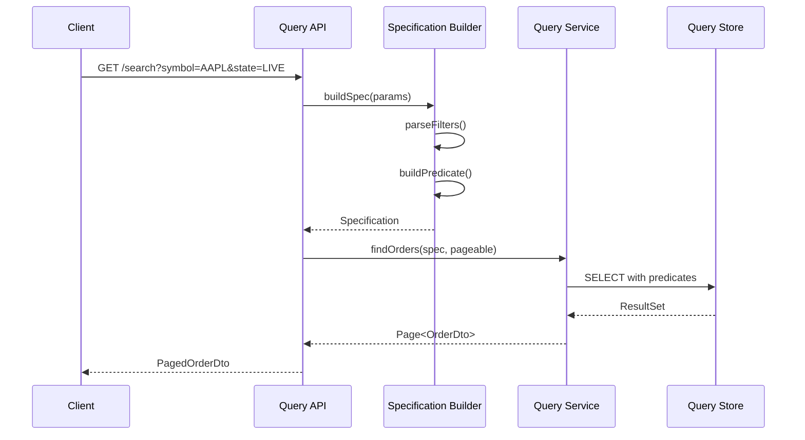
```mermaid
sequenceDiagram
    participant Client
    participant QryAPI as Query API
    participant SpecBuilder as Specification Builder
    participant QrySvc as Query Service
    participant ReadDB as Query Store
    
    Client->>QryAPI: GET /search?symbol=AAPL&state=LIVE
    QryAPI->>SpecBuilder: buildSpec(params)
    SpecBuilder->>SpecBuilder: parseFilters()
    SpecBuilder->>SpecBuilder: buildPredicate()
    SpecBuilder-->>QryAPI: Specification
    QryAPI->>QrySvc: findOrders(spec, pageable)
    QrySvc->>ReadDB: SELECT with predicates
    ReadDB-->>QrySvc: ResultSet
    QrySvc-->>QryAPI: Page<OrderDto>
    QryAPI-->>Client: PagedOrderDto
```

### 6.3 The Event Log

`order_events` is append-only. Each row carries:

| Column | Purpose |
| --- | --- |
| `order_id` + `version` | Per-order sequence starting at 1, unique together |
| `event` | `NEW_ORDER`, `ACK`, `PARTIAL_FILL`, `FILL`, `CXL`, `REJ` |
| `transaction` | The command that caused the change |
| `resulting_state` | The state the order was left in |
| `order_snapshot` | The order as it stood immediately after the event |

The unique constraint on `(order_id, version)` is load-bearing: it orders the stream, and it rejects
the loser when two writers race to append the same version, rolling that command back for retry.

Reconstruction reads the snapshot rather than folding deltas, because orders are small and every
event already records the state it produced:

```java
Order atVersion3 = orderReplayService.replayAt(orderId, 3).orElseThrow();
Order latest     = orderReplayService.replay(orderId).orElseThrow();
boolean intact   = orderReplayService.isContiguous(orderId);
```

Comparing `replay(orderId)` against the live `orders` row is the cheapest check that no path mutated
an order without recording it; `EventSourcingIntegrationTest` asserts exactly this.

### 6.4 Read Path (Query Side)

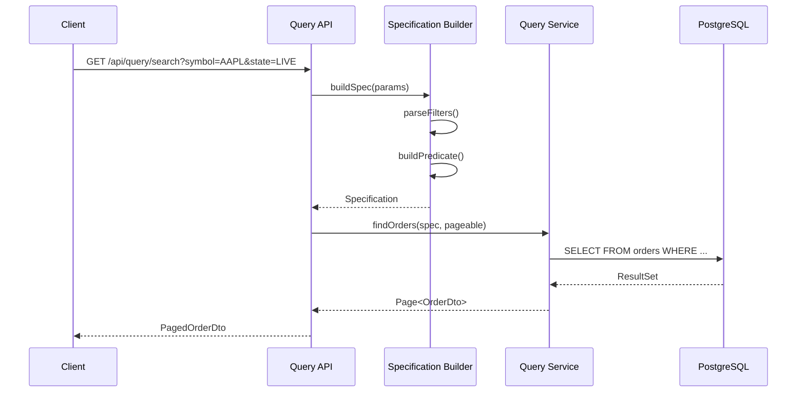
```mermaid
sequenceDiagram
    participant Client
    participant QryAPI as Query API
    participant SpecBuilder as Specification Builder
    participant QrySvc as Query Service
    participant DB as PostgreSQL

    Client->>QryAPI: GET /api/query/search?symbol=AAPL&state=LIVE
    QryAPI->>SpecBuilder: buildSpec(params)
    SpecBuilder->>SpecBuilder: parseFilters()
    SpecBuilder->>SpecBuilder: buildPredicate()
    SpecBuilder-->>QryAPI: Specification
    QryAPI->>QrySvc: findOrders(spec, pageable)
    QrySvc->>DB: SELECT FROM orders WHERE ...
    DB-->>QrySvc: ResultSet
    QrySvc-->>QryAPI: Page<OrderDto>
    QryAPI-->>Client: PagedOrderDto
```

> **Not yet implemented.** The query side reads the same `orders` table the command side writes.
> There is no projector service and no separate read store, so "CQRS" here means separated APIs and
> models, not separated storage. Reads are consistent with writes by construction, at the cost of the
> independent scaling a materialized read model would allow. See section 15 for the target design.

---

## 7. Domain Model

### 7.1 Order Hierarchy

The OMS supports hierarchical order trees to represent parent-child relationships:

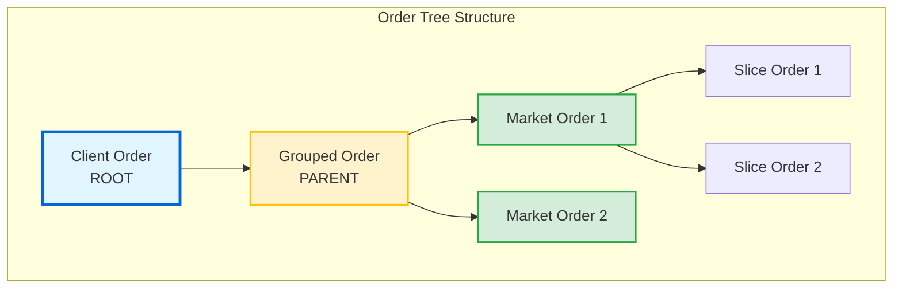
```mermaid
graph TB
    subgraph "Order Tree Structure"
        CO[Client Order<br/>ROOT]
        GO[Grouped Order<br/>PARENT]
        MO1[Market Order 1]
        MO2[Market Order 2]
        SL1[Slice Order 1]
        SL2[Slice Order 2]
    end
    
    CO --> GO
    GO --> MO1
    GO --> MO2
    MO1 --> SL1
    MO1 --> SL2
    
    style CO fill:#e1f5ff,stroke:#0366d6,stroke-width:3px
    style GO fill:#fff3cd,stroke:#ffc107,stroke-width:2px
    style MO1 fill:#d4edda,stroke:#28a745,stroke-width:2px
    style MO2 fill:#d4edda,stroke:#28a745,stroke-width:2px
```

### 7.2 Order Entity Fields

```java
Order {
    // Identity
    Long id;               // Database primary key
    String orderId;        // Business identifier
    String parentOrderId;  // Parent in hierarchy
    String rootOrderId;    // Root of order tree
    String sessionId;      // Trading session
    String clOrdId;        // Client order ID (FIX Tag 11)

    // Concurrency and sequencing
    long txNr;             // @Version. Optimistic lock, and the per-order
                           // sequence published to Kafka as eventId

    // Core Attributes
    String symbol;
    Side side;             // BUY, SELL, SELL_SHORT
    OrdType ordType;       // MARKET, LIMIT, STOP, STOP_LIMIT, MARKET_ON_CLOSE
    BigDecimal price;
    BigDecimal orderQty;

    // Execution Tracking
    BigDecimal cumQty;     // Cumulative executed
    BigDecimal leavesQty;  // Remaining open
    BigDecimal placeQty;   // Placed in market
    BigDecimal allocQty;   // Allocated to client

    // State — persisted by name, never by ordinal
    @Enumerated(EnumType.STRING) State state;
    @Enumerated(EnumType.STRING) CancelState cancelState;
}
```

Two details that are easy to get wrong and expensive to fix afterwards:

- **`state` and `cancelState` must stay `@Enumerated(EnumType.STRING)`.** They were persisted as
  ordinals until changeset `007`. With ordinal persistence, inserting a value anywhere but the end of
  the `State` enum silently relabels every stored order, and `ddl-auto: validate` cannot detect it.
- **`txNr` is the `@Version` column.** Hibernate increments it at flush, so its value is stale while
  a command is still executing. Anything that needs the sequence *during* the transaction — the
  outbox message, the published `eventId` — takes it from the event-log version instead.

*Not yet implemented:* `avgPx` on the order, and the grouping fields (`groupOrderId`,
`isGroupedOrder`, `memberCount`) described in earlier drafts of this document. Average price is
currently carried on `Execution` only.

### 7.3 Quantity Calculation Flow

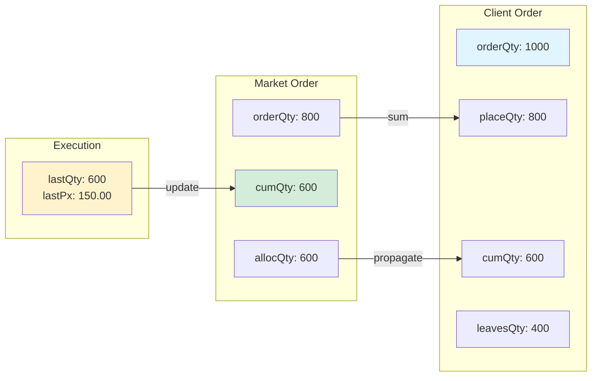
```mermaid
graph LR
    subgraph "Client Order"
        CO_OQ[orderQty: 1000]
        CO_PQ[placeQty: 800]
        CO_CQ[cumQty: 600]
        CO_LQ[leavesQty: 400]
    end
    
    subgraph "Market Order"
        MO_OQ[orderQty: 800]
        MO_CQ[cumQty: 600]
        MO_AQ[allocQty: 600]
    end
    
    subgraph "Execution"
        EX[lastQty: 600<br/>lastPx: 150.00]
    end
    
    EX -->|update| MO_CQ
    MO_AQ -->|propagate| CO_CQ
    MO_OQ -->|sum| CO_PQ
    
    style CO_OQ fill:#e1f5ff
    style MO_CQ fill:#d4edda
    style EX fill:#fff3cd
```

---

## 8. State Management

### 8.1 Order State Machine

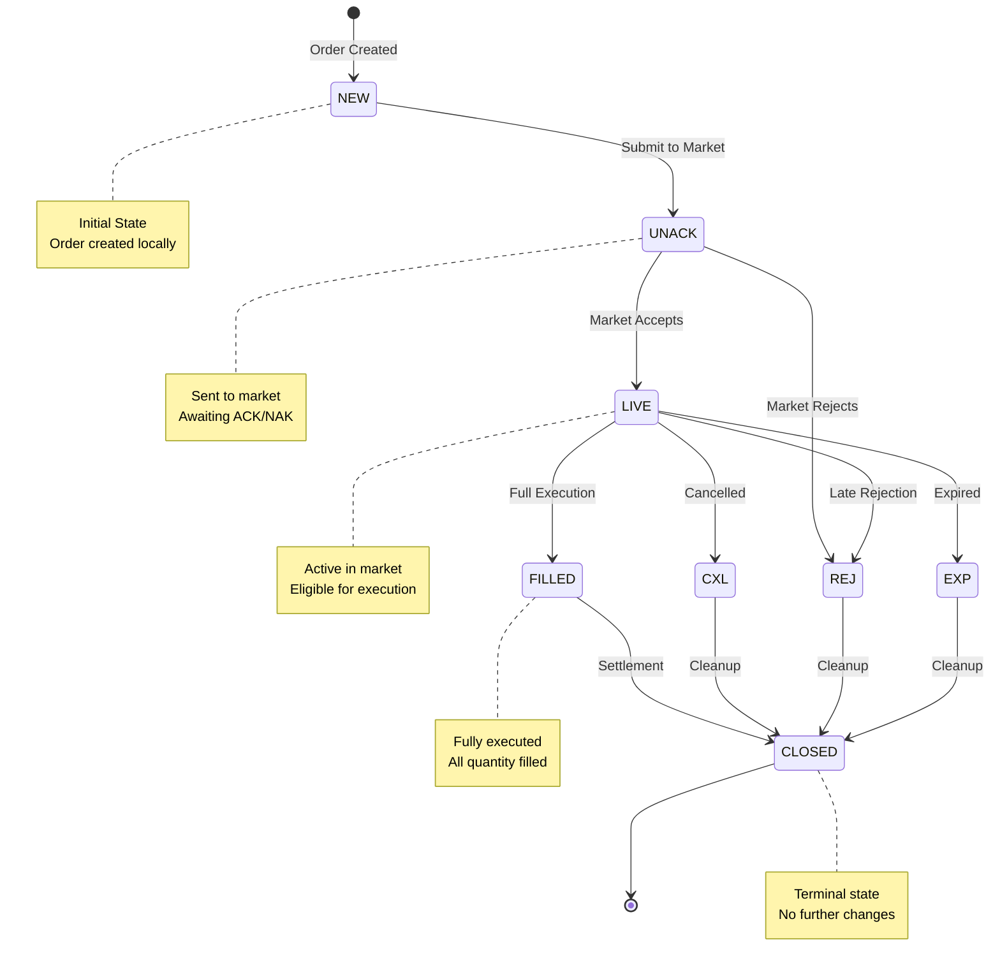
```mermaid
stateDiagram-v2
    [*] --> NEW: Order Created
    
    NEW --> UNACK: Submit to Market
    UNACK --> LIVE: Market Accepts
    UNACK --> REJ: Market Rejects
    
    LIVE --> FILLED: Full Execution
    LIVE --> CXL: Cancelled
    LIVE --> REJ: Late Rejection
    LIVE --> EXP: Expired
    
    FILLED --> CLOSED: Settlement
    CXL --> CLOSED: Cleanup
    REJ --> CLOSED: Cleanup
    EXP --> CLOSED: Cleanup
    
    CLOSED --> [*]
    
    note right of NEW
        Initial State
        Order created locally
    end note
    
    note right of UNACK
        Sent to market
        Awaiting ACK/NAK
    end note
    
    note right of LIVE
        Active in market
        Eligible for execution
    end note
    
    note right of FILLED
        Fully executed
        All quantity filled
    end note
    
    note right of CLOSED
        Terminal state
        No further changes
    end note
```

### 8.2 State Machine Implementation

The framework provides a generic, type-safe state machine:

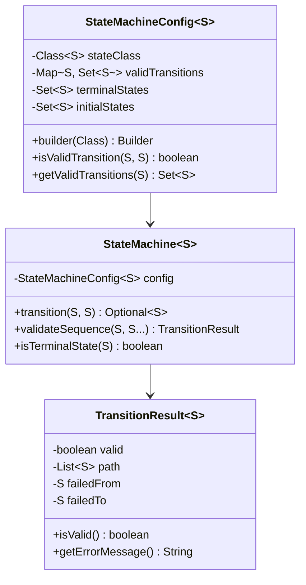
```mermaid
classDiagram
    class StateMachineConfig~S~ {
        -Class~S~ stateClass
        -Map~S, Set~S~~ validTransitions
        -Set~S~ terminalStates
        -Set~S~ initialStates
        +builder(Class) Builder
        +isValidTransition(S, S) boolean
        +getValidTransitions(S) Set~S~
    }
    
    class StateMachine~S~ {
        -StateMachineConfig~S~ config
        +transition(S, S) Optional~S~
        +validateSequence(S, S...) TransitionResult
        +isTerminalState(S) boolean
    }
    
    class TransitionResult~S~ {
        -boolean valid
        -List~S~ path
        -S failedFrom
        -S failedTo
        +isValid() boolean
        +getErrorMessage() String
    }
    
    StateMachineConfig --> StateMachine
    StateMachine --> TransitionResult
```

### 8.3 State Transition Matrix

| From State | → NEW | → UNACK | → LIVE | → FILLED | → CXL | → REJ | → CLOSED | → EXP |
|------------|-------|---------|--------|----------|-------|-------|----------|-------|
| **NEW**    | -     | ✓       | -      | -        | -     | -     | -        | -     |
| **UNACK**  | -     | -       | ✓      | -        | -     | ✓     | -        | -     |
| **LIVE**   | -     | -       | -      | ✓        | ✓     | ✓     | -        | ✓     |
| **FILLED** | -     | -       | -      | -        | -     | -     | ✓        | -     |
| **CXL**    | -     | -       | -      | -        | -     | -     | ✓        | -     |
| **REJ**    | -     | -       | -      | -        | -     | -     | ✓        | -     |
| **CLOSED** | -     | -       | -      | -        | -     | -     | -        | -     |
| **EXP**    | -     | -       | -      | -        | -     | -     | -        | -     |

---

## 9. Task Orchestration

### 9.1 Task Pipeline Architecture

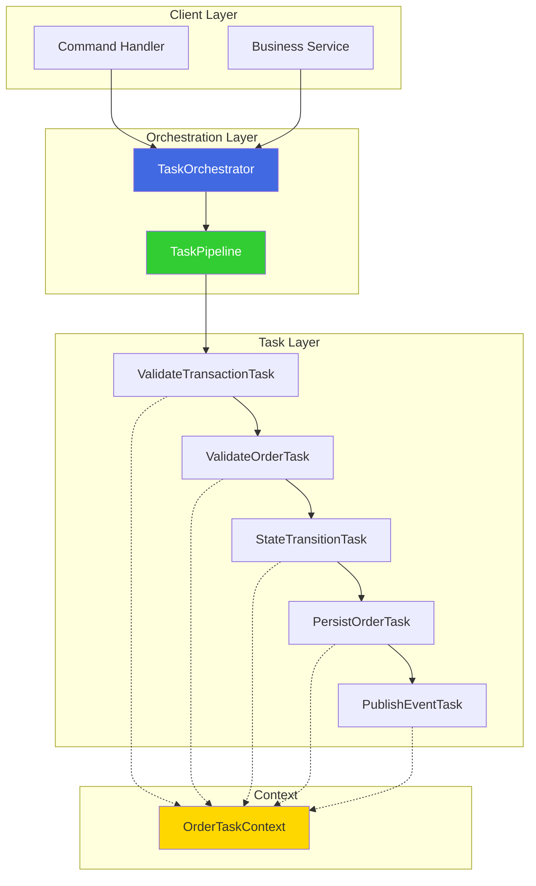
```mermaid
graph TB
    subgraph "Client Layer"
        CMD[Command Handler]
        SVC[Business Service]
    end
    
    subgraph "Orchestration Layer"
        ORCH[TaskOrchestrator]
        PIPE[TaskPipeline]
    end
    
    subgraph "Task Layer"
        T1[ValidateTransactionTask]
        T2[ValidateOrderTask]
        T3[StateTransitionTask]
        T4[PersistOrderTask]
        T5[PublishEventTask]
    end
    
    subgraph "Context"
        CTX[OrderTaskContext]
    end
    
    CMD --> ORCH
    SVC --> ORCH
    ORCH --> PIPE
    PIPE --> T1
    T1 --> T2
    T2 --> T3
    T3 --> T4
    T4 --> T5
    T1 -.-> CTX
    T2 -.-> CTX
    T3 -.-> CTX
    T4 -.-> CTX
    T5 -.-> CTX
    
    style ORCH fill:#4169E1,color:#FFF
    style PIPE fill:#32CD32,color:#FFF
    style CTX fill:#FFD700
```

### 9.2 Task Execution Flow

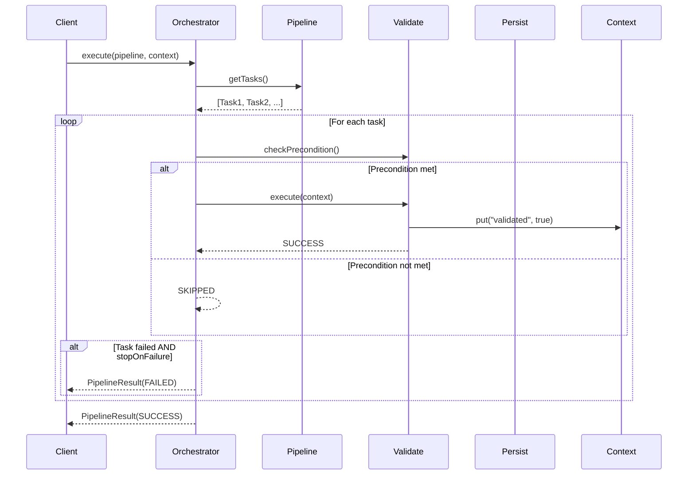
```mermaid
sequenceDiagram
    participant Client
    participant Orchestrator
    participant Pipeline
    participant Task1 as Validate
    participant Task2 as Persist
    participant Context
    
    Client->>Orchestrator: execute(pipeline, context)
    Orchestrator->>Pipeline: getTasks()
    Pipeline-->>Orchestrator: [Task1, Task2, ...]
    
    loop For each task
        Orchestrator->>Task1: checkPrecondition()
        alt Precondition met
            Orchestrator->>Task1: execute(context)
            Task1->>Context: put("validated", true)
            Task1-->>Orchestrator: SUCCESS
        else Precondition not met
            Orchestrator-->>Orchestrator: SKIPPED
        end
        
        alt Task failed AND stopOnFailure
            Orchestrator-->>Client: PipelineResult(FAILED)
        end
    end
    
    Orchestrator-->>Client: PipelineResult(SUCCESS)
```

### 9.3 OMS Order Processing Pipeline

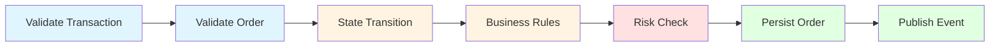
```mermaid
graph LR
    A[Validate Transaction] --> B[Validate Order]
    B --> C[State Transition]
    C --> D[Business Rules]
    D --> E[Risk Check]
    E --> F[Persist Order]
    F --> G[Publish Event]
    
    style A fill:#e1f5ff
    style B fill:#e1f5ff
    style C fill:#fff4e1
    style D fill:#fff4e1
    style E fill:#ffe1e1
    style F fill:#e1ffe1
    style G fill:#e1ffe1
```

---

## 10. Real-Time Streaming

> Everything in this section is implemented by **oms-streaming-service**, a separate module. oms-core
> is a servlet application with no RSocket or WebFlux dependency; its only part in this flow is
> publishing to `oms_orders` and `oms_executions`, and serving the initial snapshot over the Query
> API.

### 10.1 Trade Blotter Architecture

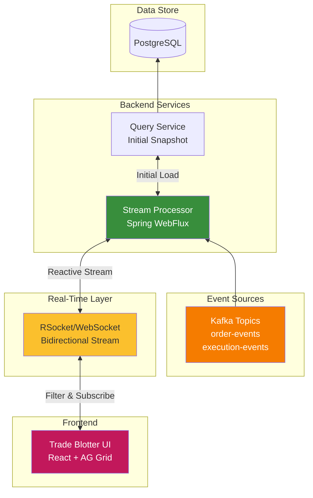
```mermaid
graph BT
    subgraph "Frontend"
        TB[Trade Blotter UI<br/>React + AG Grid]
    end
    
    subgraph "Real-Time Layer"
        RS[RSocket/WebSocket<br/>Bidirectional Stream]
    end
    
    subgraph "Backend Services"
        SP[Stream Processor<br/>Spring WebFlux]
        QS[Query Service<br/>Initial Snapshot]
    end
    
    subgraph "Event Sources"
        KAFKA[Kafka Topics<br/>order-events<br/>execution-events]
    end
    
    subgraph "Data Store"
        DB[(PostgreSQL)]
    end
    
    TB <-->|Filter & Subscribe| RS
    RS <-->|Reactive Stream| SP
    SP <-->|Initial Load| QS
    QS --> DB
    KAFKA --> SP
    
    style TB fill:#c2185b,color:#FFF
    style RS fill:#fbc02d
    style SP fill:#388e3c,color:#FFF
    style KAFKA fill:#f57c00,color:#FFF
```

### 10.2 Streaming Data Flow

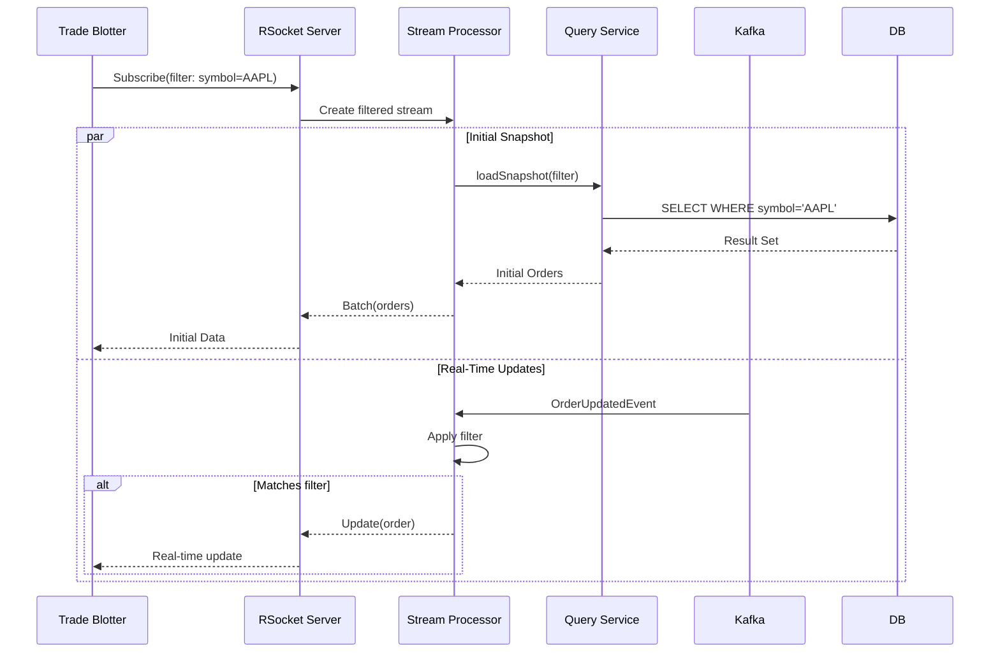
```mermaid
sequenceDiagram
    participant UI as Trade Blotter
    participant WS as RSocket Server
    participant SP as Stream Processor
    participant QS as Query Service
    participant Kafka
    participant DB
    
    UI->>WS: Subscribe(filter: symbol=AAPL)
    WS->>SP: Create filtered stream
    
    par Initial Snapshot
        SP->>QS: loadSnapshot(filter)
        QS->>DB: SELECT WHERE symbol='AAPL'
        DB-->>QS: Result Set
        QS-->>SP: Initial Orders
        SP-->>WS: Batch(orders)
        WS-->>UI: Initial Data
    and Real-Time Updates
        Kafka->>SP: OrderUpdatedEvent
        SP->>SP: Apply filter
        alt Matches filter
            SP-->>WS: Update(order)
            WS-->>UI: Real-time update
        end
    end
```

---

## 11. API Architecture

### 11.1 OpenAPI Specification Structure

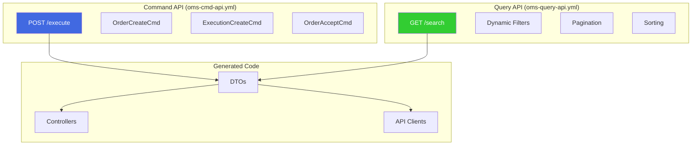
```mermaid
graph TD
    subgraph "Command API (oms-cmd-api.yml)"
        C1[POST /execute]
        C2[OrderCreateCmd]
        C3[ExecutionCreateCmd]
        C4[OrderAcceptCmd]
    end
    
    subgraph "Query API (oms-query-api.yml)"
        Q1[GET /search]
        Q2[Dynamic Filters]
        Q3[Pagination]
        Q4[Sorting]
    end
    
    subgraph "Generated Code"
        DTO[DTOs]
        CTRL[Controllers]
        CLIENT[API Clients]
    end
    
    C1 --> DTO
    Q1 --> DTO
    DTO --> CTRL
    DTO --> CLIENT
    
    style C1 fill:#4169E1,color:#FFF
    style Q1 fill:#32CD32,color:#FFF
```

### 11.2 Command Types

| Command | Description | Payload | Event recorded |
| --- | --- | --- | --- |
| `OrderCreateCmd` | Create new order | Order object | `NEW_ORDER` |
| `OrderAcceptCmd` | Accept/acknowledge order | orderId | `ACK` |
| `ExecutionCreateCmd` | Report execution | Execution object | `PARTIAL_FILL` or `FILL` |

All three are declared in `src/main/openapi/oms-cmd-api.yml` and dispatched by both
`CommandController` and `CommandListener`. An unrecognised command type is rejected rather than
ignored, so it reaches `commands.DLT` instead of being silently dropped.

*Not yet implemented:* `ExecutionWhackCmd` and `ExecutionBustCmd` (cancel and reverse an execution),
and the `CXL` / `REJ` events — the `Event` enum declares them but no command produces them yet.

### 11.3 Query Filters

| Filter Type | Syntax | Example |
|-------------|--------|---------|
| Equality | `field=value` | `symbol=AAPL` |
| Like | `field__like=text` | `symbol__like=AA` |
| Greater Than | `field__gt=value` | `price__gt=100` |
| Between | `field__between=a,b` | `price__between=100,200` |

---

## 12. Data Flow Patterns

### 12.1 Order Lifecycle

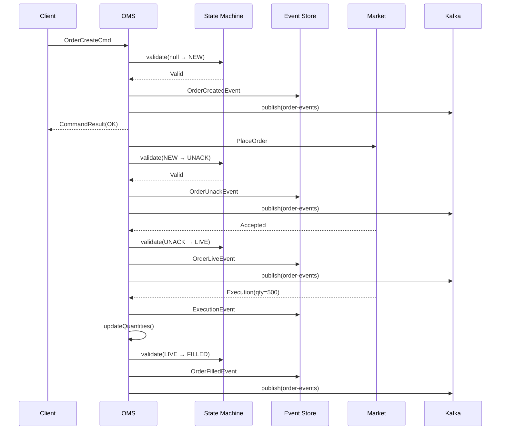
```mermaid
sequenceDiagram
    participant Client
    participant OMS
    participant SM as State Machine
    participant Store as Event Store
    participant Market
    participant Kafka
    
    Client->>OMS: OrderCreateCmd
    OMS->>SM: validate(null → NEW)
    SM-->>OMS: Valid
    OMS->>Store: OrderCreatedEvent
    OMS->>Kafka: publish(order-events)
    OMS-->>Client: CommandResult(OK)
    
    OMS->>Market: PlaceOrder
    OMS->>SM: validate(NEW → UNACK)
    SM-->>OMS: Valid
    OMS->>Store: OrderUnackEvent
    OMS->>Kafka: publish(order-events)
    
    Market-->>OMS: Accepted
    OMS->>SM: validate(UNACK → LIVE)
    OMS->>Store: OrderLiveEvent
    OMS->>Kafka: publish(order-events)
    
    Market-->>OMS: Execution(qty=500)
    OMS->>Store: ExecutionEvent
    OMS->>OMS: updateQuantities()
    OMS->>SM: validate(LIVE → FILLED)
    OMS->>Store: OrderFilledEvent
    OMS->>Kafka: publish(order-events)
```

### 12.2 Execution Allocation Flow

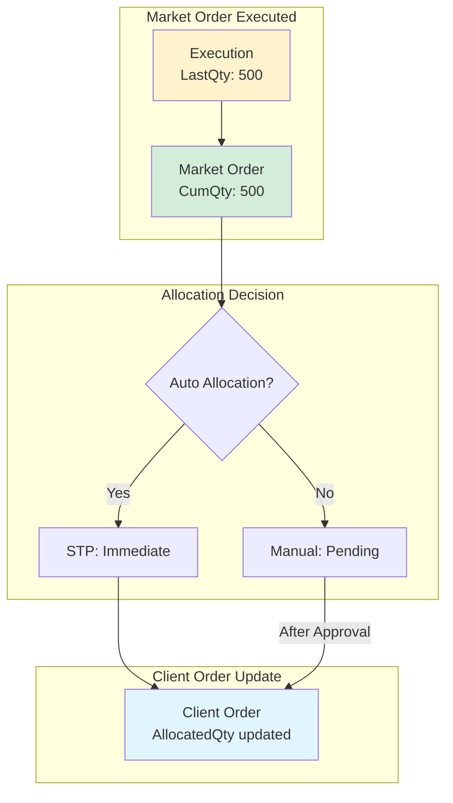
```mermaid
graph TD
    subgraph "Market Order Executed"
        MKT[Market Order<br/>CumQty: 500]
        EX[Execution<br/>LastQty: 500]
    end
    
    subgraph "Allocation Decision"
        AUTO{Auto Allocation?}
        STP[STP: Immediate]
        MAN[Manual: Pending]
    end
    
    subgraph "Client Order Update"
        CLI[Client Order<br/>AllocatedQty updated]
    end
    
    EX --> MKT
    MKT --> AUTO
    AUTO -->|Yes| STP
    AUTO -->|No| MAN
    STP --> CLI
    MAN -->|After Approval| CLI
    
    style MKT fill:#d4edda
    style EX fill:#fff3cd
    style CLI fill:#e1f5ff
```

---

## 13. Technology Stack

### 13.1 Core Technologies

```mermaid
graph TD
    subgraph "Application Layer"
        JAVA[Java 25]
        SB[Spring Boot 4.1]
        WF[Spring WebFlux]
        DATA[Spring Data JPA]
    end
    
    subgraph "Messaging"
        KAFKA[Confluent Kafka]
        AVRO[Avro Schemas]
        SR[Schema Registry]
    end
    
    subgraph "Data Storage"
        PG[PostgreSQL<br/>Azure Database]
        EVT_TBL[Event Tables]
        STATE_TBL[State Tables]
    end
    
    subgraph "Real-Time"
        RSOCKET[RSocket]
        WS[WebSocket]
        REACTOR[Project Reactor]
    end
    
    subgraph "Observability"
        PROM[Prometheus]
        LOKI[Loki]
        GRAFANA[Grafana]
        TRACE[OpenTelemetry]
    end
    
    subgraph "Build & Deploy"
        GRADLE[Gradle]
        DOCKER[Docker]
        AZURE[Azure Cloud]
    end
    
    JAVA --> SB
    SB --> WF
    SB --> DATA
    WF --> RSOCKET
    RSOCKET --> WS
    WF --> REACTOR
    DATA --> PG
    
    style JAVA fill:#007396,color:#FFF
    style KAFKA fill:#231F20,color:#FFF
    style PG fill:#336791,color:#FFF
```

### 13.2 Technology Matrix

| Layer | Technology | Purpose |
| --- | --- | --- |
| **Language** | Java 25 (Gradle toolchain) | Core development |
| **Framework** | Spring Boot 4.1.0, Spring Cloud 2025.0.3 | Application framework |
| **Web** | Spring MVC (servlet) | oms-core is not reactive |
| **Reactive** | Spring WebFlux, Reactor | oms-streaming-service only |
| **Database** | PostgreSQL | State, event log, outbox |
| **Migrations** | Liquibase (`ddl-auto: validate`) | Schema management |
| **Messaging** | Confluent Kafka | Event streaming |
| **Serialization** | Avro + Schema Registry, Jackson 3 | Event & API payloads |
| **Real-Time** | RSocket over WebSocket | UI streaming, via oms-streaming-service |
| **API Spec** | OpenAPI 3.0 | Contract definition |
| **Mapping** | MapStruct, hand-written Avro mappers | DTO transformation |
| **Testing** | JUnit 5, Mockito, Testcontainers | Testing framework |

---

## 14. Development Methodology

### 14.1 Spec-Driven Development

```mermaid
flowchart LR
    subgraph "Specification Phase"
        SPEC[OpenAPI YAML]
        AVRO_S[Avro Schema]
    end
    
    subgraph "Code Generation"
        GEN[Gradle openApiGenerate]
        DTO_G[Generated DTOs]
        CTRL_G[Generated Controllers]
    end
    
    subgraph "Implementation"
        IMPL[Business Logic]
        TEST[Tests]
    end
    
    subgraph "AI Assistance"
        COPILOT[GitHub Copilot]
        MCP[MCP Server]
        KB[Knowledge Base]
    end
    
    SPEC --> GEN
    AVRO_S --> GEN
    GEN --> DTO_G
    GEN --> CTRL_G
    DTO_G --> IMPL
    CTRL_G --> IMPL
    IMPL --> TEST
    
    KB --> COPILOT
    MCP --> COPILOT
    COPILOT --> IMPL
    COPILOT --> TEST
    
    style SPEC fill:#FFD700
    style COPILOT fill:#24292E,color:#FFF
```

### 14.2 AI-Assisted Workflow

The OMS leverages GitHub Copilot with a specialized MCP (Model Context Protocol) server that provides:

- **Domain Documentation**: Semantic search across OMS specifications
- **Order Query Tools**: Direct access to order data
- **Code Generation**: Context-aware code suggestions
- **Knowledge Base**: Indexed specifications and patterns

### 14.3 Development Commands

```powershell
# Full build
.\gradlew.bat clean build

# Fast build (skip tests)
.\gradlew.bat bootJar -x test

# Run MCP server
.\run-mcp.ps1

# Development mode
.\gradlew.bat bootRun --args='--spring.main.web-application-type=servlet --server.port=8091'
```

---

## 15. Improvement Recommendations

### 15.1 Architecture Improvements

```mermaid
graph TD
    subgraph "Current State"
        C1[Sequential task pipeline]
        C2[Single database, shared read/write]
        C3[Retry + DLT, no replay tooling]
        C4[Manual scaling]
    end

    subgraph "Recommended Improvements"
        R1[Parallel independent tasks]
        R2[Materialized read store + replicas]
        R3[Circuit breaker + replay tooling]
        R4[Auto-scaling with metrics]
    end
    
    C1 -->|Upgrade| R1
    C2 -->|Upgrade| R2
    C3 -->|Upgrade| R3
    C4 -->|Upgrade| R4
    
    style R1 fill:#32CD32,color:#FFF
    style R2 fill:#32CD32,color:#FFF
    style R3 fill:#32CD32,color:#FFF
    style R4 fill:#32CD32,color:#FFF
```

### 15.2 Detailed Recommendations

#### 1. **Parallel Task Execution**
- **Current**: Sequential task pipeline execution
- **Recommendation**: Implement parallel execution for independent tasks
- **Benefit**: Reduced latency for multi-step workflows

```java
// Future: Parallel task execution
TaskPipeline.builder("OrderProcess")
    .addParallelTasks(validateTask, enrichTask, riskTask)
    .addTask(persistTask)
    .build();
```

#### 2. **Event Store Optimization**
- **Current**: PostgreSQL as event store
- **Recommendation**: Consider specialized event store (EventStoreDB) or Kafka as primary store
- **Benefit**: Better append-only performance, native streaming support

#### 3. **Saga Pattern for Long Transactions**
- **Current**: Synchronous command handling
- **Recommendation**: Implement Saga orchestration for multi-step processes
- **Benefit**: Better failure handling, compensation logic

```mermaid
graph LR
    A[Create Order] --> B[Validate]
    B --> C[Place in Market]
    C --> D[Confirm]
    
    B -->|Fail| B_C[Cancel Order]
    C -->|Fail| C_C[Retry/Cancel]
    
    style B_C fill:#FF6347,color:#FFF
    style C_C fill:#FF6347,color:#FFF
```

#### 4. **Enhanced Observability**
- **Current**: Micrometer metrics, OpenTelemetry tracing, `oms.outbox.pending` and
  `oms.outbox.stuck` gauges
- **Recommendation**:
  - Business metrics dashboards (fill rates, state-transition latency, rejection reasons)
  - Alerting on `oms.outbox.stuck > 0` — a stuck outbox means downstream is diverging silently
  - Anomaly detection

#### 5. **API Gateway & Rate Limiting**
- **Current**: Direct API access
- **Recommendation**: API Gateway with rate limiting, caching, and circuit breaking
- **Benefit**: Better resilience, security, and performance

#### 6. **Event Schema Evolution**
- **Current**: Avro schemas
- **Recommendation**: Implement schema registry with compatibility checks
- **Benefit**: Safe schema evolution without breaking consumers

#### 7. **Delta-Based Event Log**
- **Current**: Every event stores a full snapshot of the resulting order, so replay is a single
  lookup rather than a fold
- **Recommendation**: If order size or event volume grows enough for snapshot-per-event to become
  costly, switch to storing deltas with periodic snapshots
- **Benefit**: Smaller event log; the trade-off is that replay becomes a fold and gains a failure
  mode the current design does not have

#### 8. **Caching Layer**
- **Current**: Direct database queries
- **Recommendation**: Redis or another cache for frequently accessed data (ReadySet was evaluated and removed — it only passes dynamic JPA queries through without caching them)
- **Benefit**: Reduced latency, database load offloading

#### 9. **Dead-Letter Replay Tooling**
- **Current**: Failed commands retry with exponential backoff and then land on `commands.DLT`;
  outbox messages that exhaust their retry budget stay in the `outbox` table
- **Recommendation**: An operator endpoint or CLI to inspect and replay both, rather than requiring
  manual SQL and a console producer
- **Benefit**: Recovery from a poison message or a prolonged broker outage stops being a bespoke task

#### 10. **Multi-Region Deployment**
- **Current**: Single region
- **Recommendation**: Active-passive or active-active multi-region
- **Benefit**: Disaster recovery, reduced latency for global users

### 15.3 Priority Matrix

| Improvement | Impact | Effort | Priority |
| --- | --- | --- | --- |
| Materialized read store / projector | High | High | P1 |
| Dead-letter replay tooling | High | Low | P1 |
| Cancel and amend commands (`CXL`, `REJ`) | High | Medium | P1 |
| Circuit Breaker | High | Low | P2 |
| Parallel Task Execution | Medium | Medium | P2 |
| Saga Pattern | High | High | P2 |
| Read Replicas | High | Medium | P2 |
| API Gateway | Medium | Medium | P3 |
| Delta-based event log | Low | Medium | P3 |
| Multi-Region | High | Very High | P4 |

---

## Appendix A: Reference Architecture

### Complete System Diagram

```mermaid
graph TB
    subgraph "External"
        AM[Asset Managers]
        MKT[Market Venues]
        RISK[Risk Systems]
    end
    
    subgraph "Edge Layer"
        LB[Load Balancer]
        GW[API Gateway]
        AUTH[Auth Service]
    end
    
    subgraph "Application Layer"
        CMD[Command Service]
        QRY[Query Service]
        STREAM[Streaming Service]
        ALLOC[Allocation Service]
    end
    
    subgraph "Domain Layer"
        SM[State Machine]
        ORCH[Orchestrator]
        VAL[Validator]
        RULES[Rules Engine]
    end
    
    subgraph "Integration Layer"
        FIX[FIX Gateway]
        MSG[Message Gateway]
        NOTIFY[Notification Service]
    end
    
    subgraph "Data Layer"
        EVT[(Event Store)]
        READ[(Query Store)]
        CACHE[(Redis Cache)]
        KAFKA[Kafka Cluster]
    end
    
    subgraph "Observability"
        PROM[Prometheus]
        LOKI[Loki]
        TRACE[Jaeger]
        ALERT[Alertmanager]
    end
    
    AM --> LB
    LB --> GW
    GW --> AUTH
    AUTH --> CMD
    AUTH --> QRY
    
    CMD --> SM
    CMD --> ORCH
    CMD --> VAL
    CMD --> RULES
    
    ORCH --> EVT
    ORCH --> KAFKA
    
    KAFKA --> STREAM
    KAFKA --> ALLOC
    KAFKA --> FIX
    KAFKA --> NOTIFY
    
    FIX --> MKT
    NOTIFY --> RISK
    
    QRY --> READ
    QRY --> CACHE
    
    STREAM --> READ
    STREAM --> KAFKA
    
    CMD --> PROM
    QRY --> PROM
    STREAM --> PROM
    
    style CMD fill:#4169E1,color:#FFF
    style QRY fill:#32CD32,color:#FFF
    style KAFKA fill:#FF6347,color:#FFF
    style EVT fill:#9370DB,color:#FFF
    style READ fill:#9370DB,color:#FFF
```

---

## Appendix B: Glossary

| Term | Definition |
|------|------------|
| **CQRS** | Command Query Responsibility Segregation - separate read/write models |
| **Event Sourcing** | Persist state as sequence of immutable events |
| **FIX Protocol** | Financial Information eXchange - industry standard messaging |
| **MCP** | Model Context Protocol - AI tool integration standard |
| **OpenAPI** | Specification for defining REST APIs |
| **Avro** | Data serialization system for events |
| **RSocket** | Application protocol for reactive streams |
| **STP** | Straight-Through Processing - automatic execution allocation |

---

**Document History**

| Version | Date | Author | Changes |
|---------|------|--------|---------|
| 1.0 | 2025-11-29 | OMS Team | Initial specification |

---

*This document was created with AI assistance using GitHub Copilot and the OMS MCP Server.*
