# OMS Core Architecture Specification

**Version:** 1.0  
**Last Updated:** November 29, 2025  
**Status:** Final  
**Author:** OMS Architecture Team

---

## Table of Contents

1. [Executive Summary](#1-executive-summary)
2. [System Overview](#2-system-overview)
3. [Architecture Principles](#3-architecture-principles)
4. [High-Level Architecture](#4-high-level-architecture)
5. [Core Components](#5-core-components)
6. [CQRS and Event Sourcing](#6-cqrs-and-event-sourcing)
7. [Domain Model](#7-domain-model)
8. [State Management](#8-state-management)
9. [Task Orchestration](#9-task-orchestration)
10. [Real-Time Streaming](#10-real-time-streaming)
11. [API Architecture](#11-api-architecture)
12. [Data Flow Patterns](#12-data-flow-patterns)
13. [Technology Stack](#13-technology-stack)
14. [Development Methodology](#14-development-methodology)
15. [Improvement Recommendations](#15-improvement-recommendations)

---

## 1. Executive Summary

The Order Management System (OMS) is a securities trading platform built using modern architectural patterns including **Event Sourcing**, **CQRS (Command Query Responsibility Segregation)**, and **Event-Driven Architecture**. The system is designed for high throughput, low latency, and horizontal scalability.

### Key Characteristics

- **Event-Driven**: All state changes captured as immutable events
- **CQRS**: Separate read and write models for optimal performance
- **Spec-Driven**: OpenAPI and Avro schemas define all contracts
- **AI-Assisted Development**: GitHub Copilot integration for rapid development
- **Reactive**: Spring WebFlux and RSocket for real-time streaming
- **Cloud-Native**: Azure deployment with managed services


---

## 2. System Overview

### 2.1 Business Context

The OMS manages the complete lifecycle of securities trading orders across multiple asset classes:

- **Equity** orders
- **Exchange-traded derivatives**
- **Funds** (subscribe/redeem)
- **Structured products**
- **FX and Money Market**
- **Digital Assets**

### 2.2 Core Domain Objects


---

## 3. Architecture Principles

### 3.1 Core Values

The OMS architecture follows these guiding principles from the team manifesto:

| Principle | Description |
|-----------|-------------|
| **Specification-Driven** | OpenAPI/Avro schemas are the source of truth |
| **Event Sourcing** | All state changes persisted as events |
| **CQRS** | Separate command and query models |
| **Test-Driven** | TDD/BDD for quality assurance |
| **Simplicity** | Clear, maintainable code |
| **Data-Driven** | Metrics inform decisions |

### 3.2 Design Principles


---

## 4. High-Level Architecture

### 4.1 System Architecture


### 4.2 Module Structure

```
oms/
├── oms-core/                 # Core OMS functionality
│   ├── src/main/java/
│   │   ├── org.example.common/    # Shared libraries
│   │   │   ├── model/             # Base entities
│   │   │   ├── orchestration/     # Task framework
│   │   │   ├── state/             # State machine
│   │   │   └── util/              # Utilities
│   │   └── org.example.oms/       # OMS application
│   │       ├── api/               # Controllers
│   │       ├── config/            # Configuration
│   │       ├── model/             # Domain entities
│   │       └── service/           # Business services
│   └── src/main/openapi/          # API specifications
│
├── oms-mcp-server/           # Model Context Protocol server
│   └── AI-assisted documentation & tools
│
├── oms-ui/                   # Trade Blotter UI
│   └── frontend/             # React application
│
└── oms-knowledge-base/       # Domain documentation
    ├── oms-concepts/         # Business concepts
    ├── oms-framework/        # Technical specs
    └── illustrations/        # Diagrams
```

---

## 5. Core Components

### 5.1 Component Overview


### 5.2 Component Responsibilities

| Component | Responsibility |
|-----------|---------------|
| **Base Entity Model** | Core domain objects: Order, Execution, Quote, QuoteRequest |
| **State Machine Engine** | Generic, type-safe state transition validation |
| **Validation Engine** | Predicate-based business rule enforcement |
| **Orchestrator** | Task pipeline execution and workflow management |
| **Query Service** | Specification-based dynamic queries |

---

## 6. CQRS and Event Sourcing

### 6.1 Write Path (Command Side)


### 6.2 Read Path (Query Side)


### 6.3 State-Query Store Synchronization

```mermaid
graph TD
    subgraph "Write Path"
        App_W[Application] -->|Commands| EventStore[(Event Store<br/>PostgreSQL)]
    end
    
    subgraph "Projection"
        EventStore -->|Events| Kafka[Kafka Topics]
        Kafka -->|Consume| Projector[Projector Service]
        Projector -->|Materialize| QueryStore[(Query Store<br/>Read Replica)]
    end
    
    subgraph "Read Path"
        App_R[Application] -->|Queries| QueryStore
    end
    
    style EventStore fill:#9370DB,color:#FFF
    style QueryStore fill:#32CD32,color:#FFF
    style Kafka fill:#FF6347,color:#FFF
```



---

## 7. Domain Model

### 7.1 Order Hierarchy

The OMS supports hierarchical order trees to represent parent-child relationships:


### 7.2 Order Entity Fields

```java
Order {
    // Identity
    String orderId;        // Primary identifier
    String parentOrderId;  // Parent in hierarchy
    String rootOrderId;    // Root of order tree
    String clOrdId;        // Client order ID (FIX Tag 11)
    
    // Core Attributes
    String symbol;
    Side side;            // BUY, SELL, SELL_SHORT
    OrdType ordType;      // MARKET, LIMIT, STOP
    BigDecimal price;
    BigDecimal orderQty;
    
    // Execution Tracking
    BigDecimal cumQty;     // Cumulative executed
    BigDecimal leavesQty;  // Remaining open
    BigDecimal avgPx;      // Average price
    BigDecimal placeQty;   // Placed in market
    BigDecimal allocQty;   // Allocated to client
    
    // State
    State state;          // NEW, UNACK, LIVE, FILLED, CXL, REJ
    CancelState cancelState;
    
    // Grouping
    String groupOrderId;
    Boolean isGroupedOrder;
    Integer memberCount;
}
```

### 7.3 Quantity Calculation Flow


---

## 8. State Management

### 8.1 Order State Machine


### 8.2 State Machine Implementation

The framework provides a generic, type-safe state machine:


### 8.3 State Transition Matrix

| From State | → NEW | → UNACK | → LIVE | → FILLED | → CXL | → REJ | → CLOSED | → EXP |
|------------|-------|---------|--------|----------|-------|-------|----------|-------|
| **NEW**    | -     | ✓       | -      | -        | -     | -     | -        | -     |
| **UNACK**  | -     | -       | ✓      | -        | -     | ✓     | -        | -     |
| **LIVE**   | -     | -       | -      | ✓        | ✓     | ✓     | -        | ✓     |
| **FILLED** | -     | -       | -      | -        | -     | -     | ✓        | -     |
| **CXL**    | -     | -       | -      | -        | -     | -     | ✓        | -     |
| **REJ**    | -     | -       | -      | -        | -     | -     | ✓        | -     |
| **CLOSED** | -     | -       | -      | -        | -     | -     | -        | -     |
| **EXP**    | -     | -       | -      | -        | -     | -     | -        | -     |

---

## 9. Task Orchestration

### 9.1 Task Pipeline Architecture


### 9.2 Task Execution Flow


### 9.3 OMS Order Processing Pipeline


---

## 10. Real-Time Streaming

### 10.1 Trade Blotter Architecture


### 10.2 Streaming Data Flow


---

## 11. API Architecture

### 11.1 OpenAPI Specification Structure


### 11.2 Command Types

| Command | Description | Payload |
|---------|-------------|---------|
| `OrderCreateCmd` | Create new order | Order object |
| `OrderAcceptCmd` | Accept/acknowledge order | orderId |
| `ExecutionCreateCmd` | Report execution | Execution object |
| `ExecutionWhackCmd` | Cancel execution | executionId |
| `ExecutionBustCmd` | Bust/reverse execution | executionId |

### 11.3 Query Filters

| Filter Type | Syntax | Example |
|-------------|--------|---------|
| Equality | `field=value` | `symbol=AAPL` |
| Like | `field__like=text` | `symbol__like=AA` |
| Greater Than | `field__gt=value` | `price__gt=100` |
| Between | `field__between=a,b` | `price__between=100,200` |

---

## 12. Data Flow Patterns

### 12.1 Order Lifecycle


### 12.2 Execution Allocation Flow


---

## 13. Technology Stack

### 13.1 Core Technologies

```mermaid
graph TD
    subgraph "Application Layer"
        JAVA[Java 21]
        SB[Spring Boot 3.x]
        WF[Spring WebFlux]
        DATA[Spring Data JPA]
    end
    
    subgraph "Messaging"
        KAFKA[Confluent Kafka]
        AVRO[Avro Schemas]
        SR[Schema Registry]
    end
    
    subgraph "Data Storage"
        PG[PostgreSQL<br/>Azure Database]
        EVT_TBL[Event Tables]
        STATE_TBL[State Tables]
    end
    
    subgraph "Real-Time"
        RSOCKET[RSocket]
        WS[WebSocket]
        REACTOR[Project Reactor]
    end
    
    subgraph "Observability"
        PROM[Prometheus]
        LOKI[Loki]
        GRAFANA[Grafana]
        TRACE[OpenTelemetry]
    end
    
    subgraph "Build & Deploy"
        GRADLE[Gradle]
        DOCKER[Docker]
        AZURE[Azure Cloud]
    end
    
    JAVA --> SB
    SB --> WF
    SB --> DATA
    WF --> RSOCKET
    RSOCKET --> WS
    WF --> REACTOR
    DATA --> PG
    
    style JAVA fill:#007396,color:#FFF
    style KAFKA fill:#231F20,color:#FFF
    style PG fill:#336791,color:#FFF
```

### 13.2 Technology Matrix

| Layer | Technology | Purpose |
|-------|------------|---------|
| **Language** | Java 21 | Core development |
| **Framework** | Spring Boot 3.x | Application framework |
| **Reactive** | Spring WebFlux, Reactor | Async processing |
| **Database** | PostgreSQL | Event & query stores |
| **Messaging** | Confluent Kafka | Event streaming |
| **Serialization** | Avro, JSON | Event & API payloads |
| **Real-Time** | RSocket over WebSocket | UI streaming |
| **API Spec** | OpenAPI 3.0 | Contract definition |
| **Mapping** | MapStruct | DTO transformation |
| **Testing** | JUnit 5, Testcontainers | Testing framework |

---

## 14. Development Methodology

### 14.1 Spec-Driven Development

```mermaid
flowchart LR
    subgraph "Specification Phase"
        SPEC[OpenAPI YAML]
        AVRO_S[Avro Schema]
    end
    
    subgraph "Code Generation"
        GEN[Gradle openApiGenerate]
        DTO_G[Generated DTOs]
        CTRL_G[Generated Controllers]
    end
    
    subgraph "Implementation"
        IMPL[Business Logic]
        TEST[Tests]
    end
    
    subgraph "AI Assistance"
        COPILOT[GitHub Copilot]
        MCP[MCP Server]
        KB[Knowledge Base]
    end
    
    SPEC --> GEN
    AVRO_S --> GEN
    GEN --> DTO_G
    GEN --> CTRL_G
    DTO_G --> IMPL
    CTRL_G --> IMPL
    IMPL --> TEST
    
    KB --> COPILOT
    MCP --> COPILOT
    COPILOT --> IMPL
    COPILOT --> TEST
    
    style SPEC fill:#FFD700
    style COPILOT fill:#24292E,color:#FFF
```

### 14.2 AI-Assisted Workflow

The OMS leverages GitHub Copilot with a specialized MCP (Model Context Protocol) server that provides:

- **Domain Documentation**: Semantic search across OMS specifications
- **Order Query Tools**: Direct access to order data
- **Code Generation**: Context-aware code suggestions
- **Knowledge Base**: Indexed specifications and patterns

### 14.3 Development Commands

```powershell
# Full build
.\gradlew.bat clean build

# Fast build (skip tests)
.\gradlew.bat bootJar -x test

# Run MCP server
.\run-mcp.ps1

# Development mode
.\gradlew.bat bootRun --args='--spring.main.web-application-type=servlet --server.port=8091'
```

---

## 15. Improvement Recommendations

### 15.1 Architecture Improvements

```mermaid
graph TD
    subgraph "Current State"
        C1[Synchronous Validation]
        C2[Single DB Replica]
        C3[Basic Error Handling]
        C4[Manual Scaling]
    end
    
    subgraph "Recommended Improvements"
        R1[Async Validation Pipeline]
        R2[Read Replica Strategy]
        R3[Circuit Breaker Pattern]
        R4[Auto-Scaling with Metrics]
    end
    
    C1 -->|Upgrade| R1
    C2 -->|Upgrade| R2
    C3 -->|Upgrade| R3
    C4 -->|Upgrade| R4
    
    style R1 fill:#32CD32,color:#FFF
    style R2 fill:#32CD32,color:#FFF
    style R3 fill:#32CD32,color:#FFF
    style R4 fill:#32CD32,color:#FFF
```

### 15.2 Detailed Recommendations

#### 1. **Parallel Task Execution**
- **Current**: Sequential task pipeline execution
- **Recommendation**: Implement parallel execution for independent tasks
- **Benefit**: Reduced latency for multi-step workflows

```java
// Future: Parallel task execution
TaskPipeline.builder("OrderProcess")
    .addParallelTasks(validateTask, enrichTask, riskTask)
    .addTask(persistTask)
    .build();
```

#### 2. **Event Store Optimization**
- **Current**: PostgreSQL as event store
- **Recommendation**: Consider specialized event store (EventStoreDB) or Kafka as primary store
- **Benefit**: Better append-only performance, native streaming support

#### 3. **Saga Pattern for Long Transactions**
- **Current**: Synchronous command handling
- **Recommendation**: Implement Saga orchestration for multi-step processes
- **Benefit**: Better failure handling, compensation logic

```mermaid
graph LR
    A[Create Order] --> B[Validate]
    B --> C[Place in Market]
    C --> D[Confirm]
    
    B -->|Fail| B_C[Cancel Order]
    C -->|Fail| C_C[Retry/Cancel]
    
    style B_C fill:#FF6347,color:#FFF
    style C_C fill:#FF6347,color:#FFF
```

#### 4. **Enhanced Observability**
- **Current**: Basic metrics and logging
- **Recommendation**: 
  - Distributed tracing with OpenTelemetry
  - Business metrics dashboards
  - Anomaly detection

#### 5. **API Gateway & Rate Limiting**
- **Current**: Direct API access
- **Recommendation**: API Gateway with rate limiting, caching, and circuit breaking
- **Benefit**: Better resilience, security, and performance

#### 6. **Event Schema Evolution**
- **Current**: Avro schemas
- **Recommendation**: Implement schema registry with compatibility checks
- **Benefit**: Safe schema evolution without breaking consumers

#### 7. **Snapshot Store for Event Sourcing**
- **Current**: Full event replay
- **Recommendation**: Periodic snapshots to reduce replay time
- **Benefit**: Faster order reconstruction, reduced DB load

```mermaid
graph LR
    E1[Event 1] --> E2[Event 2] --> E3[...]
    E3 --> SNAP[Snapshot @100]
    SNAP --> E101[Event 101]
    E101 --> E102[Event 102]
    
    style SNAP fill:#FFD700
```

#### 8. **Caching Layer**
- **Current**: Direct database queries
- **Recommendation**: Redis/ReadySet for frequently accessed data
- **Benefit**: Reduced latency, database load offloading

#### 9. **Dead Letter Queue (DLQ)**
- **Current**: Basic error handling
- **Recommendation**: DLQ for failed events with retry policies
- **Benefit**: No message loss, automatic retry with backoff

#### 10. **Multi-Region Deployment**
- **Current**: Single region
- **Recommendation**: Active-passive or active-active multi-region
- **Benefit**: Disaster recovery, reduced latency for global users

### 15.3 Priority Matrix

| Improvement | Impact | Effort | Priority |
|-------------|--------|--------|----------|
| Parallel Task Execution | High | Medium | P1 |
| Snapshot Store | High | Medium | P1 |
| Circuit Breaker | High | Low | P1 |
| Distributed Tracing | Medium | Low | P2 |
| Read Replicas | High | Medium | P2 |
| Saga Pattern | High | High | P2 |
| API Gateway | Medium | Medium | P3 |
| Event Store Migration | High | High | P3 |
| Multi-Region | High | Very High | P4 |

---

## Appendix A: Reference Architecture

### Complete System Diagram

```mermaid
graph TB
    subgraph "External"
        AM[Asset Managers]
        MKT[Market Venues]
        RISK[Risk Systems]
    end
    
    subgraph "Edge Layer"
        LB[Load Balancer]
        GW[API Gateway]
        AUTH[Auth Service]
    end
    
    subgraph "Application Layer"
        CMD[Command Service]
        QRY[Query Service]
        STREAM[Streaming Service]
        ALLOC[Allocation Service]
    end
    
    subgraph "Domain Layer"
        SM[State Machine]
        ORCH[Orchestrator]
        VAL[Validator]
        RULES[Rules Engine]
    end
    
    subgraph "Integration Layer"
        FIX[FIX Gateway]
        MSG[Message Gateway]
        NOTIFY[Notification Service]
    end
    
    subgraph "Data Layer"
        EVT[(Event Store)]
        READ[(Query Store)]
        CACHE[(Redis Cache)]
        KAFKA[Kafka Cluster]
    end
    
    subgraph "Observability"
        PROM[Prometheus]
        LOKI[Loki]
        TRACE[Jaeger]
        ALERT[Alertmanager]
    end
    
    AM --> LB
    LB --> GW
    GW --> AUTH
    AUTH --> CMD
    AUTH --> QRY
    
    CMD --> SM
    CMD --> ORCH
    CMD --> VAL
    CMD --> RULES
    
    ORCH --> EVT
    ORCH --> KAFKA
    
    KAFKA --> STREAM
    KAFKA --> ALLOC
    KAFKA --> FIX
    KAFKA --> NOTIFY
    
    FIX --> MKT
    NOTIFY --> RISK
    
    QRY --> READ
    QRY --> CACHE
    
    STREAM --> READ
    STREAM --> KAFKA
    
    CMD --> PROM
    QRY --> PROM
    STREAM --> PROM
    
    style CMD fill:#4169E1,color:#FFF
    style QRY fill:#32CD32,color:#FFF
    style KAFKA fill:#FF6347,color:#FFF
    style EVT fill:#9370DB,color:#FFF
    style READ fill:#9370DB,color:#FFF
```

---

## Appendix B: Glossary

| Term | Definition |
|------|------------|
| **CQRS** | Command Query Responsibility Segregation - separate read/write models |
| **Event Sourcing** | Persist state as sequence of immutable events |
| **FIX Protocol** | Financial Information eXchange - industry standard messaging |
| **MCP** | Model Context Protocol - AI tool integration standard |
| **OpenAPI** | Specification for defining REST APIs |
| **Avro** | Data serialization system for events |
| **RSocket** | Application protocol for reactive streams |
| **STP** | Straight-Through Processing - automatic execution allocation |

---

**Document History**

| Version | Date | Author | Changes |
|---------|------|--------|---------|
| 1.0 | 2025-11-29 | OMS Team | Initial specification |

---

*This document was created with AI assistance using GitHub Copilot and the OMS MCP Server.*
