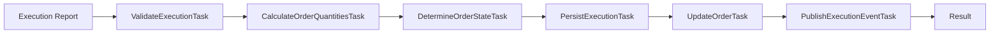

# Execution Task Pipeline

This document describes the execution task pipeline implementation, which processes execution reports (fills) for orders according to the OMS Task Orchestration Framework specification.

## Overview

The execution pipeline handles incoming execution reports from market venues, updates order state, calculates quantities, and publishes events for downstream systems.

## Architecture

The pipeline follows the **Task Orchestration Framework** pattern with these components:

- **ExecutionCommandProcessor**: Orchestrates the pipeline execution
- **OrderTaskContext**: Carries order and execution state through the pipeline
- **Execution Tasks**: Individual units of work (validation, calculation, persistence, etc.)
- **TaskOrchestrator**: Framework component that executes the pipeline

## Pipeline Flow



## Tasks

### 1. ValidateExecutionTask (Order: 100)

**Purpose**: Validates execution fields and business rules before processing.

**Validations**:
- Execution and order must be present in context
- Required fields: orderId, execID, lastQty, lastPx
- lastQty and lastPx must be positive
- Order must be in LIVE state

**Failure Behavior**: Stops pipeline execution

---

### 2. CalculateOrderQuantitiesTask (Order: 200)

**Purpose**: Calculates updated order quantities based on the execution.

**Calculations**:
```
cumQty = previous_cumQty + execution.lastQty
leavesQty = orderQty - cumQty
avgPx = (previous_cumQty × previous_avgPx + lastQty × lastPx) / cumQty
```

**Context Updates**:
- `calculatedCumQty`: New cumulative quantity
- `calculatedLeavesQty`: New leaves quantity
- `calculatedAvgPx`: New average price

**Failure Behavior**: Stops pipeline if cumQty exceeds orderQty

---

### 3. DetermineOrderStateTask (Order: 300)

**Purpose**: Determines the new order state based on fill status.

**State Transitions**:
- `LIVE → LIVE`: Partial fill (leavesQty > 0)
- `LIVE → FILLED`: Full fill (leavesQty = 0)

**Context Updates**:
- `newOrderState`: Determined state (State enum)

---

### 4. PersistExecutionTask (Order: 400)

**Purpose**: Persists the execution report to the database.

**Implementation**:
- Saves execution entity using `ExecutionRepository`
- Updates context with persisted execution (includes generated ID)

**Conditional**: Only runs if execution is present in context

**Failure Behavior**: Stops pipeline if persistence fails

---

### 5. UpdateOrderTask (Order: 500)

**Purpose**: Updates the order entity with calculated quantities and state.

**Updates**:
- `cumQty`: From context `calculatedCumQty`
- `leavesQty`: From context `calculatedLeavesQty`
- `avgPx`: From context `calculatedAvgPx`
- `state`: From context `newOrderState`

**Implementation**:
- Applies calculated values to order entity
- Persists updated order using `OrderRepository`
- Updates context with persisted order

**Conditional**: Only runs if order is present in context

**Failure Behavior**: Stops pipeline if persistence fails

---

### 6. PublishExecutionEventTask (Order: 600)

**Purpose**: Publishes execution event for downstream consumers.

**Event Consumers**:
- Risk management systems
- Position tracking systems
- Client notification services
- Audit and compliance systems

**Conditional**: Only runs if both order and execution are present

**Failure Behavior**: Returns warning but doesn't stop pipeline (non-critical)

---

## Usage Example

```java
@Autowired
private ExecutionCommandProcessor executionProcessor;

public void handleExecutionReport(Execution execution) {
    // Process the execution
    ExecutionProcessingResult result = executionProcessor.process(execution);
    
    if (result.isSuccess()) {
        log.info("Execution processed successfully");
        Order updatedOrder = result.getOrder();
        // ... handle success
    } else {
        log.error("Execution processing failed");
        // ... handle failure
    }
}
```

## Testing

### Unit Testing Individual Tasks

```java
@Test
public void testCalculateOrderQuantitiesTask() {
    // Given
    Order order = Order.builder()
        .orderQty(new BigDecimal("1000"))
        .cumQty(new BigDecimal("300"))
        .avgPx(new BigDecimal("100.00"))
        .build();
    
    Execution execution = Execution.builder()
        .lastQty(new BigDecimal("200"))
        .lastPx(new BigDecimal("100.50"))
        .build();
    
    OrderTaskContext context = new OrderTaskContext(order);
    context.setExecution(execution);
    
    CalculateOrderQuantitiesTask task = new CalculateOrderQuantitiesTask();
    
    // When
    TaskResult result = task.execute(context);
    
    // Then
    assertTrue(result.isSuccess());
    assertEquals(new BigDecimal("500"), context.get("calculatedCumQty").get());
    assertEquals(new BigDecimal("500"), context.get("calculatedLeavesQty").get());
}
```

### Integration Testing Pipeline

```java
@SpringBootTest
@Transactional
public class ExecutionPipelineIntegrationTest {
    
    @Autowired
    private ExecutionCommandProcessor processor;
    
    @Autowired
    private OrderRepository orderRepository;
    
    @Test
    public void testCompleteExecutionPipeline() {
        // Given: Order in LIVE state
        Order order = createLiveOrder();
        orderRepository.save(order);
        
        Execution execution = createExecution(order.getOrderId());
        
        // When
        ExecutionProcessingResult result = processor.process(execution);
        
        // Then
        assertTrue(result.isSuccess());
        assertEquals(State.FILLED, result.getOrder().getState());
    }
}
```

## Error Handling

### Pipeline-Level Errors

The pipeline is configured with `stopOnFailure(true)`, meaning:
- First failed task stops the entire pipeline
- Subsequent tasks are not executed
- Transaction is rolled back (due to `@Transactional`)

### Task-Level Errors

Tasks can return different result types:
- `TaskResult.success()`: Task completed successfully
- `TaskResult.failed()`: Task failed (soft error, returned as result)
- `TaskResult.warning()`: Task succeeded with warnings
- `TaskExecutionException`: Critical error (stops pipeline immediately)

## Observability

### Metrics

The processor is annotated with `@Observed(name = "oms.execution-processor.process")` for Micrometer integration:

```
oms.execution-processor.process
  - Execution duration
  - Success/failure counts
```

### Logging

Structured logging at key points:
- Pipeline start (INFO): orderId, execId, quantities
- Each task execution (DEBUG/INFO)
- Pipeline completion (INFO): duration, task counts
- Errors (ERROR): with full context

### Log Example

```
INFO  - Processing execution report: orderId=OMS-123, execId=EXEC-456, lastQty=100, lastPx=50.25
DEBUG - Validating execution in context: ctx-789
INFO  - Quantity calculations completed - orderId=OMS-123, newCumQty=100, newLeavesQty=900
INFO  - Order state determined - orderId=OMS-123, currentState=LIVE, newState=LIVE, leavesQty=900
INFO  - Execution persisted successfully - execId=EXEC-456
INFO  - Order updated successfully - orderId=OMS-123, cumQty: 0 -> 100
INFO  - Execution event published - orderId=OMS-123, execId=EXEC-456
INFO  - Pipeline execution completed - Success: true, Duration: 45ms
```

## Best Practices

1. **Transactional Boundaries**: The `@Transactional` annotation on `process()` ensures all database operations are atomic

2. **Context Passing**: Use context attributes to pass calculated values between tasks rather than modifying shared objects

3. **Conditional Tasks**: Use `ConditionalTask` for optional logic (persistence, event publishing)

4. **Task Ordering**: Use explicit `getOrder()` values (100, 200, 300...) to control execution sequence

5. **Error Messages**: Provide clear, actionable error messages for debugging

6. **Immutability**: Calculate new values rather than modifying existing ones in-place

## Future Enhancements

1. **Allocation Support**: Add tasks for order allocation (grouped orders, client order updates)

2. **Event Sourcing**: Enhance event publishing with full event store integration

3. **Retry Logic**: Add configurable retry for transient failures

4. **Parallel Execution**: Support for parallel task execution where tasks are independent

5. **Compensation**: Add compensating transactions for rollback scenarios

## References

- [Task Orchestration Framework Specification](../../../oms-knowledge-base/oms-framework/task-orchestration-framework_spec.md)
- [Order Quantity Calculations Specification](../../../oms-knowledge-base/oms-concepts/order-quantity-calculations.md)
- [State Machine Framework Specification](../../../oms-knowledge-base/oms-framework/state-machine-framework_spec.md)
