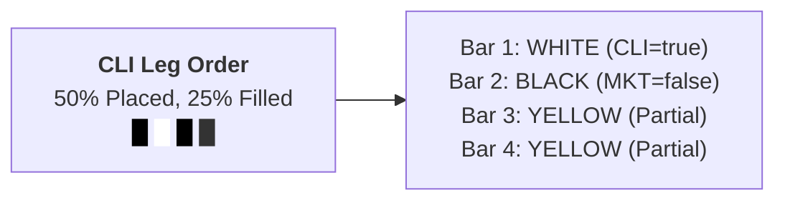
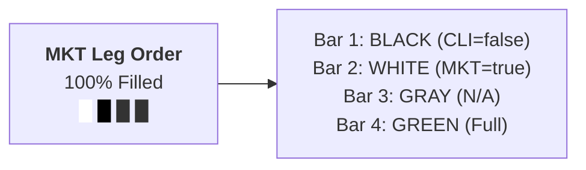
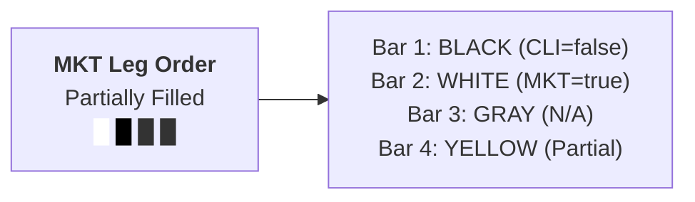
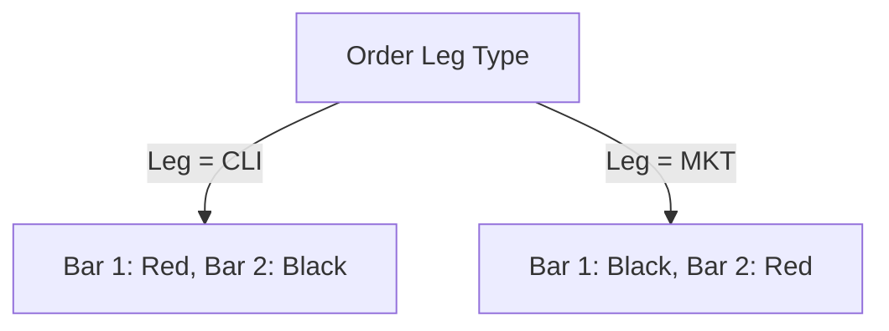
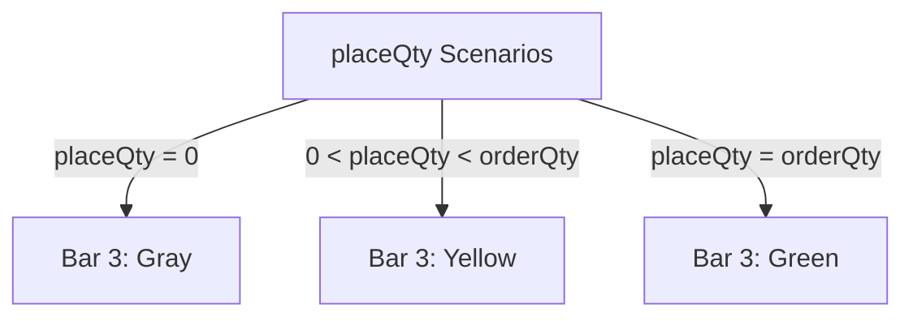
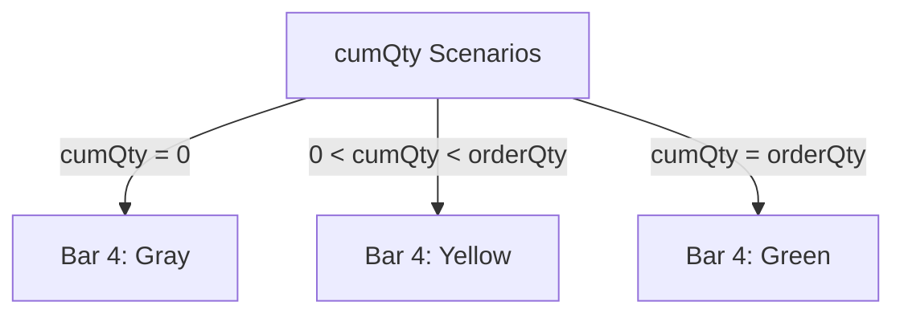

# Order State Indicator Specification

## Overview

This specification defines a custom visual indicator for representing order characteristics and execution status in the web UI. The indicator uses a rectangular component with 4 vertical bars to visually communicate:
1. Leg type indicator 1 (CLI leg presence)
2. Leg type indicator 2 (MKT leg presence)
3. Placement status (placeQty vs orderQty)
4. Execution status (cumQty vs orderQty)

## Visual Design

### Component Structure

The order state indicator is a rectangle divided into 4 vertical bars:

```
┌─────────────────────────────────┐
│ Bar 1 │ Bar 2 │ Bar 3 │ Bar 4 │
└─────────────────────────────────┘
```

### Coloring Rules

#### Bar 1: CLI Leg Indicator

- **Glossy White** (`#FFFFFF`): Leg is CLI (Client/Limit)
- **Glossy Black** (`#1a1a1a`): Leg is NOT CLI (e.g., MKT)

#### Bar 2: MKT Leg Indicator

- **Glossy White** (`#FFFFFF`): Leg is MKT (Market)
- **Glossy Black** (`#1a1a1a`): Leg is NOT MKT (e.g., CLI)

#### Bar 3: Placement Status (placeQty)

- **Glossy Yellow** (`#FFD700`): `placeQty > 0` AND `placeQty < orderQty` (Partially placed)
- **Glossy Green** (`#00AA00`): `placeQty = orderQty` (Fully placed)
- **Glossy Gray** (`#666666`): `placeQty = 0` (Not placed)

#### Bar 4: Execution Status (cumQty)

- **Glossy Yellow** (`#FFD700`): `cumQty > 0` AND `cumQty < orderQty` (Partially executed)
- **Glossy Green** (`#00AA00`): `cumQty = orderQty` (Fully executed/Filled)
- **Glossy Gray** (`#666666`): `cumQty = 0` (Not executed)

### State Encoding

The bars collectively indicate the order characteristics and execution progress:

| Bar | Purpose | Coloring |
|-----|---------|----------|
| 1 | CLI Leg | White = CLI leg, Black = Non-CLI leg |
| 2 | MKT Leg | White = MKT leg, Black = Non-MKT leg |
| 3 | Placement Status | Yellow = Partial, Green = Full, Gray = None |
| 4 | Execution Status | Yellow = Partial, Green = Full, Gray = None |

## Visual Illustrations

### Scenario 1: CLI Leg Order - Partially Placed & Partially Executed



#### Visual Representation

```
╔════════════════════════════════════════════════════════════╗
║  CLI Leg Order - Partial Status                            ║
║                                                            ║
║  ┌────────────────────────────────────────┐               ║
║  │WHITE │ BLACK │ YELLOW │ YELLOW │       ║
║  │#FFFF │ #1a1a │ #FFD7  │ #FFD7  │       ║
║  │  FF  │  1a   │   00   │   00   │       ║
║  │████  │████   │ ████   │ ████   │       ║
║  │████  │████   │ ████   │ ████   │       ║
║  │████  │████   │ ████   │ ████   │       ║
║  │ CLI  │ MKT   │ Place  │ Exec   │       ║
║  │ Yes  │ No    │ Part   │ Part   │       ║
║  └────────────────────────────────────────┘               ║
║                                                            ║
║  Leg: CLI                                                  ║
║  Bar 1 (WHITE #FFFFFF): Leg is CLI (true)                  ║
║  Bar 2 (BLACK #1a1a1a): Leg is not MKT (false)             ║
║  Bar 3 (YELLOW #FFD700): placeQty=50 (Partial)             ║
║  Bar 4 (YELLOW #FFD700): cumQty=25 (Partial Filled)        ║
╚════════════════════════════════════════════════════════════╝
```

### Scenario 2: MKT Leg Order - Market Orders Are Not Placed



#### Visual Representation

```
╔════════════════════════════════════════════════════════════╗
║  MKT Leg Order - Fully Executed                            ║
║                                                            ║
║  ┌────────────────────────────────────────┐               ║
║  │ BLACK │WHITE  │ GRAY   │ GREEN  │       ║
║  │ #1a1a │#FFFF  │ #6666  │ #00AA  │       ║
║  │  1a   │  FF   │  66    │  00    │       ║
║  │████   │████   │ ████   │ ████   │       ║
║  │████   │████   │ ████   │ ████   │       ║
║  │████   │████   │ ████   │ ████   │       ║
║  │ CLI   │ MKT   │ Place  │ Exec   │       ║
║  │ No    │ Yes   │ N/A    │ Full   │       ║
║  └────────────────────────────────────────┘               ║
║                                                            ║
║  Leg: MKT                                                  ║
║  Bar 1 (BLACK #1a1a1a): Leg is not CLI (false)             ║
║  Bar 2 (WHITE #FFFFFF): Leg is MKT (true)                  ║
║  Bar 3 (GRAY #666666): Always gray - MKT orders are not placed ║
║  Bar 4 (GREEN #00AA00): cumQty=orderQty (Fully executed)   ║
╚════════════════════════════════════════════════════════════╝
```

### Scenario 3: MKT Leg Order - Executing



#### Visual Representation

```
╔════════════════════════════════════════════════════════════╗
║  MKT Leg Order - Partially Executed                        ║
║                                                            ║
║  ┌────────────────────────────────────────┐               ║
║  │ BLACK │WHITE  │ GRAY   │ YELLOW │       ║
║  │ #1a1a │#FFFF  │ #6666  │ #FFD7  │       ║
║  │  1a   │  FF   │  66    │   00   │       ║
║  │████   │████   │ ████   │ ████   │       ║
║  │████   │████   │ ████   │ ████   │       ║
║  │████   │████   │ ████   │ ████   │       ║
║  │ CLI   │ MKT   │ Place  │ Exec   │       ║
║  │ No    │ Yes   │ N/A    │ Part   │       ║
║  └────────────────────────────────────────┘               ║
║                                                            ║
║  Leg: MKT                                                  ║
║  Bar 1 (BLACK #1a1a1a): Leg is not CLI (false)             ║
║  Bar 2 (WHITE #FFFFFF): Leg is MKT (true)                  ║
║  Bar 3 (GRAY #666666): Always gray - MKT orders are not placed ║
║  Bar 4 (YELLOW #FFD700): cumQty=25 (Partial: 0 < cumQty < orderQty) ║
╚════════════════════════════════════════════════════════════╝
```

## State-Specific Bar Styling

### Bar 1: CLI Leg Indicator

- **Glossy White**: Leg is CLI
- **Glossy Black**: Leg is not CLI (e.g., MKT)

### Bar 2: MKT Leg Indicator

- **Glossy White**: Leg is MKT
- **Glossy Black**: Leg is not MKT (e.g., CLI)

### Bar 3: Placement Status (placeQty)

- **Glossy Yellow**: Partially placed (0 < placeQty < orderQty)
- **Glossy Green**: Fully placed (placeQty = orderQty)
- **Glossy Gray**: Not placed (placeQty = 0)

### Bar 4: Execution Status (cumQty)

- **Glossy Yellow**: Partially executed (0 < cumQty < orderQty)
- **Glossy Green**: Fully executed (cumQty = orderQty)
- **Glossy Gray**: Not executed (cumQty = 0)

## Implementation Notes

### HTML/CSS Considerations

- Use CSS Grid or Flexbox for the 4-bar layout
- Implement transitions for smooth state changes
- Consider accessibility with aria-labels and tooltip descriptions
- Responsive sizing for different screen resolutions

### SVG Alternative

For higher fidelity graphics, consider implementing as SVG with:
- Smooth gradients for state transitions
- Animated transitions between states
- Support for various sizes without pixelation

### Color Palette

```css
--leg-cli-active: #FFFFFF;             /* Glossy White for CLI leg */
--leg-mkt-active: #FFFFFF;             /* Glossy White for MKT leg */
--bar-inactive: #1a1a1a;               /* Glossy Black for non-active leg */
--placement-partial: #FFD700;          /* Glossy Yellow for partial placement */
--placement-complete: #00AA00;         /* Glossy Green for full placement */
--placement-none: #666666;             /* Glossy Gray for no placement */
--execution-partial: #FFD700;          /* Glossy Yellow for partial execution */
--execution-complete: #00AA00;         /* Glossy Green for full execution */
--execution-none: #666666;             /* Glossy Gray for no execution */
```

## Comparison Table

| Bar | Purpose | Red Value | Black Value | Yellow Value | Green Value | Gray Value |
|-----|---------|-----------|-------------|--------------|-------------|-----------|
| 1 | CLI Leg | Leg is CLI | Leg is not CLI | N/A | N/A | N/A |
| 2 | MKT Leg | Leg is MKT | Leg is not MKT | N/A | N/A | N/A |
| 3 | Placement | N/A | N/A | 0 < placeQty < orderQty | placeQty = orderQty | placeQty = 0 |
| 4 | Execution | N/A | N/A | 0 < cumQty < orderQty | cumQty = orderQty | cumQty = 0 |

## Mermaid Diagram Illustrations

### Leg Type Scenarios



### Placement Status Examples



### Execution Status Examples



## Example Usage in UI

### Order List View

```
╔═══════════════════════════════════════════════════════════════════════════╗
║ Symbol │ Qty  │ Leg │  Status  │  Visual Indicator (4 Bars + Hex Colors) ║
║────────┼──────┼─────┼──────────┼──────────────────────────────────────────║
║ AAPL   │ 100  │ CLI │50%/25%   │ ██ ██ ██ ██                             ║
║        │      │     │Placed/Ex │ #FFFFFF #1a1a1a #FFD700 #FFD700          ║
║        │      │     │          │ WHITE   BLACK   YELLOW  YELLOW           ║
║────────┼──────┼─────┼──────────┼──────────────────────────────────────────║
║ INTC   │  50  │ MKT │100% Ex   │ ██ ██ ██ ██                             ║
║        │      │     │(Executed)│ #1a1a1a #FFFFFF #666666 #00AA00          ║
║        │      │     │          │ BLACK   WHITE   GRAY    GREEN            ║
║────────┼──────┼─────┼──────────┼──────────────────────────────────────────║
║ MSFT   │  75  │ MKT │50% Ex    │ ██ ██ ██ ██                             ║
║        │      │     │(Executing)│#1a1a1a #FFFFFF #666666 #FFD700          ║
║        │      │     │          │ BLACK   WHITE   GRAY    YELLOW           ║
╚═══════════════════════════════════════════════════════════════════════════╝
```

**Color Reference:**
- `#FFFFFF` = WHITE (Glossy White) - Active leg indicator (CLI or MKT)
- `#1a1a1a` = BLACK (Glossy Black) - Inactive leg indicator
- `#FFD700` = YELLOW (Glossy Yellow) - Partial placement/execution
- `#00AA00` = GREEN (Glossy Green) - Full placement/execution  
- `#666666` = GRAY (Glossy Gray) - No placement/execution (or MKT leg Bar 3)

### Indicator Reading Guide

| Bar 1 | Bar 2 | Bar 3 | Bar 4 | Hex Codes | Meaning |
|-------|-------|-------|-------|-----------|---------|
| `#FFFFFF` | `#1a1a1a` | `#00AA00` | `#00AA00` | WHITE / BLACK / GREEN / GREEN | CLI leg, fully placed & executed |
| `#FFFFFF` | `#1a1a1a` | `#FFD700` | `#FFD700` | WHITE / BLACK / YELLOW / YELLOW | CLI leg, partially placed & executed |
| `#1a1a1a` | `#FFFFFF` | `#666666` | `#00AA00` | BLACK / WHITE / GRAY / GREEN | MKT leg, fully executed (Bar 3 always gray) |
| `#1a1a1a` | `#FFFFFF` | `#666666` | `#FFD700` | BLACK / WHITE / GRAY / YELLOW | MKT leg, partially executed (Bar 3 always gray) |
| `#FFFFFF` | `#1a1a1a` | `#FFD700` | `#666666` | WHITE / BLACK / YELLOW / GRAY | CLI leg, partially placed, not executed |

## Future Extensions

- Support for additional leg types
- Multi-leg indicators using all 4 bars
- Animated transitions between states
- Tooltip information on hover
- Dark mode color variants
