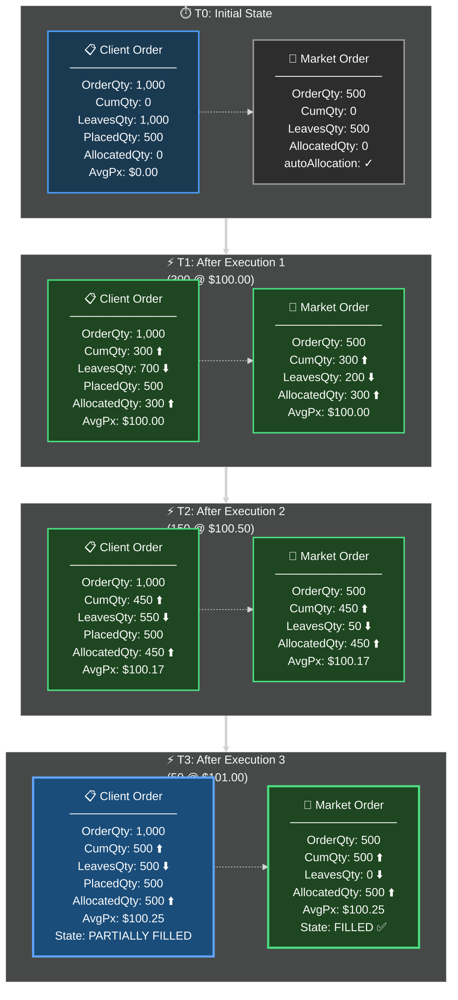
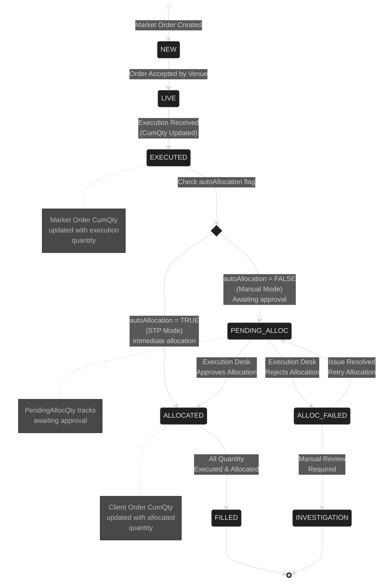
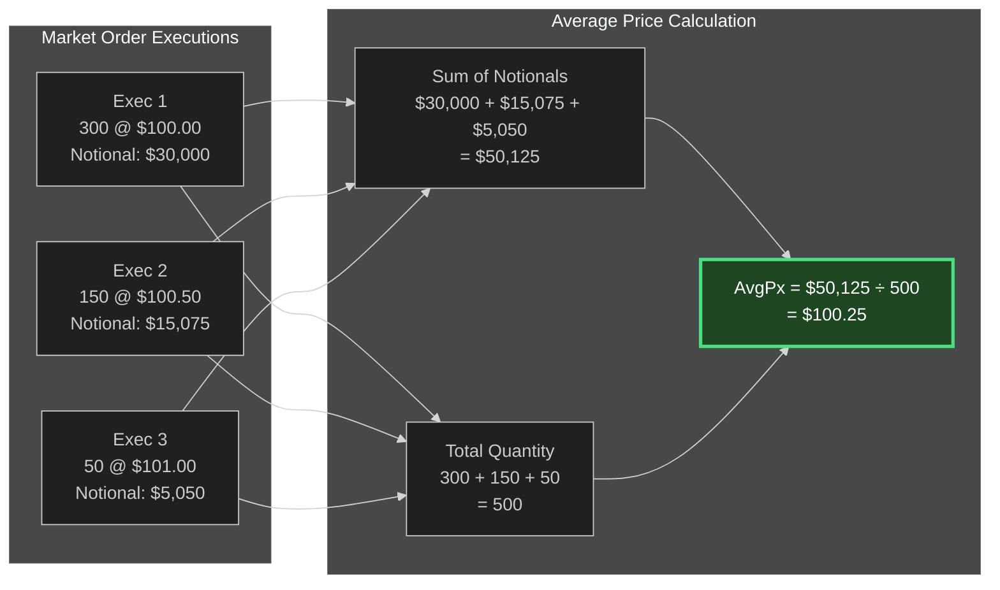
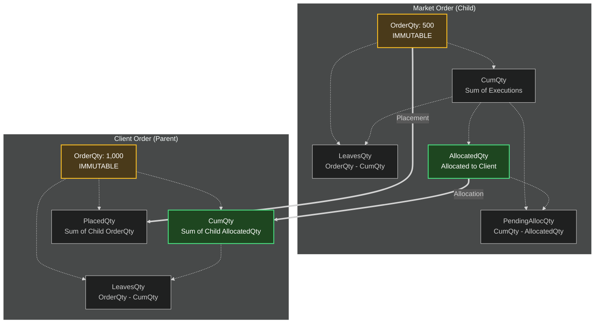

# Order Allocation Flow: Multiple Executions Scenario

**Scenario**: 1 Client Order + 1 Market Order + Multiple Executions

---

## Scenario 1: STP (Straight-Through Processing) Mode

### Timeline Sequence Diagram

```mermaid
%%{init: {'theme':'dark'}}%%
sequenceDiagram
    autonumber
    participant Client as 📋 Client Order<br/>OrderQty: 1,000
    participant Market as 🏪 Market Order<br/>OrderQty: 500<br/>autoAllocation: TRUE
    participant Venue as 🏛️ Exchange
    
    Note over Client: Initial State<br/>CumQty: 0<br/>LeavesQty: 1,000<br/>PlacedQty: 500
    
    Note over Market: Initial State<br/>CumQty: 0<br/>LeavesQty: 500<br/>AllocatedQty: 0
    
    rect rgb(25, 55, 85)
        Note over Venue: EXECUTION 1
        Venue->>Market: Fill Report<br/>LastQty: 300<br/>LastPx: $100.00
        
        activate Market
        Market->>Market: Update Market Order<br/>CumQty: 0 → 300<br/>LeavesQty: 500 → 200<br/>AvgPx: $100.00
        
        Market->>Client: 🔄 AUTO-ALLOCATE<br/>300 shares
        deactivate Market
        
        activate Client
        Client->>Client: Update Client Order<br/>CumQty: 0 → 300<br/>AllocatedQty: 0 → 300<br/>LeavesQty: 1,000 → 700<br/>AvgPx: $100.00
        deactivate Client
        
        Note over Client,Market: ✅ ALLOCATION COMPLETE
    end
    
    rect rgb(20, 60, 30)
        Note over Venue: EXECUTION 2
        Venue->>Market: Fill Report<br/>LastQty: 150<br/>LastPx: $100.50
        
        activate Market
        Market->>Market: Update Market Order<br/>CumQty: 300 → 450<br/>LeavesQty: 200 → 50<br/>AvgPx: $100.17
        
        Market->>Client: 🔄 AUTO-ALLOCATE<br/>150 shares
        deactivate Market
        
        activate Client
        Client->>Client: Update Client Order<br/>CumQty: 300 → 450<br/>AllocatedQty: 300 → 450<br/>LeavesQty: 700 → 550<br/>AvgPx: $100.17
        deactivate Client
        
        Note over Client,Market: ✅ ALLOCATION COMPLETE
    end
    
    rect rgb(60, 50, 20)
        Note over Venue: EXECUTION 3
        Venue->>Market: Fill Report<br/>LastQty: 50<br/>LastPx: $101.00
        
        activate Market
        Market->>Market: Update Market Order<br/>CumQty: 450 → 500<br/>LeavesQty: 50 → 0<br/>AvgPx: $100.25<br/>State: FILLED ✅
        
        Market->>Client: 🔄 AUTO-ALLOCATE<br/>50 shares
        deactivate Market
        
        activate Client
        Client->>Client: Update Client Order<br/>CumQty: 450 → 500<br/>AllocatedQty: 450 → 500<br/>LeavesQty: 550 → 500<br/>AvgPx: $100.25
        deactivate Client
        
        Note over Client,Market: ✅ MARKET ORDER FULLY FILLED<br/>✅ CLIENT ORDER PARTIALLY FILLED
    end
```

### State Progression Diagram

---

## Scenario 2: Manual Allocation Mode

### Timeline Sequence Diagram with Approval Steps

```mermaid
%%{init: {'theme':'dark'}}%%
sequenceDiagram
    autonumber
    participant Client as 📋 Client Order<br/>OrderQty: 1,000
    participant Market as 🏪 Market Order<br/>OrderQty: 800<br/>autoAllocation: FALSE
    participant Venue as 🏛️ Exchange
    participant Desk as 👤 Execution Desk
    
    Note over Client: Initial State<br/>CumQty: 0<br/>PlacedQty: 800
    
    Note over Market: Initial State<br/>CumQty: 0<br/>PendingAllocQty: 0<br/>AllocatedQty: 0
    
    rect rgb(60, 50, 20)
        Note over Venue: EXECUTION 1
        Venue->>Market: Fill Report<br/>LastQty: 500<br/>LastPx: $99.50
        
        activate Market
        Market->>Market: Update Market Order<br/>CumQty: 0 → 500<br/>PendingAllocQty: 0 → 500<br/>State: PENDING_ALLOC ⏳
        deactivate Market
        
        Note over Client: ⚠️ Client CumQty NOT updated<br/>(waiting for approval)
    end
    
    rect rgb(60, 25, 30)
        Note over Desk: MANUAL REVIEW PROCESS
        Market->>Desk: 📨 Allocation Request<br/>500 shares pending
        
        activate Desk
        Note over Desk: Validate Execution:<br/>✓ Price vs limit<br/>✓ Counterparty<br/>✓ Compliance checks<br/>✓ Trade details
        deactivate Desk
    end
    
    rect rgb(20, 60, 30)
        Note over Desk: PARTIAL APPROVAL
        Desk->>Market: ✅ APPROVE: 300 shares<br/>❌ REJECT: 200 shares
        
        activate Market
        Market->>Market: Update Market Order<br/>AllocatedQty: 0 → 300<br/>PendingAllocQty: 500 → 200
        
        Market->>Client: Allocate 300 shares
        deactivate Market
        
        activate Client
        Client->>Client: Update Client Order<br/>CumQty: 0 → 300<br/>AllocatedQty: 0 → 300<br/>LeavesQty: 1,000 → 700
        deactivate Client
    end
    
    rect rgb(60, 25, 30)
        Note over Market: 200 shares still pending<br/>State: ALLOC_FAILED ⚠️<br/>Requires investigation
    end
    
    rect rgb(60, 50, 20)
        Note over Venue: EXECUTION 2
        Venue->>Market: Fill Report<br/>LastQty: 200<br/>LastPx: $99.75
        
        activate Market
        Market->>Market: Update Market Order<br/>CumQty: 500 → 700<br/>PendingAllocQty: 200 → 400
        deactivate Market
    end
    
    rect rgb(20, 60, 30)
        Desk->>Market: ✅ APPROVE: 400 shares
        
        activate Market
        Market->>Client: Allocate 400 shares
        deactivate Market
        
        activate Client
        Client->>Client: Update Client Order<br/>CumQty: 300 → 700<br/>AllocatedQty: 300 → 700<br/>LeavesQty: 700 → 300<br/>AvgPx: $99.57
        deactivate Client
    end
```

### State Machine Diagram

---

## Calculation Formulas

### Average Price Calculation (Multiple Executions)

---

## Comparison: STP vs Manual Allocation

```mermaid
%%{init: {'theme':'dark'}}%%
graph TB
    subgraph STP["STP Mode (autoAllocation = TRUE)"]
        direction TB
        S1[Execution Received] --> S2[Market Order<br/>CumQty Updated]
        S2 --> S3[Immediate<br/>Auto-Allocation]
        S3 --> S4[Client Order<br/>CumQty Updated<br/>INSTANTLY ⚡]
        
        style S4 fill:#1e4620,stroke:#4ade80,stroke-width:2px,color:#fff
    end
    
    subgraph Manual["Manual Mode (autoAllocation = FALSE)"]
        direction TB
        M1[Execution Received] --> M2[Market Order<br/>CumQty Updated]
        M2 --> M3[PendingAllocQty<br/>Updated]
        M3 --> M4[Execution Desk<br/>Review ⏳]
        M4 --> M5{Approval?}
        M5 -->|Approved| M6[Client Order<br/>CumQty Updated<br/>AFTER APPROVAL ✓]
        M5 -->|Rejected| M7[Investigation<br/>Required ⚠️]
        
        style M6 fill:#1e4620,stroke:#4ade80,stroke-width:2px,color:#fff
        style M7 fill:#5c1a1a,stroke:#ef4444,stroke-width:2px,color:#fff
    end
    
    style STP fill:#1a3a52,stroke:#4a9eff,stroke-width:2px
    style Manual fill:#4a3a1a,stroke:#fbbf24,stroke-width:2px
```

---

## Key Insights

### Quantity Field Relationships

---

## Summary

**STP Mode**: Each execution immediately flows up to the client order
- ✅ Fast processing
- ✅ Real-time client updates
- ✅ No manual intervention

**Manual Mode**: Executions accumulate until approved
- ✅ Validation and compliance checks
- ✅ Partial allocation support
- ⚠️ Delayed client updates
- ⚠️ Requires execution desk resources
