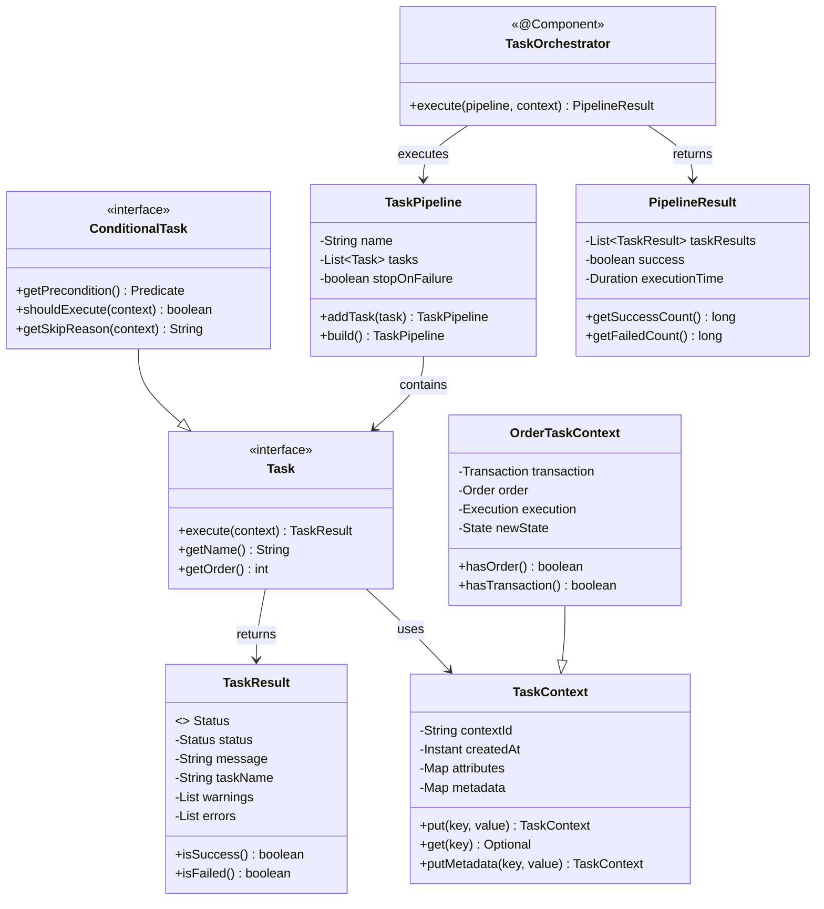
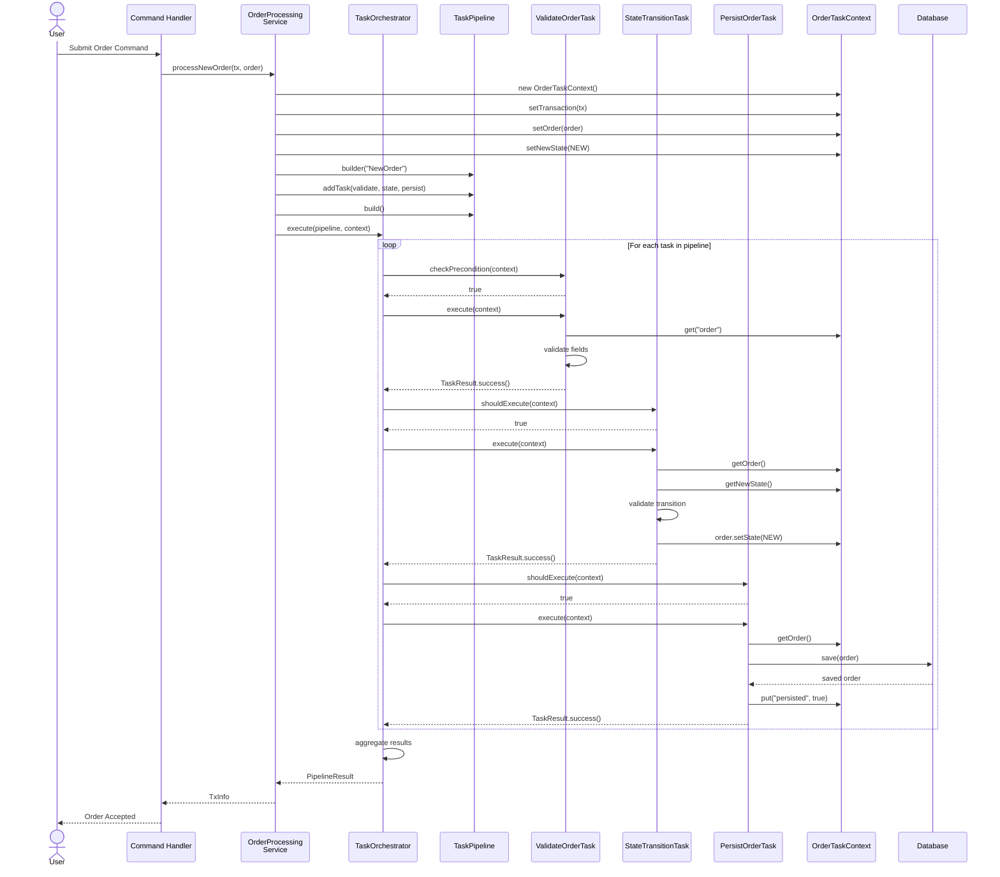
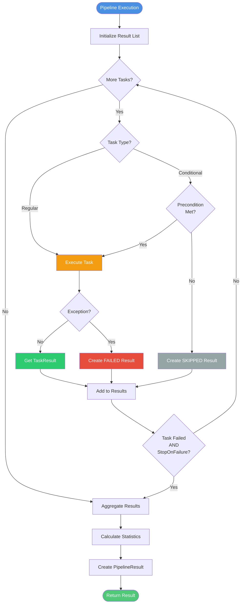
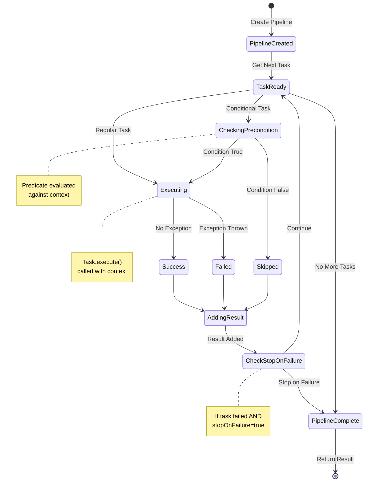
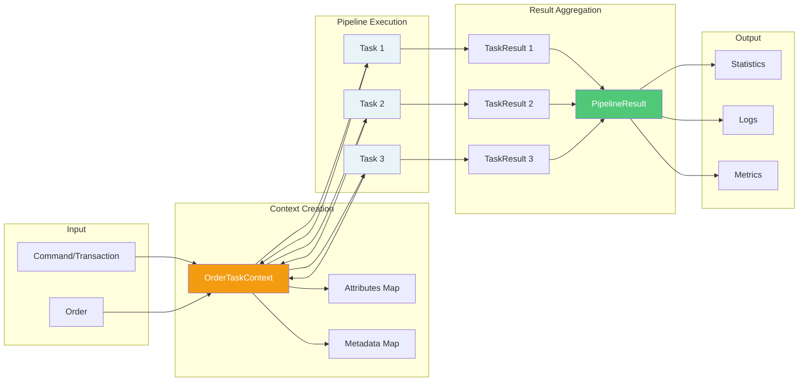
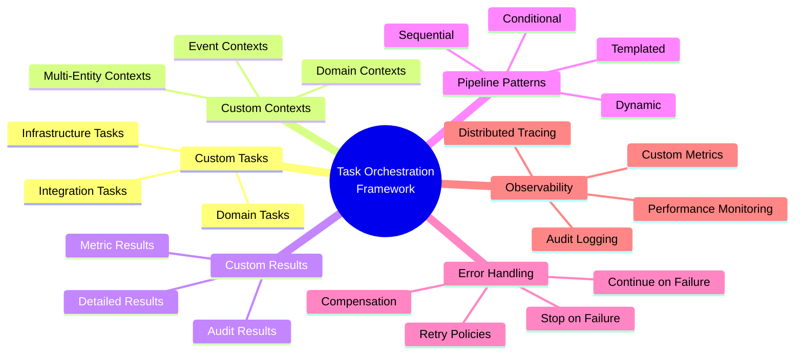

# Task Orchestration Framework - Architecture Diagrams

## System Overview

```mermaid
graph TB
    subgraph "Application Layer"
        CMD[Command Handlers]
        SVC[Business Services]
    end
    
    subgraph "Orchestration Framework"
        ORCH[TaskOrchestrator<br/>@Component]
        PIPE[TaskPipeline<br/>Builder]
        CTX[TaskContext<br/>State Container]
    end
    
    subgraph "Task Implementations"
        T1[ValidateTransactionTask<br/>@Component]
        T2[ValidateOrderTask<br/>@Component<br/>ConditionalTask]
        T3[StateTransitionTask<br/>@Component<br/>ConditionalTask]
        T4[PersistOrderTask<br/>@Component<br/>ConditionalTask]
        T5[PublishEventTask<br/>@Component<br/>ConditionalTask]
    end
    
    subgraph "Infrastructure"
        DB[(Database)]
        KAFKA[Kafka]
        METRICS[Metrics/Logs]
    end
    
    CMD --> ORCH
    SVC --> ORCH
    ORCH --> PIPE
    PIPE -.contains.-> T1
    PIPE -.contains.-> T2
    PIPE -.contains.-> T3
    PIPE -.contains.-> T4
    PIPE -.contains.-> T5
    
    T1 --> CTX
    T2 --> CTX
    T3 --> CTX
    T4 --> CTX
    T5 --> CTX
    
    T4 --> DB
    T5 --> KAFKA
    ORCH --> METRICS
    
    style ORCH fill:#4a90e2,stroke:#2d5f9e,color:#fff
    style PIPE fill:#50c878,stroke:#2d8659,color:#fff
    style CTX fill:#f39c12,stroke:#b8730a,color:#fff
    style T1 fill:#e8f4f8
    style T2 fill:#e8f4f8
    style T3 fill:#e8f4f8
    style T4 fill:#e8f4f8
    style T5 fill:#e8f4f8
```

## Class Hierarchy



## Sequence Diagram - Order Processing



## Task Execution Flow



## Component Dependencies

```mermaid
graph LR
    subgraph "Core Framework (common)"
        Task[Task Interface]
        CondTask[ConditionalTask Interface]
        TaskCtx[TaskContext]
        TaskRes[TaskResult]
        TaskExc[TaskExecutionException]
        Pipeline[TaskPipeline]
        Orch[TaskOrchestrator]
    end
    
    subgraph "OMS Domain (oms)"
        OrderCtx[OrderTaskContext]
        OrcSvc[OrderProcessing<br/>Service]
    end
    
    subgraph "OMS Tasks (oms.tasks)"
        ValTx[ValidateTransactionTask]
        ValOrd[ValidateOrderTask]
        StateTx[StateTransitionTask]
        Persist[PersistOrderTask]
        Publish[PublishEventTask]
    end
    
    subgraph "Spring Framework"
        Spring[@Component<br/>@Service<br/>DI]
    end
    
    subgraph "Observability"
        Micrometer[@Observed<br/>Metrics]
        SLF4J[SLF4J Logging]
    end
    
    CondTask -.implements.-> Task
    OrderCtx -.extends.-> TaskCtx
    
    ValTx -.implements.-> Task
    ValOrd -.implements.-> CondTask
    StateTx -.implements.-> CondTask
    Persist -.implements.-> CondTask
    Publish -.implements.-> CondTask
    
    Pipeline --> Task
    Orch --> Pipeline
    Orch --> TaskRes
    OrcSvc --> Orch
    OrcSvc --> Pipeline
    OrcSvc --> ValTx
    OrcSvc --> ValOrd
    
    Orch -.uses.-> Spring
    Orch -.uses.-> Micrometer
    ValTx -.uses.-> Spring
    ValOrd -.uses.-> Spring
    OrcSvc -.uses.-> Spring
    
    ValTx -.logs.-> SLF4J
    ValOrd -.logs.-> SLF4J
    Orch -.logs.-> SLF4J
    
    style Task fill:#e8f4f8
    style CondTask fill:#e8f4f8
    style Orch fill:#4a90e2,color:#fff
    style Pipeline fill:#50c878,color:#fff
    style OrderCtx fill:#f39c12,color:#fff
```

## State Transitions in Pipeline



## Data Flow



## Extension Points



---

**Legend:**
- 🔵 Blue: Orchestration components
- 🟢 Green: Pipeline/Results
- 🟡 Yellow: Context/State
- ⚪ Light Blue: Tasks
- ◆ Diamond: Decision points
- ⬜ Rectangle: Processes
- 🗄️ Cylinder: Data stores

---

## Related Documents

- [Task Orchestration Framework](../oms-framework/task-orchestration-framework_spec.md) — Complete framework specification that these diagrams visualize
- [Domain Model](../oms-framework/domain-model_spec.md) — OrderTaskContext class hierarchy and entity definitions
- [State Machine Framework](../oms-framework/state-machine-framework_spec.md) — StateTransitionTask usage within pipelines
