# Execution Reporting Specification

**Version:** 1.0
**Last Updated:** 2026-02-14
**Author:** OMS Team
**Status:** Active

---

## 1. Introduction

This specification defines the workflows for processing execution reports in the Order Management System (OMS). Execution reports represent confirmations of order activity from execution venues, brokers, and internal matching engines.

### 1.1 Purpose

- Define FIX ExecutionReport (35=8) message processing semantics
- Specify ExecType-based workflow routing
- Document execution bust (trade break) and whack (manual cancel) operations
- Integrate execution processing with order state machine and quantity calculations
- Provide task orchestration patterns for execution workflows

### 1.2 Scope

**In Scope:**
- FIX ExecutionReport (35=8) message parsing and validation
- ExecType semantics (NEW, PARTIAL_FILL, FILL, CANCELED, REJECTED, TRADE_CANCEL, TRADE_CORRECT)
- Execution task pipeline (6-task orchestration workflow)
- Execution bust workflows (trade breaks, corrections)
- Execution whack workflows (manual cancellation by execution desk)
- Integration with order quantity calculations and state transitions

**Out of Scope:**
- Order allocation workflows (covered in [order-quantity-calculations.md](order-quantity-calculations.md))
- Order replace/cancel operations (covered in [order-replace.md](order-replace.md))
- Order state machine mechanics (covered in [order-lifecycle.md](order-lifecycle.md))
- FIX session management and connectivity

---

## 2. FIX Protocol Foundation

### 2.1 ExecutionReport Message (35=8)

The ExecutionReport is the primary message type for reporting order status and execution details.

**Key FIX Tags:**

| FIX Tag | Field Name | Description | Example Values |
|---------|------------|-------------|----------------|
| **35** | `MsgType` | Message type | `8` (ExecutionReport) |
| **150** | `ExecType` | Execution type | `0=NEW`, `F=FILL`, `4=CANCELED`, `H=TRADE_CANCEL` |
| **39** | `OrdStatus` | Current order status | `0=NEW`, `1=PARTIAL`, `2=FILLED`, `4=CANCELED` |
| **37** | `OrderID` | Broker/market order ID | `MKT-12345` |
| **11** | `ClOrdID` | Client order ID | `CLIENT-001` |
| **17** | `ExecID` | Unique execution ID | `EXEC-789` |
| **31** | `LastPx` | Price of this execution | `100.50` |
| **32** | `LastQty` | Quantity executed | `500` |
| **14** | `CumQty` | Cumulative executed quantity | `1200` |
| **151** | `LeavesQty` | Remaining open quantity | `800` |
| **6** | `AvgPx` | Average execution price | `100.25` |
| **60** | `TransactTime` | Execution timestamp | `20260214-14:30:00.123` |

---

### 2.2 ExecType Semantics (Tag 150)

ExecType determines how the execution report is processed by the OMS.

#### Core ExecTypes

| ExecType | Code | Description | Workflow |
|----------|------|-------------|----------|
| **NEW** | `0` | Order accepted by market | Update order state to LIVE |
| **PARTIAL_FILL** | `1` | Partial execution | Update quantities, state remains LIVE |
| **FILL** | `2` | Complete execution | Update quantities, state → FILLED |
| **DONE_FOR_DAY** | `3` | Order done for today | State → CLOSED |
| **CANCELED** | `4` | Order canceled | State → CXL |
| **REPLACED** | `5` | Order replaced | Create new order version |
| **PENDING_CANCEL** | `6` | Cancel request pending | State → PENDING_CXL |
| **REJECTED** | `8` | Order rejected | State → REJ |
| **PENDING_NEW** | `A` | New order pending | State → UNACK |
| **PENDING_REPLACE** | `E` | Replace request pending | State → PENDING_REPLACE |
| **TRADE_CANCEL** | `H` | Execution busted | Reverse execution, recalculate quantities |
| **TRADE_CORRECT** | `G` | Execution corrected | Apply correction, recalculate |
| **ORDER_STATUS** | `I` | Status request response | Update order snapshot |

---

### 2.3 OrdStatus vs ExecType

**OrdStatus (Tag 39)**: Current **state** of the order
**ExecType (Tag 150)**: **Event** that caused the ExecutionReport

**Example:**
```
ExecutionReport:
  ExecType = F (FILL)
  OrdStatus = 2 (FILLED)

Meaning: A FILL event occurred, resulting in the order being FILLED
```

---

## 3. Execution Processing Architecture

### 3.1 Execution Task Pipeline

The OMS uses the Task Orchestration Framework to process executions through a 6-task pipeline:


**Pipeline Configuration:**
- **Stop on Failure**: `true` (any task failure aborts pipeline)
- **Task Ordering**: Sorted by `getOrder()` value (100, 200, 300, 400, 500, 600)
- **Transaction Boundary**: Entire pipeline wrapped in `@Transactional`

---

### 3.2 Task 1: ValidateExecutionTask

**Order:** 100 (executes first)
**Purpose:** Validate execution report fields and business rules

**Validation Rules:**

```java
@Component
public class ValidateExecutionTask implements Task<OrderTaskContext> {

    @Override
    public TaskResult execute(OrderTaskContext context) {
        Execution execution = context.getExecution();
        Order order = context.getOrder();

        // Required field validation
        validateRequiredFields(execution);

        // Positive quantity/price validation
        if (execution.getLastQty().compareTo(BigDecimal.ZERO) <= 0) {
            return TaskResult.failed("LastQty must be positive");
        }

        if (execution.getLastPx().compareTo(BigDecimal.ZERO) <= 0) {
            return TaskResult.failed("LastPx must be positive");
        }

        // Order state validation - must be LIVE to accept executions
        if (order.getState() != State.LIVE) {
            return TaskResult.failed(
                "Order must be in LIVE state, current: " + order.getState()
            );
        }

        return TaskResult.success("Validation passed");
    }
}
```

**Validation Checks:**
1. ✅ Execution present in context
2. ✅ Order present in context
3. ✅ Required fields: `orderId`, `execID`, `lastQty`, `lastPx`
4. ✅ `lastQty > 0`
5. ✅ `lastPx > 0`
6. ✅ Order state must be `LIVE`

---

### 3.3 Task 2: CalculateOrderQuantitiesTask

**Order:** 200
**Purpose:** Calculate new cumQty and leavesQty based on execution

**Calculation Logic:**

```java
@Component
public class CalculateOrderQuantitiesTask implements Task<OrderTaskContext> {

    @Override
    public TaskResult execute(OrderTaskContext context) {
        Order order = context.getOrder();
        Execution execution = context.getExecution();

        BigDecimal previousCumQty = order.getCumQty() != null
            ? order.getCumQty()
            : BigDecimal.ZERO;

        BigDecimal newCumQty = previousCumQty.add(execution.getLastQty());

        // Prevent over-execution
        if (newCumQty.compareTo(order.getOrderQty()) > 0) {
            return TaskResult.failed(
                String.format(
                    "Execution would cause cumQty (%s) to exceed orderQty (%s)",
                    newCumQty, order.getOrderQty()
                )
            );
        }

        BigDecimal newLeavesQty = order.getOrderQty().subtract(newCumQty);

        // Store calculated values in context for subsequent tasks
        context.setCalculatedCumQty(newCumQty.setScale(4, RoundingMode.HALF_UP));
        context.setCalculatedLeavesQty(newLeavesQty.setScale(4, RoundingMode.HALF_UP));

        return TaskResult.success("Quantities calculated");
    }
}
```

**Key Calculations:**
```
newCumQty = previousCumQty + execution.lastQty
newLeavesQty = orderQty - newCumQty

Constraint: newCumQty ≤ orderQty (prevent over-execution)
```

---

### 3.4 Task 3: DetermineOrderStateTask

**Order:** 300
**Purpose:** Determine target order state based on execution and quantities

**State Transition Logic:**

```java
@Component
public class DetermineOrderStateTask implements Task<OrderTaskContext> {

    @Override
    public TaskResult execute(OrderTaskContext context) {
        BigDecimal leavesQty = context.getCalculatedLeavesQty();

        State targetState;
        if (leavesQty.compareTo(BigDecimal.ZERO) == 0) {
            targetState = State.FILLED;  // Fully executed
        } else {
            targetState = State.LIVE;     // Partially filled, still active
        }

        context.setTargetState(targetState);

        log.info(
            "Target state determined: {} (leavesQty={})",
            targetState, leavesQty
        );

        return TaskResult.success("State determined: " + targetState);
    }
}
```

**Decision Matrix:**

| leavesQty | Target State | Rationale |
|-----------|--------------|-----------|
| `> 0` | `LIVE` | Partial fill, order still active in market |
| `= 0` | `FILLED` | Complete fill, order terminal state |

---

### 3.5 Task 4: PersistExecutionTask

**Order:** 400
**Purpose:** Save execution record to database

```java
@Component
public class PersistExecutionTask implements Task<OrderTaskContext> {

    private final ExecutionRepository executionRepository;

    @Override
    public TaskResult execute(OrderTaskContext context) {
        Execution execution = context.getExecution();

        // Set metadata fields
        execution.setCreationDate(Instant.now());

        // Persist to database
        Execution savedExecution = executionRepository.save(execution);

        log.info(
            "Execution persisted: id={}, execId={}, orderId={}",
            savedExecution.getId(),
            savedExecution.getExecID(),
            savedExecution.getOrderId()
        );

        return TaskResult.success("Execution persisted");
    }
}
```

---

### 3.6 Task 5: UpdateOrderTask

**Order:** 500
**Purpose:** Update order entity with calculated quantities and state

```java
@Component
public class UpdateOrderTask implements Task<OrderTaskContext> {

    private final OrderRepository orderRepository;

    @Override
    public TaskResult execute(OrderTaskContext context) {
        Order order = context.getOrder();

        // Apply calculated values from context
        order.setCumQty(context.getCalculatedCumQty());
        order.setLeavesQty(context.getCalculatedLeavesQty());
        order.setState(context.getTargetState());
        order.setUpdatedDate(Instant.now());

        // Recalculate average price
        order.setAvgPx(calculateAvgPx(order));

        orderRepository.save(order);

        return TaskResult.success("Order updated");
    }

    private BigDecimal calculateAvgPx(Order order) {
        // Weighted average price calculation
        // See order-quantity-calculations.md for details
        List<Execution> executions = executionRepository.findByOrderId(order.getOrderId());

        BigDecimal totalNotional = executions.stream()
            .map(e -> e.getLastQty().multiply(e.getLastPx()))
            .reduce(BigDecimal.ZERO, BigDecimal::add);

        return order.getCumQty().compareTo(BigDecimal.ZERO) > 0
            ? totalNotional.divide(order.getCumQty(), 4, RoundingMode.HALF_UP)
            : BigDecimal.ZERO;
    }
}
```

---

### 3.7 Task 6: PublishExecutionEventTask

**Order:** 600 (executes last)
**Purpose:** Publish execution event to Kafka for downstream consumers

```java
@Component
public class PublishExecutionEventTask implements Task<OrderTaskContext> {

    private final KafkaTemplate<String, ExecutionEvent> kafkaTemplate;

    @Override
    public TaskResult execute(OrderTaskContext context) {
        Execution execution = context.getExecution();
        Order order = context.getOrder();

        ExecutionEvent event = ExecutionEvent.builder()
            .eventId(UUID.randomUUID().toString())
            .executionId(execution.getExecID())
            .orderId(order.getOrderId())
            .lastQty(execution.getLastQty())
            .lastPx(execution.getLastPx())
            .cumQty(order.getCumQty())
            .leavesQty(order.getLeavesQty())
            .avgPx(order.getAvgPx())
            .orderState(order.getState().name())
            .timestamp(Instant.now())
            .build();

        kafkaTemplate.send("execution-events", order.getOrderId(), event);

        return TaskResult.success("Event published");
    }
}
```

**Event Consumers:**
- UI real-time updates (WebSocket streaming)
- Risk management systems
- Accounting/settlement systems
- Reporting/analytics pipelines
- Audit log aggregators

---

## 4. Execution Workflows

### 4.1 Normal Fill Workflow

**Scenario:** Order receives partial fill execution

```mermaid
sequenceDiagram
    participant Market as 🏪 Market/Broker
    participant OMS as 📋 OMS
    participant DB as 💾 Database
    participant Kafka as 📡 Kafka

    Market->>OMS: ExecutionReport<br/>ExecType=1 (PARTIAL_FILL)<br/>LastQty=300, LastPx=100.00

    Note over OMS: Task 1: Validate
    Note over OMS: ✓ LastQty > 0<br/>✓ Order state = LIVE

    Note over OMS: Task 2: Calculate
    Note over OMS: cumQty: 0→300<br/>leavesQty: 1000→700

    Note over OMS: Task 3: Determine State
    Note over OMS: Target: LIVE<br/>(leavesQty > 0)

    OMS->>DB: Task 4: Persist Execution
    DB-->>OMS: Execution saved

    OMS->>DB: Task 5: Update Order
    Note over DB: cumQty=300<br/>leavesQty=700<br/>state=LIVE

    OMS->>Kafka: Task 6: Publish Event
    Kafka-->>OMS: Event published

    OMS-->>Market: ✅ Processing Complete
```



**Result:**
- Order: `cumQty=300`, `leavesQty=700`, `state=LIVE`
- Execution record persisted
- Event published to downstream systems

---

### 4.2 Complete Fill Workflow

**Scenario:** Final execution completes the order


**Result:**
- Order: `cumQty=1000`, `leavesQty=0`, `state=FILLED` (terminal)
- Order lifecycle complete

---

## 5. Execution Bust Workflows

### 5.1 Trade Break (Bust) Overview

A **trade break** (or **bust**) occurs when a previously confirmed execution is canceled by the exchange or counterparty.

**Common Causes:**
- Exchange system error
- Erroneous trade (fat finger)
- Regulatory halt after execution
- Counterparty settlement failure
- Price outside valid trading range

**FIX Message:**
```
ExecutionReport (35=8)
  ExecType = H (TRADE_CANCEL)
  ExecRefID = EXEC-789 (original execution to cancel)
  OrdStatus = 1 (PARTIAL_FILL) or 0 (NEW)
```

---

### 5.2 Bust Processing Workflow

```mermaid
sequenceDiagram
    participant Exchange as 🏛️ Exchange
    participant OMS as 📋 OMS
    participant DB as 💾 Database
    participant Desk as 👤 Execution Desk

    Note over OMS: Current State<br/>Order: cumQty=800<br/>Execution EXEC-500: 300 shares

    Exchange->>OMS: ExecutionReport<br/>ExecType=H (TRADE_CANCEL)<br/>ExecRefID=EXEC-500

    Note over OMS: Locate Original Execution
    OMS->>DB: Find Execution EXEC-500
    DB-->>OMS: Execution found: lastQty=300

    Note over OMS: Reverse Execution
    Note over OMS: cumQty: 800→500<br/>leavesQty: 200→500

    alt Auto Bust Enabled
        OMS->>DB: Mark EXEC-500 as BUSTED
        OMS->>DB: Update Order quantities
        OMS-->>Exchange: ✅ Bust Accepted
    else Manual Review Required
        OMS->>Desk: ⚠️ Bust Notification
        Note over Desk: Review Impact<br/>Check P&L<br/>Verify legitimacy

        Desk-->>OMS: Approve Bust
        OMS->>DB: Process Bust
        OMS-->>Exchange: ✅ Bust Accepted
    end

    Note over OMS: New State<br/>cumQty=500<br/>leavesQty=500<br/>state=LIVE
```



---

### 5.3 Bust Implementation

```java
@Service
public class ExecutionBustService {

    private final ExecutionRepository executionRepository;
    private final OrderRepository orderRepository;
    private final EventPublisher eventPublisher;

    @Transactional
    public BustResult processExecutionBust(String execRefID, String reason) {
        // Locate original execution
        Execution originalExec = executionRepository.findByExecID(execRefID)
            .orElseThrow(() -> new ExecutionNotFoundException(execRefID));

        if (originalExec.isBusted()) {
            throw new IllegalStateException("Execution already busted: " + execRefID);
        }

        Order order = orderRepository.findByOrderId(originalExec.getOrderId())
            .orElseThrow();

        // Reverse quantity calculations
        BigDecimal bustQty = originalExec.getLastQty();
        BigDecimal newCumQty = order.getCumQty().subtract(bustQty);
        BigDecimal newLeavesQty = order.getOrderQty().subtract(newCumQty);

        // Validation: ensure cumQty doesn't go negative
        if (newCumQty.compareTo(BigDecimal.ZERO) < 0) {
            throw new IllegalStateException(
                "Bust would result in negative cumQty: " + newCumQty
            );
        }

        // Mark execution as busted
        originalExec.setBusted(true);
        originalExec.setBustReason(reason);
        originalExec.setBustTime(Instant.now());
        executionRepository.save(originalExec);

        // Update order quantities
        order.setCumQty(newCumQty);
        order.setLeavesQty(newLeavesQty);

        // Recalculate average price (excluding busted execution)
        order.setAvgPx(recalculateAvgPx(order));

        // Update order state if necessary
        if (order.getState() == State.FILLED && newLeavesQty.compareTo(BigDecimal.ZERO) > 0) {
            order.setState(State.LIVE);  // Reopen order
        }

        orderRepository.save(order);

        // Publish bust event
        eventPublisher.publish(ExecutionBustEvent.builder()
            .bustedExecId(execRefID)
            .orderId(order.getOrderId())
            .bustQty(bustQty)
            .reason(reason)
            .build());

        return BustResult.success(order, originalExec);
    }

    private BigDecimal recalculateAvgPx(Order order) {
        List<Execution> activeExecutions = executionRepository
            .findByOrderIdAndBustedFalse(order.getOrderId());

        BigDecimal totalNotional = activeExecutions.stream()
            .map(e -> e.getLastQty().multiply(e.getLastPx()))
            .reduce(BigDecimal.ZERO, BigDecimal::add);

        return order.getCumQty().compareTo(BigDecimal.ZERO) > 0
            ? totalNotional.divide(order.getCumQty(), 4, RoundingMode.HALF_UP)
            : BigDecimal.ZERO;
    }
}
```

**Key Operations:**
1. Locate original execution by `ExecRefID`
2. Reverse quantity calculations (`cumQty -= bustQty`)
3. Mark execution as `busted=true`
4. Recalculate `avgPx` excluding busted executions
5. Update order state (may reopen FILLED → LIVE)
6. Publish bust event for downstream systems

---

### 5.4 Bust Edge Cases

#### Case 1: Bust Fully Filled Order

```
Initial State:
  Order: cumQty=1000, leavesQty=0, state=FILLED

Bust Event:
  Bust execution: lastQty=300

Result:
  Order: cumQty=700, leavesQty=300, state=LIVE ✓ (reopened)
```

#### Case 2: Multiple Busts

```
Order: cumQty=1200 (from 4 executions of 300 each)

Bust #1: 300 → cumQty=900
Bust #2: 300 → cumQty=600

Result: Order still LIVE with cumQty=600
```

#### Case 3: Bust After Allocation (STP Mode)

```
Market Order executed: 500 shares
Auto-allocated to client order: +500 cumQty

Bust received: 500 shares

Actions:
  1. Reverse market order: cumQty -= 500
  2. Reverse client allocation: clientOrder.cumQty -= 500
  3. Update client order state (may revert FILLED → LIVE)
```

**See Also:** [order-quantity-calculations.md](order-quantity-calculations.md) for allocation rollback patterns.

---

## 6. Execution Whack (Manual Cancel)

### 6.1 Whack Overview

An **execution whack** is the manual cancellation of an execution by the execution desk, typically for:
- Compliance violations discovered post-execution
- Client request to reverse erroneous execution
- Risk limit breach
- Settlement issues

**Key Difference from Bust:**
- **Bust**: Initiated by exchange/counterparty (external)
- **Whack**: Initiated by execution desk (internal)

---

### 6.2 Whack Approval Workflow


**Authorization Levels:**
- Whack < $50K notional: Senior trader approval
- Whack ≥ $50K notional: Head of trading + compliance approval
- Whack ≥ $500K notional: Risk committee approval

---

### 6.3 Whack Implementation

```java
@Service
public class ExecutionWhackService {

    private final ExecutionRepository executionRepository;
    private final OrderRepository orderRepository;
    private final AuditService auditService;
    private final NotificationService notificationService;

    @Transactional
    public WhackResult processWhack(WhackRequest request) {
        // Validate authorization
        validateAuthorization(request);

        Execution execution = executionRepository.findByExecID(request.getExecId())
            .orElseThrow();

        Order order = orderRepository.findByOrderId(execution.getOrderId())
            .orElseThrow();

        // Calculate notional value for approval threshold
        BigDecimal notional = execution.getLastQty().multiply(execution.getLastPx());

        if (notional.compareTo(new BigDecimal("50000")) >= 0
                && !request.hasManagerApproval()) {
            throw new InsufficientAuthorizationException(
                "Whack requires manager approval for notional >= $50K"
            );
        }

        // Reverse execution (same logic as bust)
        BigDecimal newCumQty = order.getCumQty().subtract(execution.getLastQty());
        BigDecimal newLeavesQty = order.getOrderQty().subtract(newCumQty);

        // Mark execution as whacked
        execution.setWhacked(true);
        execution.setWhackReason(request.getReason());
        execution.setWhackApprovedBy(request.getApprovedBy());
        execution.setWhackTime(Instant.now());
        executionRepository.save(execution);

        // Update order
        order.setCumQty(newCumQty);
        order.setLeavesQty(newLeavesQty);
        order.setAvgPx(recalculateAvgPx(order));

        if (order.getState() == State.FILLED && newLeavesQty.compareTo(BigDecimal.ZERO) > 0) {
            order.setState(State.LIVE);
        }

        orderRepository.save(order);

        // Audit trail
        auditService.logWhack(AuditRecord.builder()
            .action("EXECUTION_WHACK")
            .executionId(execution.getExecID())
            .orderId(order.getOrderId())
            .reason(request.getReason())
            .approvedBy(request.getApprovedBy())
            .notional(notional)
            .build());

        // Notify stakeholders
        notificationService.sendWhackNotification(execution, order, request);

        return WhackResult.success(order, execution);
    }

    private void validateAuthorization(WhackRequest request) {
        if (request.getRequestedBy() == null || request.getApprovedBy() == null) {
            throw new IllegalArgumentException("Whack requires requestor and approver");
        }

        if (request.getRequestedBy().equals(request.getApprovedBy())) {
            throw new IllegalStateException("Requestor and approver must be different");
        }
    }
}
```

---

## 7. Trade Corrections

### 7.1 Correction Overview

A **trade correction** modifies execution details without canceling the entire execution.

**Common Corrections:**
- Price correction (fat finger: 100.00 → 10.00)
- Quantity correction (500 → 50)
- Counterparty/account correction

**FIX Message:**
```
ExecutionReport (35=8)
  ExecType = G (TRADE_CORRECT)
  ExecRefID = EXEC-789 (original execution)
  LastQty = 50 (corrected quantity)
  LastPx = 10.00 (corrected price)
```

---

### 7.2 Correction Workflow

```java
@Service
public class ExecutionCorrectionService {

    @Transactional
    public CorrectionResult processCorrection(
            String execRefID,
            BigDecimal correctedQty,
            BigDecimal correctedPx) {

        Execution originalExec = executionRepository.findByExecID(execRefID)
            .orElseThrow();

        Order order = orderRepository.findByOrderId(originalExec.getOrderId())
            .orElseThrow();

        // Calculate delta
        BigDecimal qtyDelta = correctedQty.subtract(originalExec.getLastQty());

        // Update execution
        originalExec.setLastQty(correctedQty);
        originalExec.setLastPx(correctedPx);
        originalExec.setCorrected(true);
        originalExec.setCorrectionTime(Instant.now());
        executionRepository.save(originalExec);

        // Update order quantities
        BigDecimal newCumQty = order.getCumQty().add(qtyDelta);
        BigDecimal newLeavesQty = order.getOrderQty().subtract(newCumQty);

        order.setCumQty(newCumQty);
        order.setLeavesQty(newLeavesQty);
        order.setAvgPx(recalculateAvgPx(order));
        orderRepository.save(order);

        return CorrectionResult.success(order, originalExec);
    }
}
```

---

## 8. Integration with Order Lifecycle

### 8.1 State Transition Matrix

Execution events trigger state transitions as defined in [order-lifecycle.md](order-lifecycle.md).

| Current State | ExecType | Next State | Conditions |
|---------------|----------|------------|------------|
| `LIVE` | `PARTIAL_FILL` | `LIVE` | `leavesQty > 0` |
| `LIVE` | `FILL` | `FILLED` | `leavesQty = 0` |
| `LIVE` | `CANCELED` | `CXL` | Order canceled |
| `LIVE` | `REJECTED` | `REJ` | Order rejected |
| `FILLED` | `TRADE_CANCEL` | `LIVE` | Bust reopens order (`leavesQty > 0`) |
| `FILLED` | `TRADE_CANCEL` | `FILLED` | Bust but still fully filled |

---

### 8.2 Execution Impact on Allocation

See [order-quantity-calculations.md](order-quantity-calculations.md) for detailed allocation workflows.

**STP Mode (Auto Allocation):**
```
Execution Received → Update Market Order cumQty → Auto-Allocate to Client Order
```

**Manual Mode:**
```
Execution Received → Update Market Order cumQty → PendingAllocQty += lastQty → Execution Desk Review
```

---

## 9. Error Handling

### 9.1 Duplicate Execution Detection

```java
@Component
public class ValidateExecutionTask implements Task<OrderTaskContext> {

    private final ExecutionRepository executionRepository;

    @Override
    public TaskResult execute(OrderTaskContext context) {
        Execution execution = context.getExecution();

        // Check for duplicate ExecID
        if (executionRepository.existsByExecID(execution.getExecID())) {
            log.warn("Duplicate execution detected: {}", execution.getExecID());
            return TaskResult.skipped(
                getName(),
                "Duplicate execution - already processed"
            );
        }

        // ... rest of validation
    }
}
```

---

### 9.2 Over-Execution Detection

```java
// In CalculateOrderQuantitiesTask
if (newCumQty.compareTo(order.getOrderQty()) > 0) {
    // Alert execution desk
    alertService.sendAlert(Alert.builder()
        .severity(Severity.HIGH)
        .type("OVER_EXECUTION")
        .orderId(order.getOrderId())
        .message(String.format(
            "Execution would exceed orderQty: %s > %s",
            newCumQty, order.getOrderQty()
        ))
        .build());

    return TaskResult.failed("Over-execution detected");
}
```

---

### 9.3 Stale Execution Handling

```java
// Reject executions older than 24 hours
if (execution.getTransactTime().isBefore(Instant.now().minus(Duration.ofHours(24)))) {
    return TaskResult.failed("Stale execution - older than 24 hours");
}
```

---

## 10. Monitoring & Metrics

### 10.1 Key Metrics

```java
@Component
public class ExecutionMetrics {

    private final MeterRegistry meterRegistry;

    public void recordExecutionProcessed(String execType, boolean success) {
        Counter.builder("oms.executions.processed")
            .tag("execType", execType)
            .tag("success", String.valueOf(success))
            .register(meterRegistry)
            .increment();
    }

    public void recordPipelineDuration(Duration duration) {
        Timer.builder("oms.execution.pipeline.duration")
            .register(meterRegistry)
            .record(duration);
    }

    public void recordBustProcessed(String reason) {
        Counter.builder("oms.executions.busts")
            .tag("reason", reason)
            .register(meterRegistry)
            .increment();
    }
}
```

**Prometheus Queries:**
```promql
# Execution processing rate
rate(oms_executions_processed_total[5m])

# Execution pipeline latency (p95)
histogram_quantile(0.95, oms_execution_pipeline_duration_seconds)

# Bust rate
rate(oms_executions_busts_total[1h])
```

---

### 10.2 Alerts

**High Priority:**
- Over-execution detected
- Bust rate > 1% of executions
- Execution pipeline failure rate > 0.1%

**Medium Priority:**
- Stale execution received
- Duplicate execution detected
- Whack pending approval > 15 minutes

---

## 11. Testing Scenarios

### 11.1 Test Case: Partial Fill Sequence

```java
@Test
void testPartialFillSequence() {
    // Given: Order with OrderQty=1000
    Order order = createOrder(1000);

    // When: First execution - 300 shares
    Execution exec1 = createExecution(order, 300, 100.00);
    executionProcessor.process(exec1);

    // Then: Order partially filled
    assertThat(order.getCumQty()).isEqualTo(300);
    assertThat(order.getLeavesQty()).isEqualTo(700);
    assertThat(order.getState()).isEqualTo(State.LIVE);

    // When: Second execution - 700 shares
    Execution exec2 = createExecution(order, 700, 100.50);
    executionProcessor.process(exec2);

    // Then: Order fully filled
    assertThat(order.getCumQty()).isEqualTo(1000);
    assertThat(order.getLeavesQty()).isEqualTo(0);
    assertThat(order.getState()).isEqualTo(State.FILLED);
    assertThat(order.getAvgPx()).isEqualByComparingTo("100.35");
}
```

---

### 11.2 Test Case: Execution Bust

```java
@Test
void testExecutionBust() {
    // Given: Order with 2 executions (total cumQty=800)
    Order order = createOrder(1000);
    Execution exec1 = createExecution(order, 500, 100.00);
    Execution exec2 = createExecution(order, 300, 101.00);

    executionProcessor.process(exec1);
    executionProcessor.process(exec2);

    assertThat(order.getCumQty()).isEqualTo(800);

    // When: Bust second execution
    bustService.processExecutionBust(exec2.getExecID(), "Exchange error");

    // Then: Quantities reversed
    assertThat(order.getCumQty()).isEqualTo(500);
    assertThat(order.getLeavesQty()).isEqualTo(500);
    assertThat(order.getAvgPx()).isEqualByComparingTo("100.00");
    assertThat(exec2.isBusted()).isTrue();
}
```

---

### 11.3 Test Case: Pipeline Failure Recovery

```java
@Test
void testPipelineFailureRollback() {
    // Given: Order and execution
    Order order = createOrder(1000);
    Execution execution = createExecution(order, 2000, 100.00); // Over-execution!

    // When: Process execution (will fail validation)
    ExecutionProcessingResult result = executionProcessor.process(execution);

    // Then: Pipeline failed, transaction rolled back
    assertThat(result.isSuccess()).isFalse();
    assertThat(result.getFailedCount()).isGreaterThan(0);

    // Verify no database changes committed
    assertThat(executionRepository.existsByExecID(execution.getExecID())).isFalse();
    assertThat(order.getCumQty()).isEqualTo(0); // Unchanged
}
```

---

## 12. Related Documents

- [Order Lifecycle](order-lifecycle.md) — State transitions triggered by executions (NEW→LIVE→FILLED)
- [Order Quantity Calculations](order-quantity-calculations.md) — Allocation workflows (STP vs manual), PlacedQty/CumQty calculations
- [Order Replace](order-replace.md) — Order modification operations, cancel workflows
- [Domain Model](../oms-framework/domain-model_spec.md) — Order and Execution entity field specifications
- [Task Orchestration Framework](../oms-framework/task-orchestration-framework_spec.md) — Task pipeline patterns, conditional execution, error handling
- [State Machine Framework](../oms-framework/state-machine-framework_spec.md) — State transition mechanics and validation

---

## 13. Implementation Checklist

### Phase 1: Core Execution Processing
- [x] Implement 6-task execution pipeline
- [x] FIX ExecutionReport parsing
- [x] Quantity calculation and validation
- [x] Order state determination
- [x] Event publishing to Kafka

### Phase 2: Bust/Whack Support
- [ ] Execution bust service (TRADE_CANCEL processing)
- [ ] Manual whack workflow with approval gates
- [ ] Trade correction service (TRADE_CORRECT processing)
- [ ] Allocation rollback for busted executions

### Phase 3: Error Handling
- [ ] Duplicate execution detection
- [ ] Over-execution alerts
- [ ] Stale execution rejection
- [ ] Pipeline failure recovery

### Phase 4: Monitoring
- [ ] Prometheus metrics for execution processing
- [ ] Alerting rules for bust rate, over-execution
- [ ] Grafana dashboards for execution analytics

---

## Revision History

| Version | Date | Author | Changes |
|---------|------|--------|---------|
| 1.0 | 2026-02-14 | OMS Team | Initial specification |
