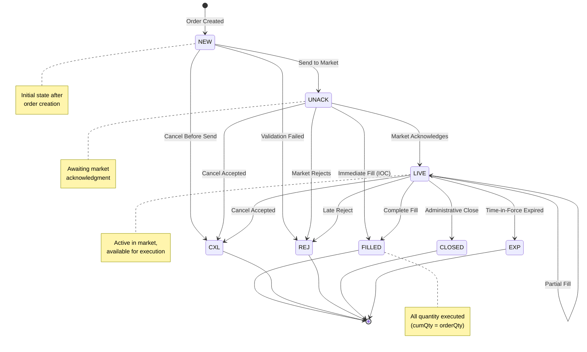
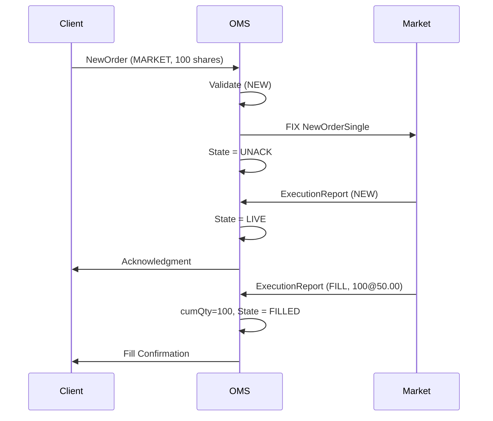
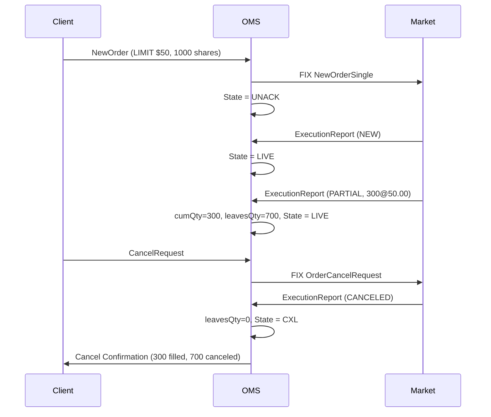
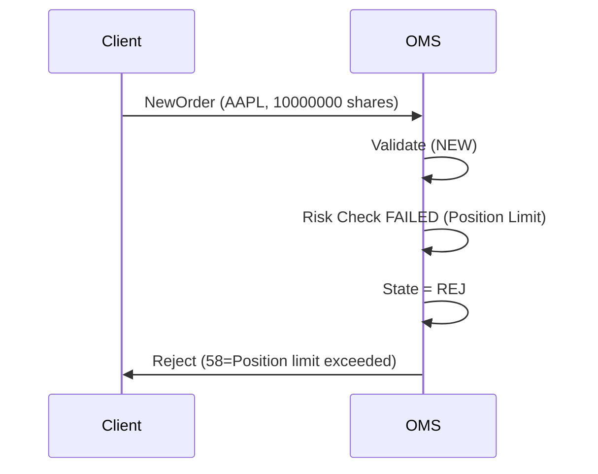
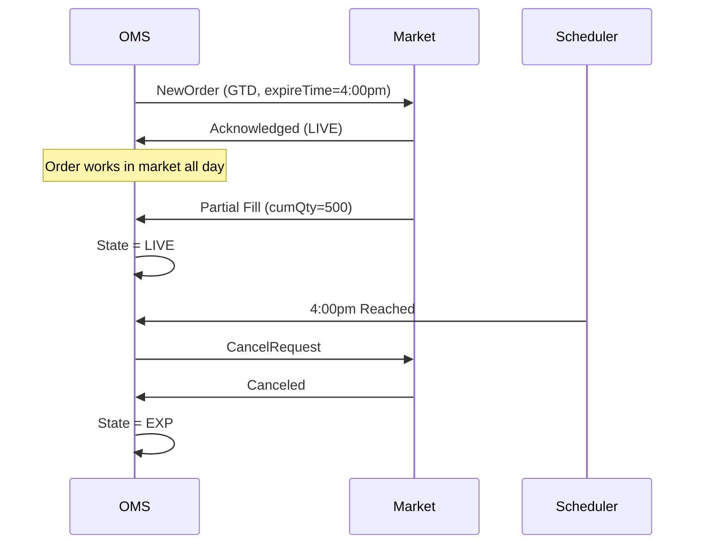

# Order Lifecycle Management Specification

**Version:** 1.0
**Last Updated:** 2026-02-14
**Author:** OMS Team
**Status:** Active

---

## 1. Overview

This specification provides a unified reference for order state transitions throughout the complete order lifecycle in the Order Management System (OMS). It consolidates state machine mechanics, business workflows, and FIX protocol semantics into a single authoritative document.

**Scope:** From order creation (NEW) to terminal states (FILLED, CXL, REJ, CLOSED, EXP).

**Purpose:** Enable developers to understand and implement order lifecycle logic correctly by providing:
- Complete state diagram with all transitions
- Business triggers for each state change
- FIX protocol mappings
- Error paths and edge cases
- Example workflows

---

## 2. Order States

### 2.1 State Definitions

The `State` enum defines all possible order states:

```java
package org.example.common.model;

public enum State {
    NEW,      // Order created, not yet sent to market
    UNACK,    // Order sent to market, awaiting acknowledgment
    LIVE,     // Order active in market (acknowledged)
    FILLED,   // Order completely filled
    CXL,      // Order canceled
    REJ,      // Order rejected
    CLOSED,   // Order closed (administrative)
    EXP       // Order expired (GTD, IOC timeout)
}
```

### 2.2 State Categories

**Working States** (order can still be executed):
- `NEW` - Initial state
- `UNACK` - Pending market acknowledgment
- `LIVE` - Active in market

**Terminal States** (order lifecycle complete):
- `FILLED` - Successful completion
- `CXL` - Canceled
- `REJ` - Rejected
- `CLOSED` - Administratively closed
- `EXP` - Expired

---

## 3. Complete State Diagram



---

## 4. State Transition Details

### 4.1 NEW → UNACK (Send to Market)

**Business Trigger:** Order passes validation and is routed to market

**Conditions:**
- Order validation succeeds
- Risk checks pass
- Market connectivity available
- During market hours (if required)

**Actions:**
- Generate FIX NewOrderSingle (35=D) message
- Set `state = UNACK`
- Record `sendingTime`
- Update `placeQty` on parent order

**FIX Message:**
```
35=D|11=CLIENT123|55=AAPL|54=1|38=100|40=2|44=150.00|...
```

### 4.2 NEW → REJ (Validation Failed)

**Business Trigger:** Order fails pre-trade validation

**Conditions:**
- Invalid symbol
- Price out of bounds (limit up/down)
- Insufficient buying power
- Position limit exceeded
- Duplicate `clOrdId`

**Actions:**
- Set `state = REJ`
- Generate rejection message to client
- Record rejection reason in `text` field

**FIX Message to Client:**
```
35=8|11=CLIENT123|150=8|39=8|58=Invalid symbol|...
```

### 4.3 NEW → CXL (Cancel Before Send)

**Business Trigger:** Client cancels order before market routing

**Conditions:**
- Order still in NEW state
- Cancel request received (FIX OrderCancelRequest 35=F)

**Actions:**
- Set `state = CXL`
- Set `leavesQty = 0`
- Preserve `cumQty` (should be 0)
- No market communication needed

### 4.4 UNACK → LIVE (Market Acknowledges)

**Business Trigger:** Market confirms order acceptance

**Conditions:**
- Market sends Execution Report with ExecType=NEW (150=0)
- Order validated by market

**Actions:**
- Set `state = LIVE`
- Order now available for execution
- Generate client acknowledgment

**FIX Message from Market:**
```
35=8|11=CLIENT123|150=0|39=0|...
```

### 4.5 UNACK → REJ (Market Rejects)

**Business Trigger:** Market rejects the order

**Conditions:**
- Unknown symbol at market
- Market-specific validation failure
- Order type not supported
- Price collar violation

**Actions:**
- Set `state = REJ`
- Forward rejection to client
- Record market rejection reason

### 4.6 UNACK → FILLED (Immediate Fill)

**Business Trigger:** IOC order fills immediately

**Conditions:**
- TimeInForce = IOC (Immediate or Cancel)
- Market matches immediately
- Full quantity available

**Actions:**
- Set `state = FILLED`
- Update `cumQty = orderQty`
- Set `leavesQty = 0`
- Calculate `avgPx`

### 4.7 LIVE → LIVE (Partial Fill)

**Business Trigger:** Execution received, quantity remaining

**Conditions:**
- Execution report received (150=F)
- `cumQty < orderQty` after execution

**Actions:**
- Update `cumQty` (add execution quantity)
- Update `leavesQty` (orderQty - cumQty)
- Recalculate `avgPx`
- Remain in LIVE state

**Example:**
```
Order: orderQty=1000, cumQty=0
Execution 1: lastQty=300 → cumQty=300, leavesQty=700 (LIVE)
Execution 2: lastQty=400 → cumQty=700, leavesQty=300 (LIVE)
```

### 4.8 LIVE → FILLED (Complete Fill)

**Business Trigger:** Final execution completes the order

**Conditions:**
- Execution report received
- `cumQty = orderQty` after execution

**Actions:**
- Set `state = FILLED`
- Update `cumQty = orderQty`
- Set `leavesQty = 0`
- Finalize `avgPx`
- Generate fill notification to client

**FIX Message:**
```
35=8|11=CLIENT123|150=F|39=2|14=1000|151=0|6=150.25|...
```

### 4.9 LIVE → CXL (Cancel Accepted)

**Business Trigger:** Market accepts cancel request

**Conditions:**
- Cancel request sent (FIX 35=F)
- Market confirms cancellation (ExecType=4)
- No pending executions

**Actions:**
- Set `state = CXL`
- Set `leavesQty = 0`
- Preserve `cumQty` (partial fills remain)
- Generate cancel confirmation to client

**Reference:** [Order Replace](order-replace.md) — Complete cancel/replace workflows

### 4.10 LIVE → EXP (Time-in-Force Expired)

**Business Trigger:** Order expires per time-in-force rules

**Conditions:**
- TimeInForce = GTD and `expireTime` reached
- TimeInForce = DAY and market close reached
- TimeInForce = IOC and not immediately filled

**Actions:**
- Set `state = EXP`
- Set `leavesQty = 0`
- Preserve `cumQty`
- Generate expiration notice to client

### 4.11 LIVE → CLOSED (Administrative Close)

**Business Trigger:** Manual administrative action

**Conditions:**
- Operations team closes order
- System maintenance requiring order cleanup
- Stale order cleanup process

**Actions:**
- Set `state = CLOSED`
- Set `leavesQty = 0`
- Record reason in audit log

---

## 5. Business Workflows

### 5.1 Market Order - Happy Path



**States:** NEW → UNACK → LIVE → FILLED

### 5.2 Limit Order - Partial Fill Then Cancel



**States:** NEW → UNACK → LIVE → LIVE (partial) → CXL

**Reference:** [Order Quantity Calculations](order-quantity-calculations.md) — Quantity field semantics

### 5.3 Order Rejection - Pre-Trade Validation Failure



**States:** NEW → REJ

### 5.4 IOC Order - Immediate Fill or Expire

**Scenario A: Immediate Fill**
```
NEW → UNACK → FILLED (market matches immediately)
```

**Scenario B: No Match**
```
NEW → UNACK → EXP (no liquidity, order expires)
```

### 5.5 GTD Order - Day End Expiration



**States:** NEW → UNACK → LIVE → LIVE (partial) → EXP

---

## 6. State Transition Matrix

| From State | To State | Trigger | FIX ExecType | OrdStatus |
|-----------|----------|---------|--------------|-----------|
| NEW | UNACK | Send to market | N/A | A (Pending New) |
| NEW | REJ | Validation failed | 8 (Rejected) | 8 (Rejected) |
| NEW | CXL | Cancel before send | 4 (Canceled) | 4 (Canceled) |
| UNACK | LIVE | Market acknowledges | 0 (New) | 0 (New) |
| UNACK | REJ | Market rejects | 8 (Rejected) | 8 (Rejected) |
| UNACK | CXL | Cancel accepted | 4 (Canceled) | 4 (Canceled) |
| UNACK | FILLED | Immediate fill (IOC) | F (Trade) | 2 (Filled) |
| LIVE | LIVE | Partial fill | F (Trade) | 1 (Partial) |
| LIVE | FILLED | Complete fill | F (Trade) | 2 (Filled) |
| LIVE | CXL | Cancel accepted | 4 (Canceled) | 4 (Canceled) |
| LIVE | EXP | TIF expired | C (Expired) | C (Expired) |
| LIVE | CLOSED | Admin close | N/A | N/A |

**Reference:** [State Machine Framework](../oms-framework/state-machine-framework_spec.md) — Generic state machine implementation

---

## 7. FIX Protocol Integration

### 7.1 ExecType Values (FIX Tag 150)

| Code | Name | OMS State Transition |
|------|------|---------------------|
| 0 | New | UNACK → LIVE |
| 4 | Canceled | → CXL |
| 8 | Rejected | → REJ |
| C | Expired | → EXP |
| F | Trade (Fill) | → LIVE (partial) or FILLED (complete) |

### 7.2 OrdStatus Values (FIX Tag 39)

| Code | Name | OMS State Mapping |
|------|------|-------------------|
| 0 | New | LIVE |
| 1 | Partially filled | LIVE (with cumQty > 0) |
| 2 | Filled | FILLED |
| 4 | Canceled | CXL |
| 8 | Rejected | REJ |
| A | Pending New | UNACK |
| C | Expired | EXP |

---

## 8. Quantity Field Relationships

### 8.1 Field Semantics by State

| State | orderQty | cumQty | leavesQty | Invariant |
|-------|----------|--------|-----------|-----------|
| NEW | Set | 0 | orderQty | leavesQty = orderQty - cumQty |
| UNACK | Set | 0 | orderQty | leavesQty = orderQty - cumQty |
| LIVE | Set | 0 to < orderQty | > 0 | leavesQty = orderQty - cumQty |
| LIVE (partial) | Set | > 0, < orderQty | > 0 | leavesQty = orderQty - cumQty |
| FILLED | Set | orderQty | 0 | cumQty = orderQty |
| CXL | Set | 0 to < orderQty | 0 | leavesQty forced to 0 |
| EXP | Set | 0 to < orderQty | 0 | leavesQty forced to 0 |
| REJ | Set | 0 | 0 | No executions |

**Key Invariant:** `leavesQty = orderQty - cumQty` (except when forced to 0 in terminal states)

**Reference:** [Order Quantity Calculations](order-quantity-calculations.md)

---

## 9. Error Paths and Edge Cases

### 9.1 Late Rejection

**Scenario:** Market accepts order (LIVE) but later rejects due to compliance issue.

**Path:** NEW → UNACK → LIVE → REJ

**Handling:** Rare but possible. System must handle late state transition to REJ even from LIVE.

### 9.2 Cancel While Filling

**Scenario:** Cancel request sent while execution is in-flight.

**Possible Outcomes:**
1. **Cancel accepted:** Order goes to CXL, execution ignored
2. **Cancel rejected (Too late):** Execution processed, cancel request rejected
3. **Partial fill then cancel:** Execution processed first, then cancel accepted

**Handling:** Use event sequencing and idempotency keys to ensure correct final state.

### 9.3 Duplicate Acknowledgments

**Scenario:** Market sends duplicate NEW acknowledgment.

**Handling:**
- Check if already in LIVE state
- Ignore duplicate if state unchanged
- Log warning for audit

### 9.4 Fill Without Acknowledgment

**Scenario:** Execution received before NEW acknowledgment (race condition).

**Handling:**
- Process execution
- Transition directly NEW → LIVE or NEW → FILLED
- Skip UNACK state

---

## 10. State Persistence and Event Sourcing

### 10.1 Event Types

| State Transition | Event Type | Example |
|-----------------|------------|---------|
| NEW | OrderCreatedEvent | `{ orderId, orderQty, symbol, price }` |
| → UNACK | OrderSentEvent | `{ orderId, sendingTime, exDestination }` |
| → LIVE | OrderAcknowledgedEvent | `{ orderId, execID }` |
| → LIVE (fill) | ExecutionReceivedEvent | `{ orderId, execID, lastQty, lastPx, cumQty }` |
| → FILLED | OrderFilledEvent | `{ orderId, cumQty, avgPx }` |
| → CXL | OrderCanceledEvent | `{ orderId, canceledQty, reason }` |
| → REJ | OrderRejectedEvent | `{ orderId, reason, rejectCode }` |
| → EXP | OrderExpiredEvent | `{ orderId, reason }` |

**Reference:** [OMS State Store](../oms-framework/oms-state-store.md) — Event sourcing patterns

---

## 11. Testing State Transitions

### 11.1 Unit Test Pattern

```java
@Test
void testOrderLifecycle_HappyPath() {
    // Create order
    Order order = Order.builder()
        .orderId("ORD123")
        .orderQty(BigDecimal.valueOf(1000))
        .state(State.NEW)
        .cumQty(BigDecimal.ZERO)
        .leavesQty(BigDecimal.valueOf(1000))
        .build();

    // Transition to UNACK
    order.setState(State.UNACK);
    assertEquals(State.UNACK, order.getState());

    // Transition to LIVE
    order.setState(State.LIVE);
    assertEquals(State.LIVE, order.getState());

    // Partial fill
    order.setCumQty(BigDecimal.valueOf(300));
    assertEquals(BigDecimal.valueOf(700),
        order.getOrderQty().subtract(order.getCumQty()));

    // Complete fill
    order.setCumQty(order.getOrderQty());
    order.setState(State.FILLED);
    assertEquals(State.FILLED, order.getState());
    assertEquals(BigDecimal.ZERO,
        order.getOrderQty().subtract(order.getCumQty()));
}
```

### 11.2 Integration Test Scenarios

- [ ] Market order immediate fill (NEW → UNACK → FILLED)
- [ ] Limit order partial fill then complete (NEW → UNACK → LIVE → LIVE → FILLED)
- [ ] Order rejection at validation (NEW → REJ)
- [ ] Order rejection at market (NEW → UNACK → REJ)
- [ ] Cancel before market send (NEW → CXL)
- [ ] Cancel after acknowledgment (LIVE → CXL)
- [ ] GTD expiration (LIVE → EXP)
- [ ] IOC expiration (UNACK → EXP)

---

## 12. Monitoring and Alerts

### 12.1 Key Metrics

| Metric | Description | Alert Threshold |
|--------|-------------|-----------------|
| `orders_in_unack` | Orders stuck in UNACK | > 100 for > 5 minutes |
| `unack_to_live_duration_p99` | Time to market acknowledgment | > 2 seconds |
| `live_to_filled_duration_p99` | Time from live to filled | > 30 seconds (for market orders) |
| `rejection_rate` | % of orders rejected | > 5% |
| `cancel_accept_rate` | % of cancel requests accepted | < 95% |

### 12.2 Dashboard Views

- **Order State Distribution** - Pie chart of orders by current state
- **State Transition Timeline** - Time-series of state changes
- **Stuck Orders** - Orders in UNACK > threshold
- **Rejection Reasons** - Top rejection reasons by count

---

## 13. Related Documents

- [State Machine Framework](../oms-framework/state-machine-framework_spec.md) — Generic state machine implementation and configuration
- [Order Replace](order-replace.md) — Complete cancel/replace workflows and FIX semantics
- [Domain Model](../oms-framework/domain-model_spec.md) — Order entity field definitions and State enum
- [Order Quantity Calculations](order-quantity-calculations.md) — Quantity field calculations (cumQty, leavesQty)
- [Task Orchestration Framework](../oms-framework/task-orchestration-framework_spec.md) — StateTransitionTask usage in pipelines
- [OMS State Store](../oms-framework/oms-state-store.md) — Event sourcing for state transitions

---

**Document Status:** This is a living document. Update when new states or transitions are added to the system.
