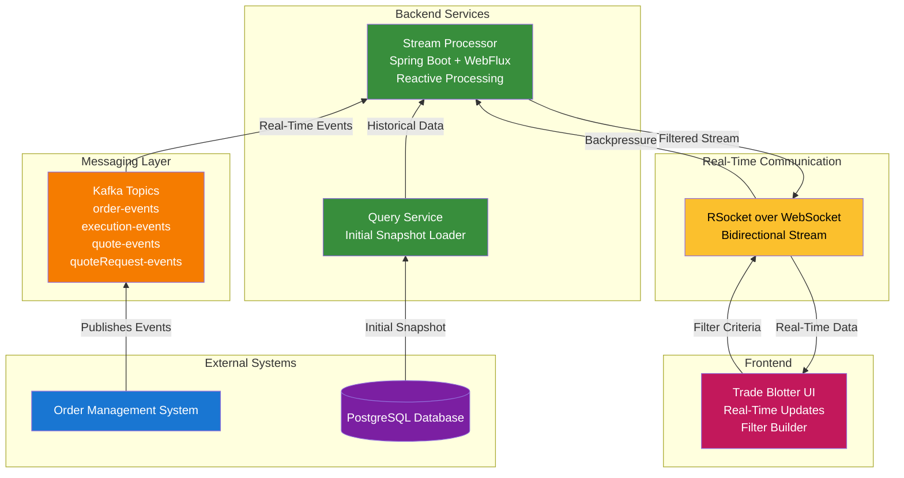

# Trade Blotter Backend Component Specification

---

## Table of Contents

1. [Introduction](#1-introduction)
2. [Goals](#2-goals)
3. [Architecture and Principles](#3-architecture-and-principles)
4. [Technology Stack](#4-technology-stack)
5. [Visual Concepts & UI Design](#visual-concepts--ui-design)
6. [Data Model](#5-data-model)
7. [Endpoints](#6-endpoints)
8. [Data Flow](#7-data-flow)
9. [Filtering](#8-filtering)
10. [Real-Time Communication](#9-real-time-communication)
11. [Error Handling](#10-error-handling)
12. [Security](#11-security)
13. [Scalability and Performance](#12-scalability-and-performance)
14. [Monitoring and Logging](#13-monitoring-and-logging)
15. [API Versioning](#14-api-versioning)
16. [Improvements and Considerations](#improvements-and-considerations)

---

**1. Introduction**

This document specifies the design and functionality of the backend component responsible for providing real-time data streams to the Trade Blotter user interface. The Trade Blotter allows users to monitor and manage orders, executions, quote requests, and quotes, with customizable filters and views. This component will provide the data feed, metadata, and filtering capabilities required to support the Trade Blotter's functionality.

**2. Goals**

*   Provide a real-time, low-latency data stream to the Trade Blotter UI.
*   Support customizable filters defined by the user.
*   Offer metadata describing the available data fields and their properties.
*   Enable flow control and backpressure to handle varying consumer speeds.
*   Provide an efficient mechanism for initializing the data stream with historical data.
*   Support multiple concurrent Trade Blotter instances with different configurations.

**3. Architecture and Principles**

*   **Reactive Programming:** Leverage Spring Reactor and WebFlux for asynchronous, non-blocking data processing.
*   **Streaming Architecture:** Design the component to efficiently handle high volumes of real-time data.
*   **Scalability and Performance:** Optimize the component for low latency and high throughput.
*   **Loose Coupling:** Decouple the backend from the UI implementation details as much as possible.
*   **Resilience:** Ensure the component can gracefully handle errors and recover from failures.

**4. Technology Stack**

*   **Programming Language:** Java 21
*   **Framework:** Spring Boot, Spring WebFlux, Spring Reactor
*   **Reactive Data Access:** Spring Data R2DBC
*   **Messaging:** Confluent Kafka (for receiving real-time events)
*   **Real-Time Protocol:** RSocket over WebSocket (for bidirectional communication with the UI)
*   **Serialization:** JSON with Jackson

## Visual Concepts & UI Design

### Trade Blotter Interface

```
---------------------------------------------------
| Trade Blotter                                   |
|-------------------------------------------------|
| [Filter Panel]   [Order Table / Grid]           |
|-------------------------------------------------|
| [Status] [Symbol] [Qty] [Price] [Actions]       |
|-------------------------------------------------|
| NEW     AAPL     100   175.20   [View] [Edit]   |
| FILLED  MSFT     50    320.10   [View]          |
| ...                                             |
---------------------------------------------------
| [Real-Time Updates: Connected]                  |
---------------------------------------------------
```

### Data Flow Architecture

```
   [OMS]
     |
   [Kafka Topics] ---> [Backend Stream Processor] ---> [WebSocket/RSocket] ---> [Trade Blotter UI]
     ^                 |                                 |
     |                 v                                 v
   [Query Service] <--- [Initial Snapshot Loader]         [User Filter Input]
```

### Filter Builder Interface

```
----------------------------------------------------
| Filter Builder                                   |
|--------------------------------------------------|
| Field: [status]  Operator: [equals] Value: [NEW] |
| [Add Condition] [AND/OR]                         |
| Field: [orderQty] Operator: [> ] Value: [1000]   |
|--------------------------------------------------|
| [Apply Filter]                                   |
----------------------------------------------------
```

### Architecture Diagram



**5. Data Model**

*   The data model consists of the following domain objects:
    *   `Order`
    *   `Execution`
    *   `QuoteRequest`
    *   `Quote`
*   Each domain object has a well-defined schema with attributes like:
    *   Field Name
    *   Data Type (e.g., String, Integer, Double, Date)
    *   Description
    *   Value Range (if applicable)
    *   Units (if applicable)
*   **Event Sequence:**  Each state change event includes a sequence number, allowing the backend to determine the latest version of an object.

**6. Endpoints**

*   **Data Stream Endpoint (RSocket over WebSocket):**
    *   Path: `/trade-blotter/stream`
    *   Purpose: Provides a real-time stream of domain objects to the UI.
    *   Parameters:
        *   `blotterId`:  Unique identifier for the Trade Blotter instance.
        *   `filter`: A JSON object representing the user-defined filter criteria (see Section 8).
    *   Data Format: A Flux of serialized domain objects (e.g., `Flux<Order>`, `Flux<Execution>`).
    *   Flow Control: Supports backpressure to allow the UI to control the rate of data consumption.
*   **Metadata Endpoint (REST):**
    *   Path: `/trade-blotter/metadata`
    *   Purpose: Provides metadata about the available domain objects and their attributes.
    *   Method: `GET`
    *   Response Format: JSON array containing metadata for each domain object.

    ```json
    // Example Metadata Response
    [
      {
        "objectType": "Order",
        "fields": [
          {
            "name": "orderId",
            "dataType": "String",
            "description": "Unique identifier for the order",
            "filterable": true,
            "sortable": true
          },
          {
            "name": "clOrdID",
            "dataType": "String",
            "description": "Client Order ID (FIX Tag 11)",
            "filterable": true,
            "sortable": true
          },
          // ... other fields
        ]
      },
      // ... other object types (Execution, QuoteRequest, Quote)
    ]
    ```

**7. Data Flow**

1.  **UI Request:** The UI requests a data stream from the `/trade-blotter/stream` endpoint, providing the `blotterId` and `filter`.
2.  **Initial Data Load:**
    *   The backend retrieves all entities matching the specified filter from the database or query engine. This provides an initial snapshot of the data.
    *   The retrieval uses reactive data access technologies to avoid blocking the event loop.
3.  **Kafka Event Subscription:** The backend subscribes to the relevant Kafka topics (e.g., `order-events`, `execution-events`) to receive real-time updates.
4.  **Data Merging:**
    *   The backend merges the initial data snapshot with the real-time event stream.
    *   For each event, the backend updates the corresponding domain object in the stream.
    *   The event sequence number is used to determine the latest version of each object.
5.  **Filtering:**
    *   The backend applies the user-defined filter to the merged data stream.
    *   Only objects that match the filter criteria are passed to the UI.
6.  **Data Streaming:** The backend streams the filtered data to the UI using RSocket over WebSocket.

**8. Filtering**

*   **Filter Definition:** Users define filters in the UI using a visual interface (e.g., AG Grid's filtering capabilities).
*   **Filter Format:** Filters are represented as a JSON object that is sent to the backend. The JSON object should support:
    *   **Field Name:** The name of the field to filter on.
    *   **Operator:** The comparison operator (e.g., equals, not equals, greater than, less than, contains).
    *   **Value:** The value to compare against.
    *   **Logical Operators:** Support for combining multiple filter conditions using logical operators (e.g., AND, OR, NOT).

    ```json
    // Example Filter
    {
      "logicalOperator": "AND",
      "filters": [
        {
          "fieldName": "status",
          "operator": "equals",
          "value": "NEW"
        },
        {
          "fieldName": "orderQty",
          "operator": "greaterThan",
          "value": 1000
        }
      ]
    }
    ```

*   **Filter Application:** The backend applies the filter to the data stream using reactive operators (e.g., `filter` from Spring Reactor).
*   **Security:** The filter criteria must be validated to prevent malicious users from injecting code or accessing unauthorized data. Implement safeguards to prevent SQL injection or other security vulnerabilities.

**9. Real-Time Communication (RSocket over WebSocket)**

*   **RSocket:** Use RSocket for bidirectional communication between the backend and the UI. RSocket provides features like:
    *   **Request/Response:** For the initial metadata request.
    *   **Request/Stream:** For streaming data to the UI.
    *   **Fire-and-Forget:** For sending non-critical updates from the UI to the backend.
    *   **Backpressure:** Allows the UI to control the rate of data consumption.
*   **WebSocket:** Use WebSocket as the transport layer for RSocket.
*   **Benefits:** Improved performance, scalability, and reliability compared to traditional REST-based approaches.

**10. Error Handling and Resilience Patterns**

### 10.1 WebSocket Connection Lifecycle Management

#### Server-Side Connection Handler

```java
package org.example.streaming.rsocket;

import java.time.Duration;
import org.springframework.messaging.rsocket.RSocketRequester;
import org.springframework.stereotype.Component;
import io.micrometer.core.instrument.MeterRegistry;
import io.rsocket.ConnectionSetupPayload;
import io.rsocket.RSocket;
import io.rsocket.SocketAcceptor;
import lombok.RequiredArgsConstructor;
import lombok.extern.slf4j.Slf4j;
import reactor.core.publisher.Mono;

/**
 * RSocket connection acceptor with connection lifecycle management.
 * Handles connection setup, authentication, and resource cleanup.
 */
@Component
@Slf4j
@RequiredArgsConstructor
public class TradeBlotterRSocketAcceptor implements SocketAcceptor {

    private final MeterRegistry meterRegistry;
    private final ConnectionRegistry connectionRegistry;

    @Override
    public Mono<RSocket> accept(ConnectionSetupPayload setup, RSocket sendingSocket) {
        String connectionId = extractConnectionId(setup);

        log.info("Accepting RSocket connection: {}", connectionId);

        // Track connection metrics
        meterRegistry.counter("rsocket.connections.total").increment();
        meterRegistry.gauge(
            "rsocket.connections.active",
            connectionRegistry,
            ConnectionRegistry::getActiveConnectionCount
        );

        return Mono.fromCallable(() -> {
            // Register connection
            connectionRegistry.register(connectionId, sendingSocket);

            // Setup connection cleanup on disconnect
            sendingSocket.onClose()
                .doOnError(error -> {
                    log.error("Connection {} closed with error", connectionId, error);
                    meterRegistry.counter(
                        "rsocket.connections.errors",
                        "error", error.getClass().getSimpleName()
                    ).increment();
                })
                .doFinally(signal -> {
                    log.info("Connection {} closed: {}", connectionId, signal);
                    connectionRegistry.unregister(connectionId);
                    meterRegistry.counter("rsocket.connections.closed").increment();
                })
                .subscribe();

            return sendingSocket;
        });
    }

    private String extractConnectionId(ConnectionSetupPayload setup) {
        // Extract from metadata or generate UUID
        return setup.metadataUtf8();
    }
}
```

---

#### Client-Side Connection Management (TypeScript/React)

```typescript
// TradeBlotterWebSocketClient.ts
import { RSocketClient, JsonSerializer, IdentitySerializer } from 'rsocket-core';
import RSocketWebSocketClient from 'rsocket-websocket-client';

export class TradeBlotterWebSocketClient {
  private client: RSocketClient | null = null;
  private rsocket: any = null;
  private reconnectAttempts = 0;
  private maxReconnectAttempts = 10;
  private baseReconnectDelay = 1000; // 1 second
  private maxReconnectDelay = 30000; // 30 seconds

  /**
   * Establishes WebSocket connection with exponential backoff retry.
   */
  async connect(): Promise<void> {
    try {
      const transport = new RSocketWebSocketClient({
        url: 'ws://localhost:7000/rsocket',
        wsCreator: (url) => new WebSocket(url),
      });

      this.client = new RSocketClient({
        serializers: {
          data: JsonSerializer,
          metadata: IdentitySerializer,
        },
        setup: {
          keepAlive: 60000, // 60 seconds
          lifetime: 180000, // 3 minutes
          dataMimeType: 'application/json',
          metadataMimeType: 'text/plain',
        },
        transport,
      });

      this.rsocket = await this.client.connect();

      // Reset reconnect attempts on successful connection
      this.reconnectAttempts = 0;

      // Setup connection error handler
      this.rsocket.connectionStatus().subscribe({
        onNext: (status: any) => {
          console.log('Connection status:', status);
        },
        onError: (error: Error) => {
          console.error('Connection error:', error);
          this.handleConnectionError(error);
        },
        onComplete: () => {
          console.log('Connection closed');
          this.handleDisconnect();
        },
      });

      console.log('RSocket connection established');
    } catch (error) {
      console.error('Failed to establish connection:', error);
      this.handleConnectionError(error as Error);
    }
  }

  /**
   * Handles connection errors with exponential backoff retry.
   */
  private handleConnectionError(error: Error): void {
    if (this.reconnectAttempts >= this.maxReconnectAttempts) {
      console.error('Max reconnection attempts reached');
      this.notifyUser('Connection failed. Please refresh the page.');
      return;
    }

    const delay = this.calculateReconnectDelay();
    this.reconnectAttempts++;

    console.log(
      `Reconnecting in ${delay}ms (attempt ${this.reconnectAttempts}/${this.maxReconnectAttempts})`
    );

    setTimeout(() => this.connect(), delay);
  }

  /**
   * Calculates reconnect delay with exponential backoff and jitter.
   */
  private calculateReconnectDelay(): number {
    const exponentialDelay = Math.min(
      this.baseReconnectDelay * Math.pow(2, this.reconnectAttempts),
      this.maxReconnectDelay
    );

    // Add jitter (±20%)
    const jitter = exponentialDelay * 0.2 * (Math.random() - 0.5);

    return exponentialDelay + jitter;
  }

  /**
   * Handles graceful disconnection.
   */
  private handleDisconnect(): void {
    console.log('Handling disconnection...');
    this.notifyUser('Connection lost. Reconnecting...');
    this.handleConnectionError(new Error('Connection closed'));
  }

  /**
   * Notifies user of connection status.
   */
  private notifyUser(message: string): void {
    // Dispatch event for UI to display notification
    window.dispatchEvent(
      new CustomEvent('connection-status', { detail: { message } })
    );
  }

  /**
   * Gracefully closes the connection.
   */
  disconnect(): void {
    if (this.rsocket) {
      this.rsocket.close();
      this.rsocket = null;
    }
    this.client = null;
  }
}
```

---

### 10.2 Stream Error Handling

#### Server-Side Stream Error Recovery

```java
package org.example.streaming.service;

import java.time.Duration;
import org.example.common.model.Order;
import org.springframework.stereotype.Service;
import reactor.core.publisher.Flux;
import reactor.core.publisher.Mono;
import reactor.util.retry.Retry;
import lombok.RequiredArgsConstructor;
import lombok.extern.slf4j.Slf4j;

/**
 * Trade Blotter streaming service with comprehensive error handling.
 */
@Service
@Slf4j
@RequiredArgsConstructor
public class TradeBlotterStreamService {

    private final KafkaOrderEventConsumer kafkaConsumer;
    private final OrderQueryService queryService;

    /**
     * Streams orders with error recovery and backpressure handling.
     */
    public Flux<Order> streamOrders(String blotterId, FilterCriteria filter) {
        return Flux.merge(
                loadInitialSnapshot(filter),
                streamRealTimeUpdates(filter)
            )
            .distinct(Order::getOrderId) // Deduplicate
            .onErrorResume(this::handleStreamError)
            .retryWhen(buildRetrySpec())
            .doOnError(error -> {
                log.error("Stream error for blotter {}", blotterId, error);
                meterRegistry.counter(
                    "trade_blotter.stream.errors",
                    "blotterId", blotterId
                ).increment();
            })
            .doOnCancel(() -> {
                log.info("Stream cancelled for blotter {}", blotterId);
            });
    }

    /**
     * Loads initial snapshot from database.
     */
    private Flux<Order> loadInitialSnapshot(FilterCriteria filter) {
        return queryService.findOrders(filter)
            .doOnSubscribe(s -> log.info("Loading initial snapshot"))
            .doOnComplete(() -> log.info("Initial snapshot loaded"))
            .onErrorResume(error -> {
                log.error("Failed to load initial snapshot", error);
                return Flux.empty(); // Continue with real-time stream
            });
    }

    /**
     * Streams real-time updates from Kafka.
     */
    private Flux<Order> streamRealTimeUpdates(FilterCriteria filter) {
        return kafkaConsumer.consume("order-events")
            .map(this::convertToOrder)
            .filter(order -> filter.matches(order))
            .onErrorContinue((error, value) -> {
                log.warn("Skipping event due to error: {}", value, error);
            });
    }

    /**
     * Handles stream errors with fallback strategy.
     */
    private Mono<Order> handleStreamError(Throwable error) {
        if (error instanceof KafkaException) {
            log.error("Kafka error, attempting reconnection", error);
            return Mono.empty(); // Skip this event
        } else if (error instanceof DatabaseException) {
            log.error("Database error, using cache", error);
            return Mono.empty();
        } else {
            log.error("Unexpected error in stream", error);
            return Mono.error(error); // Propagate for retry
        }
    }

    /**
     * Retry specification with exponential backoff.
     */
    private Retry buildRetrySpec() {
        return Retry.backoff(5, Duration.ofSeconds(1))
            .maxBackoff(Duration.ofSeconds(30))
            .jitter(0.5)
            .filter(error -> isRetryableError(error))
            .doBeforeRetry(signal -> {
                log.warn(
                    "Retrying stream (attempt {}): {}",
                    signal.totalRetries() + 1,
                    signal.failure().getMessage()
                );
            })
            .onRetryExhaustedThrow((spec, signal) -> {
                log.error("Retry exhausted after {} attempts", signal.totalRetries());
                return new StreamException("Stream retry exhausted", signal.failure());
            });
    }

    private boolean isRetryableError(Throwable error) {
        return error instanceof KafkaException
            || error instanceof TimeoutException
            || error instanceof IOException;
    }
}
```

---

#### Client-Side Stream Error Handling (TypeScript)

```typescript
// TradeBlotterStream.ts
import { Subscription } from 'rxjs';
import { retry, catchError, tap } from 'rxjs/operators';
import { of, throwError, timer } from 'rxjs';

export class TradeBlotterStream {
  private subscription: Subscription | null = null;

  /**
   * Subscribes to order stream with error handling.
   */
  subscribeToOrders(
    filter: FilterCriteria,
    onNext: (order: Order) => void,
    onError: (error: Error) => void
  ): void {
    this.subscription = this.client.rsocket
      .requestStream({
        data: { blotterId: this.blotterId, filter },
        metadata: String.fromCharCode('orders'.length) + 'orders',
      })
      .pipe(
        tap((order) => console.log('Received order:', order.orderId)),
        retry({
          count: 3,
          delay: (error, retryCount) => {
            console.warn(`Retry attempt ${retryCount}:`, error);
            return timer(1000 * Math.pow(2, retryCount)); // Exponential backoff
          },
        }),
        catchError((error) => {
          console.error('Stream error:', error);
          onError(error);

          // Attempt reconnection
          this.notifyUser('Stream error. Reconnecting...');
          return this.reconnectStream(filter, onNext, onError);
        })
      )
      .subscribe({
        onNext: (order) => onNext(order),
        onError: (error) => {
          console.error('Unrecoverable stream error:', error);
          onError(error);
          this.notifyUser('Connection lost. Please refresh.');
        },
        onComplete: () => {
          console.log('Stream completed');
        },
      });
  }

  /**
   * Attempts to reconnect stream after error.
   */
  private reconnectStream(
    filter: FilterCriteria,
    onNext: (order: Order) => void,
    onError: (error: Error) => void
  ) {
    return timer(5000).pipe(
      tap(() => {
        console.log('Reconnecting stream...');
        this.subscribeToOrders(filter, onNext, onError);
      }),
      catchError(() => of(null))
    );
  }

  /**
   * Unsubscribes from stream.
   */
  unsubscribe(): void {
    if (this.subscription) {
      this.subscription.unsubscribe();
      this.subscription = null;
    }
  }
}
```

---

### 10.3 Backpressure Handling

#### Server-Side Backpressure Strategy

```java
package org.example.streaming.service;

import java.time.Duration;
import org.springframework.stereotype.Service;
import reactor.core.publisher.Flux;
import reactor.core.publisher.FluxSink;
import reactor.core.scheduler.Schedulers;
import lombok.extern.slf4j.Slf4j;

/**
 * Handles backpressure scenarios when client can't keep up with server.
 */
@Service
@Slf4j
public class BackpressureHandler {

    /**
     * Streams with overflow strategy and buffering.
     */
    public Flux<Order> streamWithBackpressure(Flux<Order> source) {
        return source
            // Buffer up to 1000 items
            .onBackpressureBuffer(
                1000,
                order -> log.warn("Buffer full, dropping order: {}", order.getOrderId()),
                BufferOverflowStrategy.DROP_OLDEST
            )
            // Limit emission rate
            .limitRate(100) // Request 100 items at a time
            // Add delay between batches to prevent overwhelming client
            .delayElements(Duration.ofMillis(10))
            // Process on bounded elastic scheduler
            .publishOn(Schedulers.boundedElastic())
            .doOnRequest(n -> log.debug("Client requested {} items", n))
            .doOnCancel(() -> log.warn("Client cancelled subscription"));
    }

    /**
     * Adaptive backpressure based on client processing speed.
     */
    public Flux<Order> streamWithAdaptiveBackpressure(Flux<Order> source) {
        return Flux.create(sink -> {
            AtomicLong requestedCount = new AtomicLong(0);
            AtomicLong emittedCount = new AtomicLong(0);

            sink.onRequest(n -> {
                long current = requestedCount.addAndGet(n);
                log.debug("Client requested {} items (total: {})", n, current);

                // Adjust emission rate based on backlog
                long backlog = current - emittedCount.get();
                if (backlog > 1000) {
                    log.warn("High backlog: {} items", backlog);
                    // Could slow down Kafka consumption here
                }
            });

            source.subscribe(order -> {
                if (requestedCount.get() > emittedCount.get()) {
                    sink.next(order);
                    emittedCount.incrementAndGet();
                } else {
                    log.warn("Dropping order due to slow client: {}", order.getOrderId());
                }
            });
        }, FluxSink.OverflowStrategy.DROP);
    }
}
```

---

### 10.4 Circuit Breaker Pattern

```java
package org.example.streaming.resilience;

import java.time.Duration;
import org.springframework.stereotype.Component;
import io.github.resilience4j.circuitbreaker.CircuitBreaker;
import io.github.resilience4j.circuitbreaker.CircuitBreakerConfig;
import io.github.resilience4j.circuitbreaker.CircuitBreakerRegistry;
import io.github.resilience4j.reactor.circuitbreaker.operator.CircuitBreakerOperator;
import reactor.core.publisher.Flux;
import lombok.extern.slf4j.Slf4j;

/**
 * Circuit breaker for preventing cascading failures in streaming.
 */
@Component
@Slf4j
public class StreamCircuitBreaker {

    private final CircuitBreaker circuitBreaker;

    public StreamCircuitBreaker() {
        CircuitBreakerConfig config = CircuitBreakerConfig.custom()
            .failureRateThreshold(50) // 50% failure rate
            .slowCallRateThreshold(50) // 50% slow call rate
            .slowCallDurationThreshold(Duration.ofSeconds(5))
            .waitDurationInOpenState(Duration.ofSeconds(30))
            .permittedNumberOfCallsInHalfOpenState(5)
            .slidingWindowSize(100)
            .recordExceptions(KafkaException.class, DatabaseException.class)
            .build();

        CircuitBreakerRegistry registry = CircuitBreakerRegistry.of(config);
        this.circuitBreaker = registry.circuitBreaker("trade-blotter-stream");

        // Register event listeners
        circuitBreaker.getEventPublisher()
            .onStateTransition(event -> {
                log.warn(
                    "Circuit breaker state transition: {} -> {}",
                    event.getStateTransition().getFromState(),
                    event.getStateTransition().getToState()
                );
            })
            .onFailureRateExceeded(event -> {
                log.error("Circuit breaker failure rate exceeded: {}%", event.getFailureRate());
            });
    }

    /**
     * Wraps stream with circuit breaker protection.
     */
    public <T> Flux<T> protect(Flux<T> stream) {
        return stream
            .transformDeferred(CircuitBreakerOperator.of(circuitBreaker))
            .onErrorResume(throwable -> {
                log.error("Circuit breaker triggered", throwable);
                return Flux.empty(); // Return empty stream when circuit is open
            });
    }
}
```

---

### 10.5 Message Acknowledgment and Retry

```java
package org.example.streaming.kafka;

import org.springframework.kafka.annotation.KafkaListener;
import org.springframework.kafka.support.Acknowledgment;
import org.springframework.stereotype.Component;
import lombok.extern.slf4j.Slf4j;

/**
 * Kafka consumer with manual acknowledgment for error handling.
 */
@Component
@Slf4j
public class OrderEventConsumer {

    @KafkaListener(
        topics = "order-events",
        groupId = "trade-blotter-stream",
        containerFactory = "manualAckKafkaListenerContainerFactory"
    )
    public void consumeOrderEvent(
            OrderEvent event,
            Acknowledgment acknowledgment) {

        try {
            // Process event
            processEvent(event);

            // Acknowledge successful processing
            acknowledgment.acknowledge();

        } catch (RetryableException e) {
            log.warn("Retryable error processing event: {}", event.getOrderId(), e);
            // Don't acknowledge - Kafka will redeliver after timeout

        } catch (NonRetryableException e) {
            log.error("Non-retryable error processing event: {}", event.getOrderId(), e);
            // Acknowledge to skip bad message
            acknowledgment.acknowledge();
            // Send to dead letter queue
            sendToDeadLetterQueue(event, e);
        }
    }

    private void sendToDeadLetterQueue(OrderEvent event, Exception error) {
        // Send failed message to DLQ for manual inspection
        log.error("Sending event {} to DLQ", event.getOrderId());
    }
}
```

---

### 10.6 Monitoring and Alerting

```java
package org.example.streaming.monitoring;

import org.springframework.scheduling.annotation.Scheduled;
import org.springframework.stereotype.Component;
import io.micrometer.core.instrument.MeterRegistry;
import io.micrometer.core.instrument.Tags;
import lombok.RequiredArgsConstructor;
import lombok.extern.slf4j.Slf4j;

/**
 * Monitors WebSocket/RSocket stream health.
 */
@Component
@Slf4j
@RequiredArgsConstructor
public class StreamHealthMonitor {

    private final ConnectionRegistry connectionRegistry;
    private final MeterRegistry meterRegistry;

    @Scheduled(fixedRate = 10000) // Every 10 seconds
    public void monitorStreamHealth() {
        int activeConnections = connectionRegistry.getActiveConnectionCount();
        int stalledStreams = connectionRegistry.getStalledStreamCount();
        int errorRate = connectionRegistry.getRecentErrorCount();

        // Record metrics
        meterRegistry.gauge("stream.connections.active", activeConnections);
        meterRegistry.gauge("stream.stalled.count", stalledStreams);
        meterRegistry.gauge("stream.errors.rate", errorRate);

        // Alert if thresholds exceeded
        if (stalledStreams > 5) {
            log.warn("High number of stalled streams: {}", stalledStreams);
            sendAlert("HIGH_STALLED_STREAMS", stalledStreams);
        }

        if (errorRate > 100) {
            log.error("High stream error rate: {}", errorRate);
            sendAlert("HIGH_ERROR_RATE", errorRate);
        }
    }

    private void sendAlert(String alertType, int value) {
        // Integrate with alerting system (PagerDuty, Slack, etc.)
        log.error("ALERT: {} = {}", alertType, value);
    }
}
```

---

**Prometheus Alerts:**

```yaml
groups:
  - name: trade_blotter_streaming
    rules:
      - alert: HighStreamErrorRate
        expr: rate(trade_blotter_stream_errors_total[5m]) > 10
        for: 2m
        labels:
          severity: critical
        annotations:
          summary: "High stream error rate detected"
          description: "Stream error rate is {{ $value }} errors/sec"

      - alert: StreamConnectionsDropping
        expr: rate(rsocket_connections_closed_total[5m]) > 5
        for: 5m
        labels:
          severity: warning
        annotations:
          summary: "High connection drop rate"
          description: "{{ $value }} connections/min closing"

      - alert: CircuitBreakerOpen
        expr: circuit_breaker_state{name="trade-blotter-stream"} == 1
        for: 1m
        labels:
          severity: critical
        annotations:
          summary: "Circuit breaker is OPEN"
          description: "Trade blotter stream circuit breaker triggered"
```

**11. Security**

*   **Authentication and Authorization:** Implement authentication and authorization to ensure that only authorized users can access the data stream.
*   **Data Encryption:** Encrypt data in transit using TLS.
*   **Input Validation:** Validate all user inputs to prevent security vulnerabilities.
*   **Rate Limiting:** Implement rate limiting to prevent abuse.

**12. Scalability and Performance**

*   **Asynchronous Processing:** Leverage asynchronous processing and non-blocking I/O to maximize performance.
*   **Caching:** Implement caching to reduce database load (if applicable).
*   **Horizontal Scalability:** Design the component to be horizontally scalable.

**13. Monitoring and Logging**

*   **Metrics:** Expose key metrics (e.g., data stream latency, throughput, error rates) for monitoring.
*   **Logging:** Implement comprehensive logging to facilitate debugging and troubleshooting.
*   **Distributed Tracing:** Use distributed tracing to track requests across multiple services.

**14. API Versioning**

*   Implement API versioning to allow for future changes to the API without breaking existing clients.

**Improvements and Considerations:**

*   **Filter Pushdown:** If you are using a query engine that supports filter pushdown (e.g., Apache Arrow Flight), explore the possibility of pushing the filter logic down to the query engine to improve performance.  This reduces the amount of data that needs to be transferred over the network.
*   **GraphQL Considerations:**  While GraphQL offers flexibility, it also adds complexity.  Carefully weigh the benefits of GraphQL against the overhead of implementing and maintaining a GraphQL API.  For simple use cases, a well-designed REST API with clear filtering capabilities might be sufficient.
*   **Initial Load Optimization:** Explore strategies for optimizing the initial data load, such as:
    *   Using a read replica database to avoid impacting the performance of the primary database.
    *   Using pagination to load data in smaller chunks.
    *   Caching the initial data snapshot in memory.
*   **Testing:** Implement thorough unit, integration, and end-to-end tests to ensure the component's functionality and reliability.  Pay particular attention to testing the filtering logic and the real-time data streaming.
*   **Documentation:** Create comprehensive documentation for the component, including API documentation, usage examples, and troubleshooting guides.

---

## Related Documents

- [OMS State Store](../oms-framework/oms-state-store.md) — Event emission to Kafka topics after state mutations
- [State Query Store](../oms-framework/state-query-store_spec.md) — Read model synchronization from event streams
- [OMS Admin UI](../ui/oms-admin-ui_spec.md) — Real-time UI updates via WebSocket/RSocket streaming
- [Domain Model](../oms-framework/domain-model_spec.md) — Domain objects (Order, Execution, Quote, QuoteRequest) being streamed
