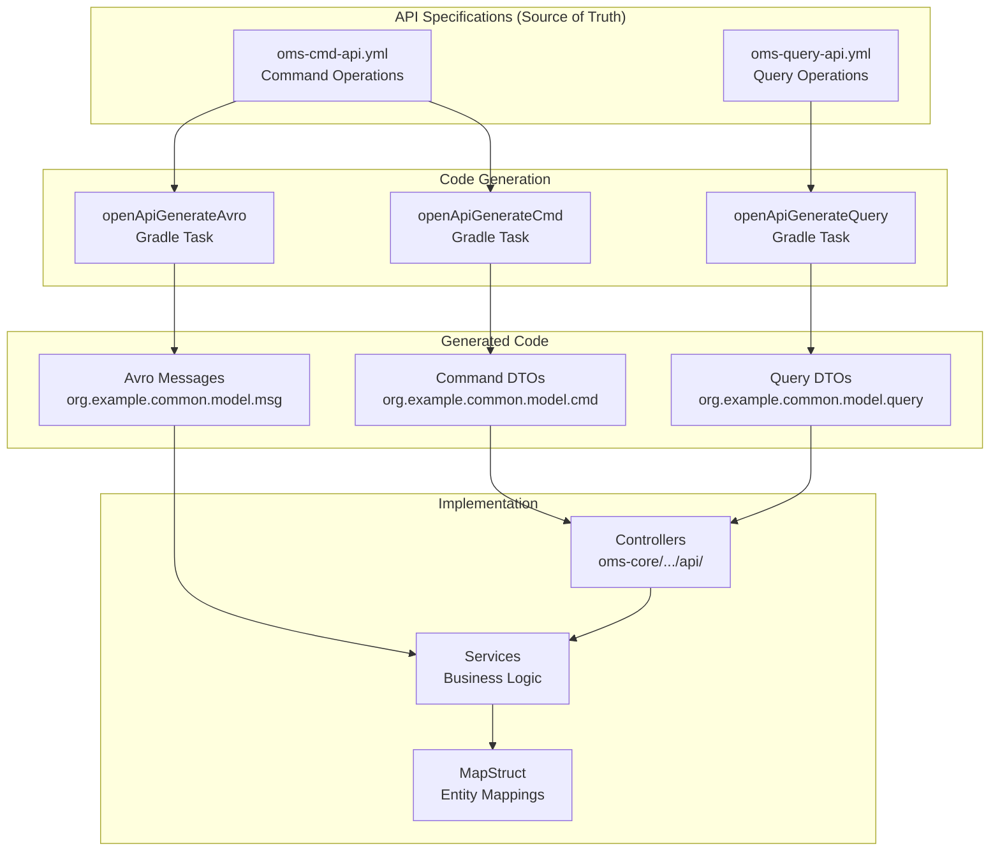

# OpenAPI Contracts and Code Generation Guide

**Version:** 1.0
**Last Updated:** 2026-02-14
**Author:** OMS Team
**Status:** Active

---

## 1. Overview

This specification documents the OpenAPI-based API contracts for the Order Management System (OMS) and provides a comprehensive guide to the code generation workflow. The OMS follows a **specification-first** approach where OpenAPI YAML files are the source of truth for all API definitions.

**Scope:** Command API, Query API, and Avro message schema generation

**Purpose:** Enable developers to:
- Understand the API structure and available endpoints
- Generate DTOs and controller interfaces from specifications
- Maintain consistency between spec and implementation
- Implement new endpoints correctly

---

## 2. API Contract Files

### 2.1 File Locations

| API Type | File Path | Purpose |
|----------|-----------|---------|
| **Command API** | `oms-core/src/main/openapi/oms-cmd-api.yml` | Order create, modify, cancel commands |
| **Query API** | `oms-core/src/main/openapi/oms-query-api.yml` | Order queries, search, filtering |

### 2.2 API Architecture



---

## 3. Command API (oms-cmd-api.yml)

### 3.1 Purpose

The Command API handles **write operations** that modify system state:
- Creating new orders
- Modifying existing orders
- Canceling orders
- Processing executions

### 3.2 Key Endpoints

| HTTP Method | Path | Operation | Request DTO | Response |
|-------------|------|-----------|-------------|----------|
| POST | `/api/commands/orders` | Create order | `OrderCreateCmd` | `TxInfo` |
| POST | `/api/commands/orders/accept` | Accept order | `OrderAcceptCmd` | `TxInfo` |
| POST | `/api/commands/orders/cancel` | Cancel order | `OrderCancelCmd` | `TxInfo` |
| POST | `/api/commands/orders/replace` | Replace order | `OrderReplaceCmd` | `TxInfo` |
| POST | `/api/commands/executions` | Create execution | `ExecutionCreateCmd` | `TxInfo` |

### 3.3 Command DTO Structure

**Example: OrderCreateCmd**

```java
// Generated from oms-cmd-api.yml
package org.example.common.model.cmd;

import lombok.experimental.SuperBuilder;
import lombok.extern.jackson.Jacksonized;
import java.math.BigDecimal;
import java.time.Instant;

@SuperBuilder
@Jacksonized
public class OrderCreateCmd {
    private String orderId;
    private String clOrdId;          // FIX Tag 11
    private String sessionId;
    private String symbol;           // FIX Tag 55
    private BigDecimal orderQty;     // FIX Tag 38
    private BigDecimal price;        // FIX Tag 44
    private String ordType;          // FIX Tag 40 (MARKET, LIMIT, etc.)
    private String side;             // FIX Tag 54 (BUY, SELL)
    private String timeInForce;      // FIX Tag 59 (DAY, GTC, IOC)
    private String account;          // FIX Tag 1
    private Instant sendingTime;     // FIX Tag 52
    // ... additional fields
}
```

### 3.4 Response Format

All command endpoints return `TxInfo`:

```java
public class TxInfo {
    private Long txNr;              // Transaction number
    private String orderId;         // Business order ID
    private String status;          // SUCCESS, FAILED
    private String message;         // Status message
    private Instant timestamp;      // Transaction timestamp
}
```

---

## 4. Query API (oms-query-api.yml)

### 4.1 Purpose

The Query API handles **read operations** following CQRS pattern:
- Retrieving orders by ID
- Searching orders with filters
- Paginated order lists
- Order status queries

### 4.2 Key Endpoints

| HTTP Method | Path | Operation | Query Params | Response DTO |
|-------------|------|-----------|--------------|--------------|
| GET | `/api/query/orders/{orderId}` | Get order by ID | - | `OrderDto` |
| GET | `/api/query/orders` | List orders | `page`, `size` | `PagedOrderDto` |
| POST | `/api/query/orders/search` | Search orders | - | `PagedOrderDto` |
| GET | `/api/query/orders/by-clordid` | Get by client order ID | `clOrdId`, `sessionId` | `OrderDto` |
| GET | `/api/query/executions` | List executions | `page`, `size`, `orderId` | `PagedExecutionDto` |

### 4.3 Query DTO Structure

**Example: OrderDto**

```java
// Generated from oms-query-api.yml
package org.example.common.model.query;

import lombok.experimental.SuperBuilder;
import lombok.extern.jackson.Jacksonized;
import java.math.BigDecimal;
import java.time.Instant;

@SuperBuilder
@Jacksonized
public class OrderDto {
    private Long id;                 // Internal ID
    private String orderId;          // Business ID
    private String clOrdId;
    private String sessionId;
    private String symbol;
    private BigDecimal orderQty;
    private BigDecimal cumQty;
    private BigDecimal leavesQty;
    private String state;            // Order state
    private String ordType;
    private String side;
    private BigDecimal price;
    private Instant sendingTime;
    private Instant transactTime;
    // ... additional fields
}
```

**Example: PagedOrderDto**

```java
public class PagedOrderDto {
    private List<OrderDto> content;  // Order list
    private Integer page;            // Current page number
    private Integer size;            // Page size
    private Long totalElements;      // Total record count
    private Integer totalPages;      // Total page count
    private Boolean last;            // Is last page
}
```

### 4.4 Search Request Format

```java
public class OrderSearchRequest {
    private String symbol;           // Filter by symbol
    private String state;            // Filter by state
    private String side;             // Filter by side (BUY/SELL)
    private String account;          // Filter by account
    private Instant fromDate;        // Date range start
    private Instant toDate;          // Date range end
    private Integer page;            // Page number (0-indexed)
    private Integer size;            // Page size (default: 100)
    private String sortBy;           // Sort field
    private String sortDirection;    // ASC, DESC
}
```

**Reference:** [State Query Store](state-query-store_spec.md) — CQRS read model patterns

---

## 5. Code Generation Workflow

### 5.1 Gradle Tasks

Code generation is configured in `oms-core/build.gradle`:

```gradle
// Command API Generation
task openApiGenerateCmd(type: org.openapitools.generator.gradle.plugin.tasks.GenerateTask) {
    generatorName = "spring"
    inputSpec = "$projectDir/src/main/openapi/oms-cmd-api.yml"
    outputDir = "$buildDir/generated"
    apiPackage = "org.example.common.api.cmd"
    modelPackage = "org.example.common.model.cmd"
    configOptions = [
        useSpringBoot3: "true",
        skipDefaultInterface: "true",
        enumPropertyNaming: "original",
        modelNameSuffix: "",
        additionalModelTypeAnnotations: "@lombok.experimental.SuperBuilder @lombok.extern.jackson.Jacksonized"
    ]
}

// Query API Generation
task openApiGenerateQuery(type: org.openapitools.generator.gradle.plugin.tasks.GenerateTask) {
    generatorName = "spring"
    inputSpec = "$projectDir/src/main/openapi/oms-query-api.yml"
    outputDir = "$buildDir/generated"
    apiPackage = "org.example.common.api.query"
    modelPackage = "org.example.common.model.query"
    configOptions = [
        useSpringBoot3: "true",
        skipDefaultInterface: "true",
        enumPropertyNaming: "original",
        modelNameSuffix: "",
        additionalModelTypeAnnotations: "@lombok.experimental.SuperBuilder @lombok.extern.jackson.Jacksonized"
    ]
}

// Avro Schema Generation
task openApiGenerateAvro(type: org.openapitools.generator.gradle.plugin.tasks.GenerateTask) {
    generatorName = "avro-schema"
    inputSpec = "$projectDir/src/main/openapi/oms-cmd-api.yml"
    outputDir = "$buildDir/generated-avro"
    configOptions = [
        packageName: "org.example.common.model.msg"
    ]
}
```

### 5.2 Running Code Generation

```powershell
# Windows PowerShell

# Generate all (command + query + avro)
.\gradlew.bat openApiGenerateCmd openApiGenerateQuery openApiGenerateAvro

# Or run a full clean build (regenerates everything)
.\gradlew.bat clean build

# Generate only command API
.\gradlew.bat openApiGenerateCmd

# Generate only query API
.\gradlew.bat openApiGenerateQuery

# Generate only Avro schemas
.\gradlew.bat openApiGenerateAvro
```

```bash
# Unix/Linux/Mac

# Generate all
./gradlew openApiGenerateCmd openApiGenerateQuery openApiGenerateAvro

# Full clean build
./gradlew clean build
```

### 5.3 Generated Code Locations

| Generated Artifact | Output Location |
|-------------------|-----------------|
| Command DTOs | `build/generated/src/main/java/org/example/common/model/cmd` |
| Command API interfaces | `build/generated/src/main/java/org/example/common/api/cmd` |
| Query DTOs | `build/generated/src/main/java/org/example/common/model/query` |
| Query API interfaces | `build/generated/src/main/java/org/example/common/api/query` |
| Avro schemas (.avsc) | `build/generated-avro/` |

**Note:** Generated code is **not committed to version control**. It is regenerated on every build.

---

## 6. Implementing Endpoints

### 6.1 Controller Implementation Pattern

**Step 1: Create Controller Class**

```java
package org.example.oms.api;

import org.example.common.api.cmd.OrderCommandApi;  // Generated interface
import org.example.common.model.cmd.OrderCreateCmd;
import org.example.common.model.cmd.TxInfo;
import org.springframework.web.bind.annotation.RestController;
import lombok.RequiredArgsConstructor;

@RestController
@RequiredArgsConstructor
public class OrderCommandController implements OrderCommandApi {

    private final OrderService orderService;

    @Override
    public ResponseEntity<TxInfo> createOrder(OrderCreateCmd command) {
        TxInfo result = orderService.createOrder(command);
        return ResponseEntity.ok(result);
    }
}
```

**Step 2: Implement Service Layer**

```java
package org.example.oms.service;

import org.example.common.model.cmd.OrderCreateCmd;
import org.example.common.model.cmd.TxInfo;
import org.example.oms.model.Order;
import org.springframework.stereotype.Service;
import lombok.RequiredArgsConstructor;

@Service
@RequiredArgsConstructor
public class OrderService {

    private final OrderRepository repository;
    private final OrderMapper mapper;

    public TxInfo createOrder(OrderCreateCmd command) {
        // 1. Map DTO to entity
        Order order = mapper.commandToEntity(command);

        // 2. Apply business logic
        order.setState(State.NEW);
        order.setLeavesQty(order.getOrderQty());

        // 3. Persist
        order = repository.save(order);

        // 4. Return transaction info
        return TxInfo.builder()
            .orderId(order.getOrderId())
            .txNr(order.getTxNr())
            .status("SUCCESS")
            .timestamp(Instant.now())
            .build();
    }
}
```

**Step 3: Create MapStruct Mapper**

```java
package org.example.oms.mapping;

import org.example.common.model.cmd.OrderCreateCmd;
import org.example.common.model.query.OrderDto;
import org.example.oms.model.Order;
import org.mapstruct.Mapper;
import org.mapstruct.Mapping;

@Mapper(componentModel = "spring")
public interface OrderMapper {

    // Command DTO → Entity
    @Mapping(source = "clOrdId", target = "clOrdId")
    Order commandToEntity(OrderCreateCmd command);

    // Entity → Query DTO
    OrderDto entityToDto(Order order);
}
```

**Reference:** [Domain Model](domain-model_spec.md) — Entity definitions and MapStruct patterns

---

## 7. Modifying API Contracts

### 7.1 Workflow for Adding New Endpoint

1. **Update OpenAPI YAML**
   ```yaml
   # oms-cmd-api.yml
   paths:
     /api/commands/orders/modify:
       post:
         operationId: modifyOrder
         requestBody:
           content:
             application/json:
               schema:
                 $ref: '#/components/schemas/OrderModifyCmd'
         responses:
           '200':
             content:
               application/json:
                 schema:
                   $ref: '#/components/schemas/TxInfo'
   ```

2. **Define Schema Component**
   ```yaml
   components:
     schemas:
       OrderModifyCmd:
         type: object
         required:
           - orderId
           - newPrice
         properties:
           orderId:
             type: string
           newPrice:
             type: number
             format: double
   ```

3. **Regenerate Code**
   ```powershell
   .\gradlew.bat openApiGenerateCmd
   ```

4. **Implement Controller Method**
   ```java
   @Override
   public ResponseEntity<TxInfo> modifyOrder(OrderModifyCmd command) {
       TxInfo result = orderService.modifyOrder(command);
       return ResponseEntity.ok(result);
   }
   ```

5. **Test**
   ```java
   @Test
   void testModifyOrder() {
       OrderModifyCmd cmd = OrderModifyCmd.builder()
           .orderId("ORD123")
           .newPrice(BigDecimal.valueOf(150.50))
           .build();

       TxInfo result = controller.modifyOrder(cmd).getBody();

       assertNotNull(result);
       assertEquals("SUCCESS", result.getStatus());
   }
   ```

### 7.2 Breaking vs Non-Breaking Changes

**Non-Breaking Changes** (safe to deploy):
- Adding new optional fields
- Adding new endpoints
- Adding new enum values

**Breaking Changes** (require coordination):
- Removing fields
- Renaming fields
- Changing field types
- Making optional fields required
- Removing endpoints

---

## 8. Avro Schema Generation

### 8.1 Purpose

Avro schemas are generated from the Command API specification for **event messaging** via Kafka.

### 8.2 Generated Avro Files

From `oms-cmd-api.yml`, the following Avro schemas are generated:

```
build/generated-avro/
├── OrderCreateCmd.avsc
├── OrderAcceptCmd.avsc
├── OrderCancelCmd.avsc
├── OrderReplaceCmd.avsc
├── ExecutionCreateCmd.avsc
└── TxInfo.avsc
```

### 8.3 Avro Usage Pattern

```java
// Kafka producer using Avro schema
@Service
@RequiredArgsConstructor
public class OrderEventPublisher {

    private final KafkaTemplate<String, OrderCreateCmd> kafkaTemplate;

    public void publishOrderCreated(OrderCreateCmd command) {
        kafkaTemplate.send("order-events", command.getOrderId(), command);
    }
}
```

**Reference:** [OMS State Store](oms-state-store.md) — Event sourcing with Kafka and Avro

---

## 9. Configuration Options

### 9.1 Generator Configuration

| Option | Value | Effect |
|--------|-------|--------|
| `useSpringBoot3` | `true` | Generate Spring Boot 3 compatible code |
| `skipDefaultInterface` | `true` | Skip default methods in API interfaces |
| `enumPropertyNaming` | `original` | Preserve enum case from spec |
| `modelNameSuffix` | `""` | No suffix added to model names |
| `additionalModelTypeAnnotations` | `@SuperBuilder @Jacksonized` | Add Lombok annotations |

### 9.2 Customizing Generated Code

**DO:**
- ✅ Extend generated DTOs with custom methods (in separate files)
- ✅ Add validation annotations to controller methods
- ✅ Customize serialization with Jackson annotations

**DON'T:**
- ❌ Edit generated files directly (will be overwritten)
- ❌ Commit generated code to version control
- ❌ Rely on generated code for business logic

---

## 10. Testing Generated APIs

### 10.1 Controller Integration Test

```java
@SpringBootTest(webEnvironment = WebEnvironment.RANDOM_PORT)
@AutoConfigureMockMvc
class OrderCommandControllerIntegrationTest {

    @Autowired
    private MockMvc mockMvc;

    @Autowired
    private ObjectMapper objectMapper;

    @Test
    void testCreateOrder() throws Exception {
        OrderCreateCmd command = OrderCreateCmd.builder()
            .clOrdId("CLIENT123")
            .sessionId("SESSION1")
            .symbol("AAPL")
            .orderQty(BigDecimal.valueOf(100))
            .price(BigDecimal.valueOf(150.00))
            .ordType("LIMIT")
            .side("BUY")
            .timeInForce("DAY")
            .build();

        mockMvc.perform(post("/api/commands/orders")
                .contentType(MediaType.APPLICATION_JSON)
                .content(objectMapper.writeValueAsString(command)))
            .andExpect(status().isOk())
            .andExpect(jsonPath("$.status").value("SUCCESS"))
            .andExpect(jsonPath("$.orderId").isNotEmpty());
    }
}
```

---

## 11. Best Practices

### 11.1 Specification-First Development

1. **Define API in YAML first** before writing any code
2. **Generate code** using Gradle tasks
3. **Implement controllers** against generated interfaces
4. **Test against spec** using OpenAPI validation

### 11.2 Versioning Strategy

- **Major version in path:** `/api/v1/commands/orders`, `/api/v2/commands/orders`
- **Breaking changes:** Require new major version
- **Backward compatibility:** Maintain old versions during migration period

### 11.3 Documentation

- **Swagger UI** available at: `http://localhost:8080/swagger-ui.html`
- **OpenAPI JSON** available at: `http://localhost:8080/v3/api-docs`
- Use `@Operation` annotations for custom descriptions

---

## 12. Troubleshooting

### 12.1 Common Issues

**Issue:** Generated code not found
```
Solution: Run ./gradlew clean build to regenerate
```

**Issue:** Type mismatch errors after regeneration
```
Solution: Invalidate IDE caches and restart
```

**Issue:** Gradle task not found
```
Solution: Check build.gradle has openapi-generator plugin:
plugins {
    id 'org.openapi.generator' version '7.0.1'
}
```

**Issue:** Lombok annotations not working
```
Solution: Ensure Lombok plugin installed in IDE
Check additionalModelTypeAnnotations in build.gradle
```

---

## 13. Related Documents

- [Domain Model](domain-model_spec.md) — Entity definitions and mapping patterns
- [Order Lifecycle](../oms-concepts/order-lifecycle.md) — State transitions exposed via Command API
- [OMS State Store](oms-state-store.md) — Event sourcing with Avro schemas
- [State Query Store](state-query-store_spec.md) — CQRS query patterns
- [Task Orchestration Framework](task-orchestration-framework_spec.md) — Command handler orchestration

---

**Document Status:** Living document - update when API contracts evolve
