# State Machine Framework Specification

**Version:** 1.0  
**Last Updated:** October 10, 2025  
**Status:** Implementation Complete

---

## Table of Contents

1. [Overview](#1-overview)
2. [Architecture](#2-architecture)
3. [Core Components](#3-core-components)
4. [Configuration](#4-configuration)
5. [Usage Patterns](#5-usage-patterns)
6. [State Diagrams](#6-state-diagrams)
7. [Examples](#7-examples)
8. [Best Practices](#8-best-practices)
9. [Testing](#9-testing)

---

## 1. Overview

### 1.1 Purpose

The State Machine Framework provides a generic, type-safe, and configurable way to validate state transitions in domain models. It enables declarative definition of valid state transitions and provides runtime validation to ensure business rules are enforced.

### 1.2 Key Features

- **Type-Safe:** Generic implementation works with any enum type
- **Immutable:** Thread-safe, immutable configuration
- **Configurable:** Fluent builder API for easy configuration
- **Functional:** Support for functional programming patterns
- **Comprehensive:** Handles initial states, terminal states, and transition sequences
- **Validated:** Detailed validation results with error information

### 1.3 Design Principles

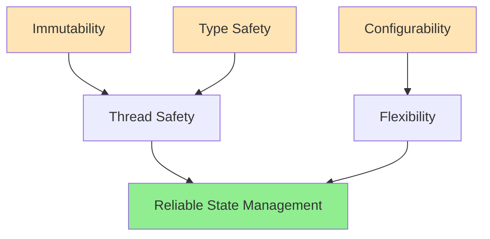

---

## 2. Architecture

### 2.1 Component Overview

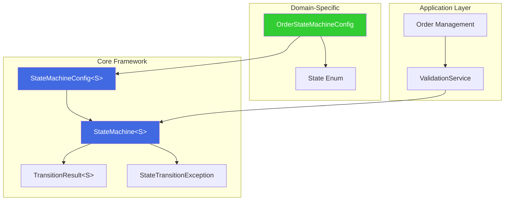

### 2.2 Class Diagram

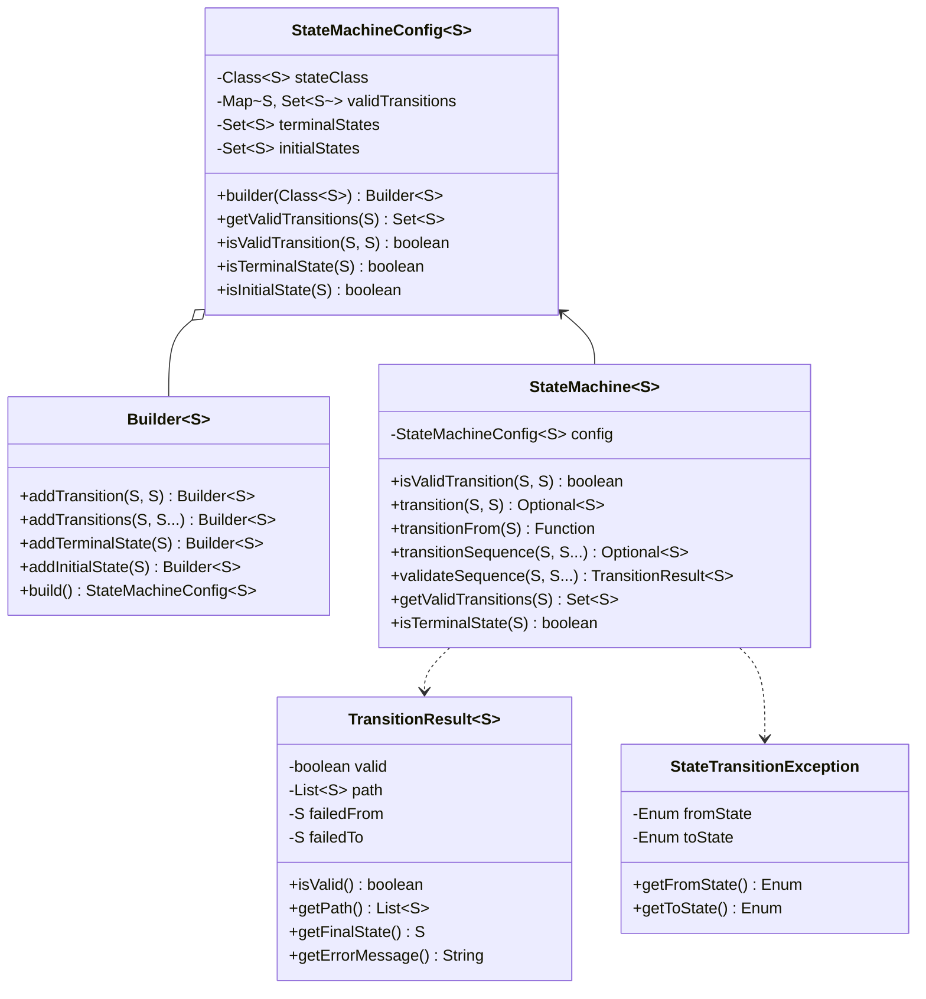

---

## 3. Core Components

### 3.1 StateMachineConfig

Immutable configuration defining valid state transitions.

**Responsibilities:**
- Define valid state transitions
- Track terminal and initial states
- Provide validation logic
- Ensure immutability and thread-safety

**Key Methods:**
- `builder(Class<S>)` - Create a new builder
- `isValidTransition(S, S)` - Validate a single transition
- `getValidTransitions(S)` - Get all valid target states

### 3.2 StateMachine

Main orchestrator for state transition validation.

**Responsibilities:**
- Execute transition validation
- Support functional programming patterns
- Validate transition sequences
- Provide detailed results

**Key Methods:**
- `transition(S, S)` - Attempt a state transition
- `transitionFrom(S)` - Create a transition function
- `transitionSequence(S, S...)` - Validate a sequence
- `validateSequence(S, S...)` - Get detailed validation results

### 3.3 TransitionResult

Detailed result of a transition sequence validation.

**Responsibilities:**
- Track validation success/failure
- Maintain complete transition path
- Provide error details
- Support debugging and auditing

### 3.4 StateTransitionException

Exception for invalid state transitions.

**Use Cases:**
- Throwing exceptions on invalid transitions
- Providing detailed error context
- Integration with error handling frameworks

---

## 4. Configuration

### 4.1 Builder Pattern

The framework uses a fluent builder pattern for configuration:

```java
StateMachineConfig<State> config = StateMachineConfig.builder(State.class)
    .addInitialState(State.NEW)
    .addTransition(State.NEW, State.UNACK)
    .addTransitions(State.UNACK, State.LIVE, State.REJ)
    .addTransitions(State.LIVE, State.FILLED, State.CXL, State.REJ)
    .addTransition(State.FILLED, State.CLOSED)
    .addTerminalState(State.CLOSED)
    .build();
```

### 4.2 Predefined Configurations

The `OrderStateMachineConfig` provides three predefined configurations:

#### Standard Configuration

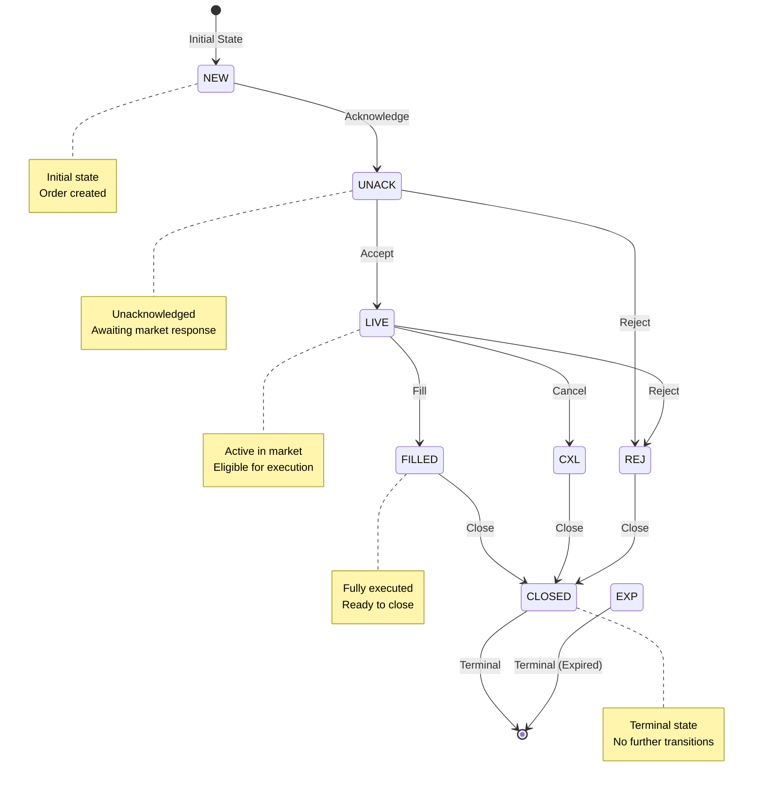

#### Simplified Configuration

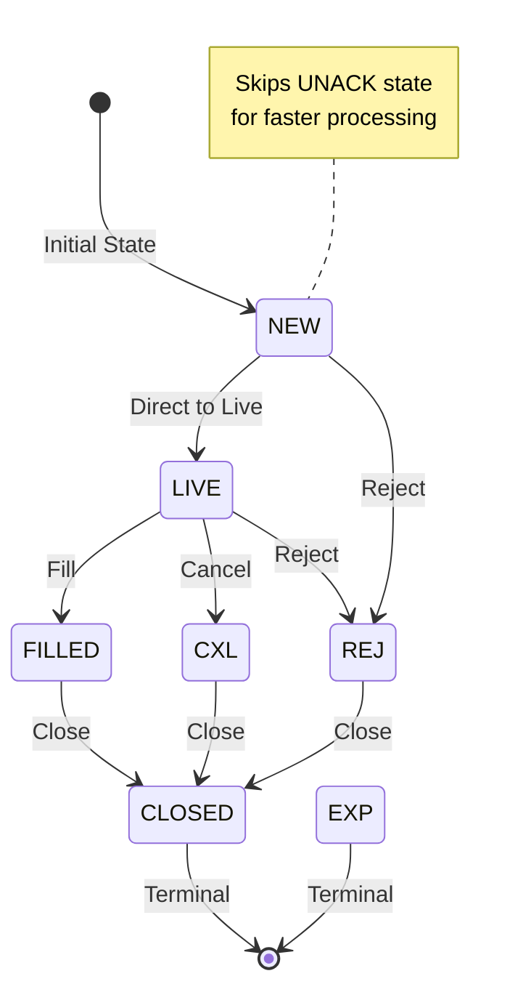

#### Extended Configuration

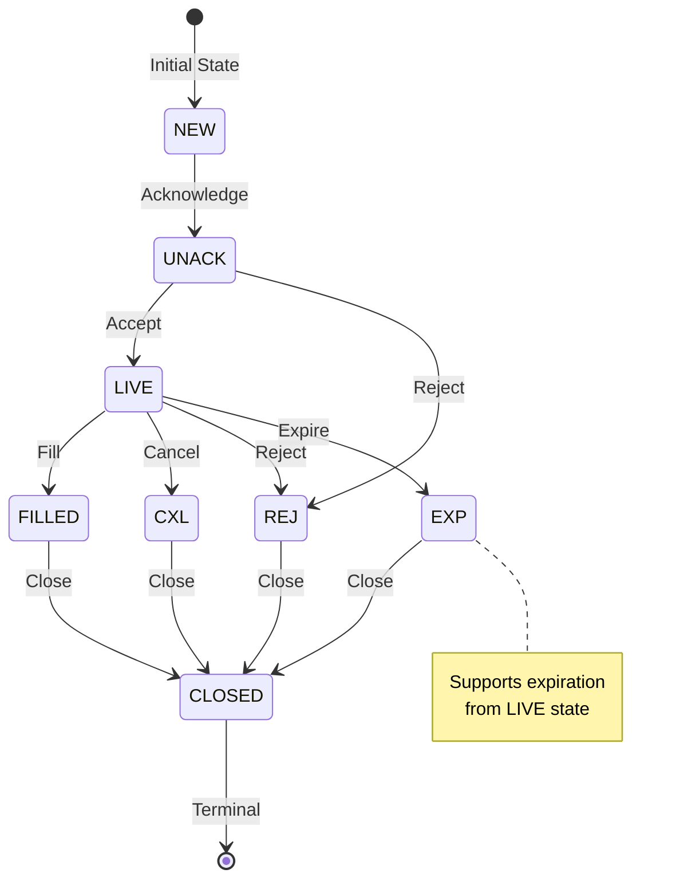

---

## 5. Usage Patterns

### 5.1 Basic Validation

```java
StateMachine<State> machine = OrderStateMachineConfig.createStandard();

// Validate a single transition
if (machine.isValidTransition(currentState, targetState)) {
    // Perform transition
    order.setState(targetState);
}

// Or use Optional pattern
machine.transition(currentState, targetState)
    .ifPresent(newState -> order.setState(newState));
```

### 5.2 Sequence Validation

```java
// Validate entire order lifecycle
Optional<State> finalState = machine.transitionSequence(
    State.NEW,
    State.UNACK,
    State.LIVE,
    State.FILLED,
    State.CLOSED
);

if (finalState.isPresent()) {
    System.out.println("Valid order lifecycle: " + finalState.get());
}
```

### 5.3 Detailed Validation Results

```java
StateMachine.TransitionResult<State> result = machine.validateSequence(
    State.NEW,
    State.LIVE  // Invalid in standard config
);

if (!result.isValid()) {
    System.out.println(result.getErrorMessage());
    System.out.println("Failed at: " + result.getFailedFrom().get() 
                      + " -> " + result.getFailedTo().get());
    System.out.println("Valid path: " + result.getPath());
}
```

### 5.4 Functional Programming

```java
// Create transition function for a specific state
Function<State, Optional<State>> liveTransitions = 
    machine.transitionFrom(State.LIVE);

// Use in stream operations
List<State> validNextStates = possibleStates.stream()
    .map(liveTransitions)
    .filter(Optional::isPresent)
    .map(Optional::get)
    .collect(Collectors.toList());
```

---

## 6. State Diagrams

### 6.1 Complete Order Lifecycle

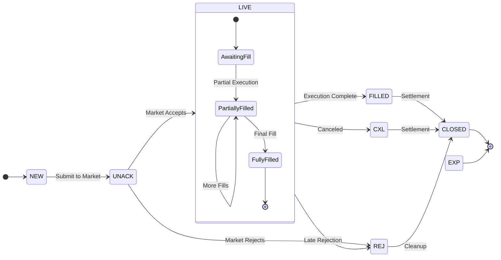

### 6.2 Error Paths

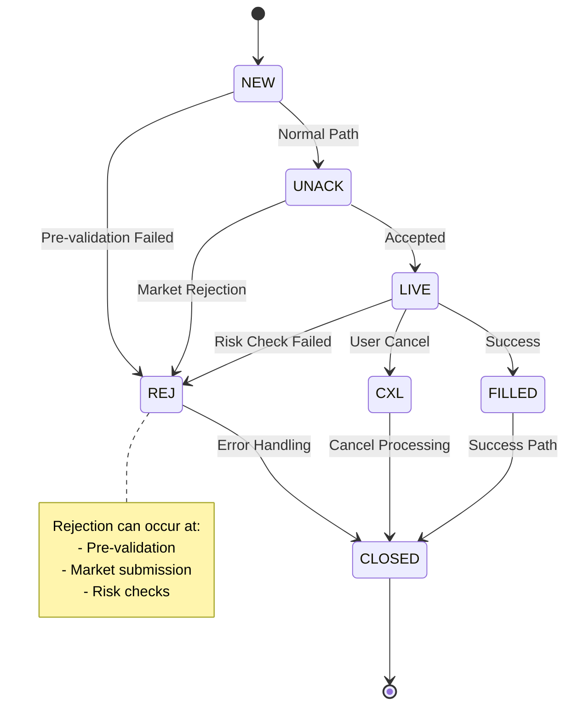

### 6.3 State Transition Matrix

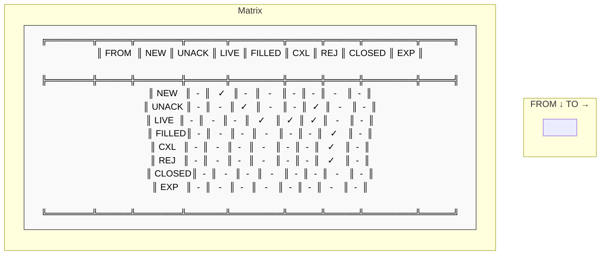

---

## 7. Examples

### 7.1 Order Creation and Execution

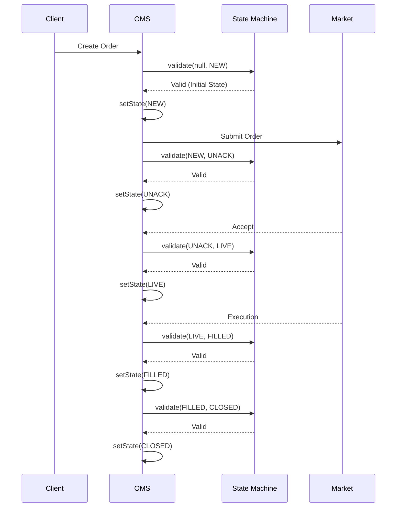

### 7.2 Order Rejection Flow

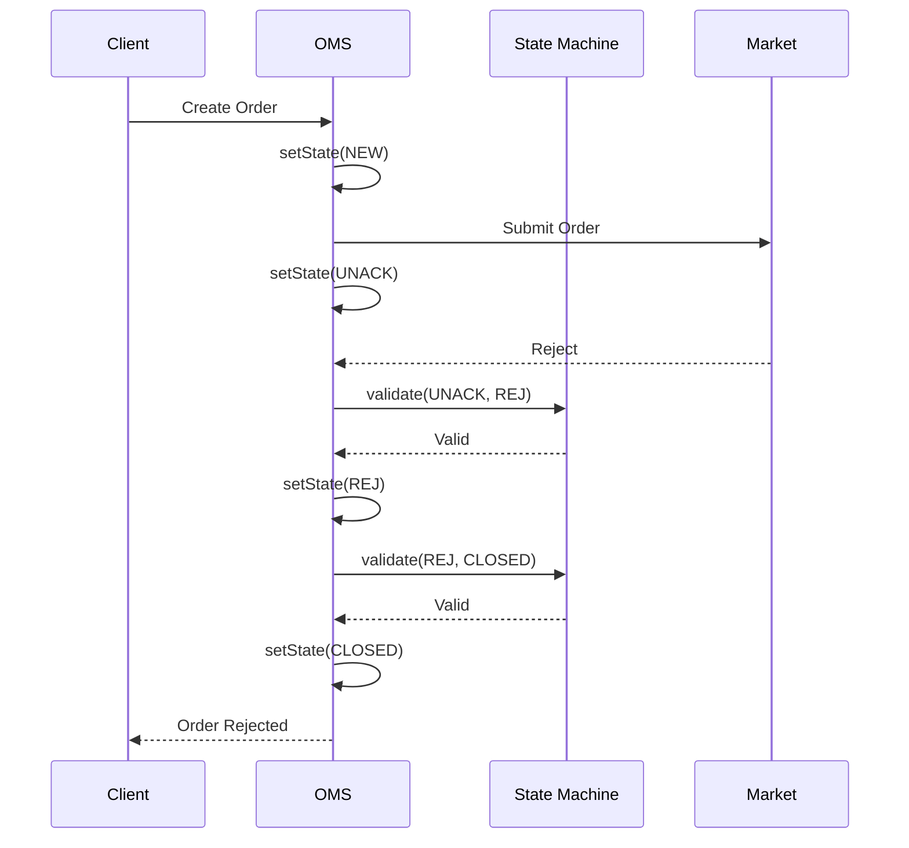

### 7.3 Invalid Transition Handling

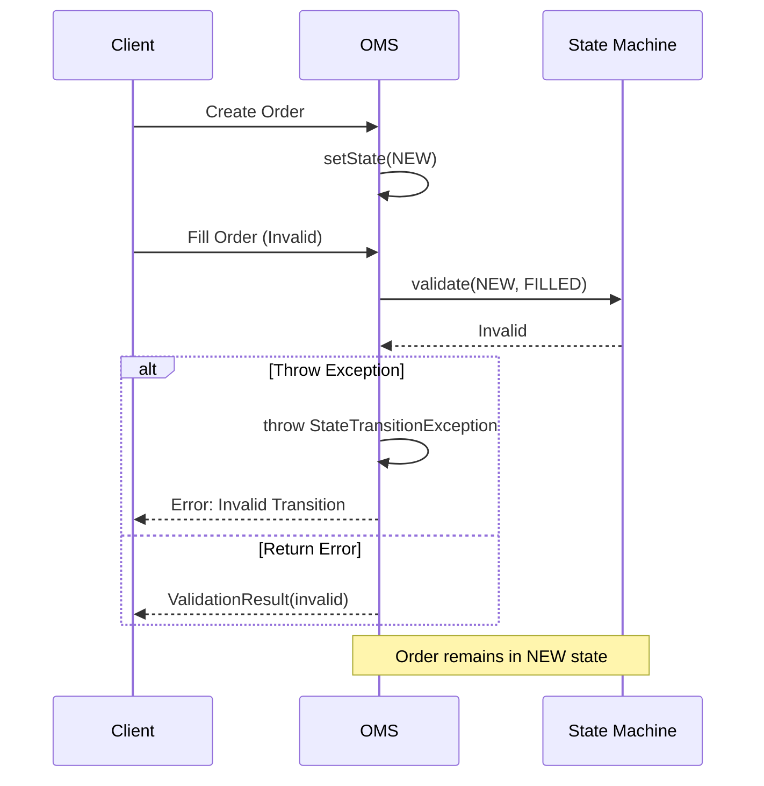

---

## 8. Best Practices

### 8.1 Configuration Design

**DO:**
- Define clear initial and terminal states
- Keep state transitions unidirectional when possible
- Document business rules for each transition
- Use predefined configurations when applicable

**DON'T:**
- Create circular dependencies without business justification
- Allow transitions from terminal states
- Skip validation in critical paths

### 8.2 Error Handling

```java
// Option 1: Optional pattern (graceful)
machine.transition(from, to)
    .ifPresentOrElse(
        newState -> order.setState(newState),
        () -> log.warn("Invalid transition: {} -> {}", from, to)
    );

// Option 2: Exception pattern (fail-fast)
if (!machine.isValidTransition(from, to)) {
    throw new StateTransitionException(from, to);
}
order.setState(to);

// Option 3: Result pattern (detailed)
var result = machine.validateSequence(initial, steps);
if (!result.isValid()) {
    handleError(result.getErrorMessage());
}
```

### 8.3 Testing Strategy

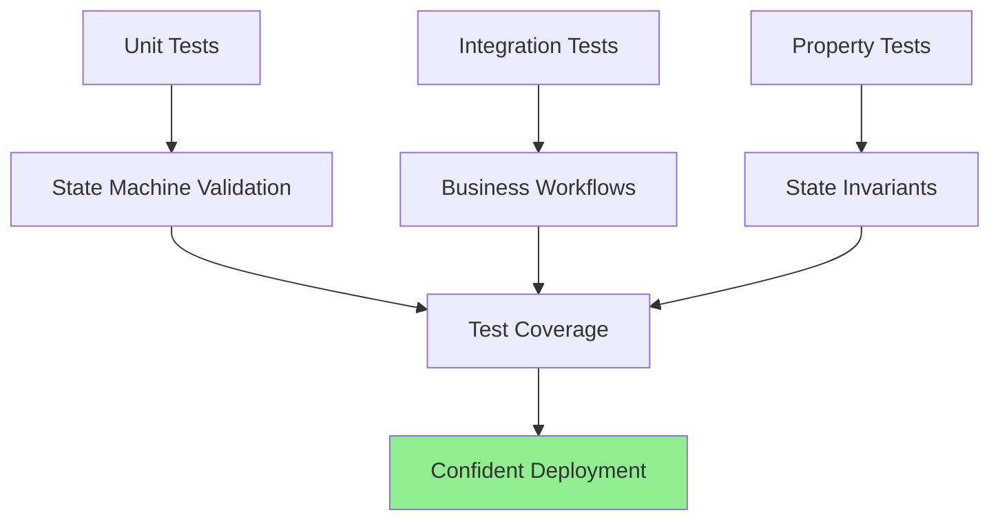

**Test Coverage:**
1. Valid transitions for each state
2. Invalid transitions rejection
3. Complete lifecycle sequences
4. Error path handling
5. Terminal state behavior
6. Initial state validation

---

## 9. Testing

### 9.1 Test Structure

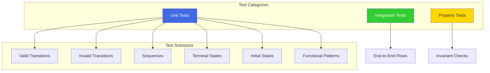

### 9.2 Test Examples

See `StateMachineTest.java` for comprehensive test coverage including:

- **Standard State Machine Tests:** Core transition validation
- **Simplified State Machine Tests:** Alternative configuration testing
- **Transition Result Tests:** Detailed result validation
- **Functional Programming Tests:** Higher-order function testing
- **Initial and Terminal State Tests:** Boundary condition testing
- **Null Safety Tests:** Defensive programming validation

### 9.3 Running Tests

```bash
# Run all state machine tests
./gradlew test --tests "org.example.common.state.*"

# Run specific test class
./gradlew test --tests "StateMachineTest"

# Run with coverage
./gradlew test jacocoTestReport
```

---

## 10. Integration Example

### 10.1 Service Layer Integration

```java
@Service
public class OrderService {
    
    private final StateMachine<State> stateMachine = 
        OrderStateMachineConfig.createStandard();
    
    public void processOrder(Order order, State newState) {
        State currentState = order.getState();
        
        var result = stateMachine.transition(currentState, newState);
        
        result.ifPresentOrElse(
            validState -> {
                order.setState(validState);
                orderRepository.save(order);
                publishStateChangeEvent(order, currentState, validState);
            },
            () -> {
                throw new StateTransitionException(currentState, newState,
                    "Cannot transition order " + order.getId() + 
                    " from " + currentState + " to " + newState);
            }
        );
    }
}
```

### 10.2 Complete Workflow

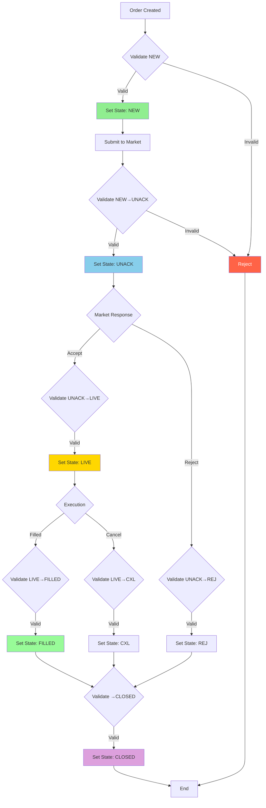

---

## 11. Extensibility

### 11.1 Custom State Enums

```java
public enum QuoteState {
    PENDING, QUOTED, ACCEPTED, REJECTED, EXPIRED
}

// Create custom configuration
StateMachineConfig<QuoteState> quoteConfig = 
    StateMachineConfig.builder(QuoteState.class)
        .addInitialState(QuoteState.PENDING)
        .addTransition(QuoteState.PENDING, QuoteState.QUOTED)
        .addTransitions(QuoteState.QUOTED, 
            QuoteState.ACCEPTED, QuoteState.REJECTED, QuoteState.EXPIRED)
        .addTerminalStates(QuoteState.ACCEPTED, 
            QuoteState.REJECTED, QuoteState.EXPIRED)
        .build();

StateMachine<QuoteState> quoteMachine = new StateMachine<>(quoteConfig);
```

### 11.2 Context-Aware Validation

```java
public interface ContextAwareStateMachine<S extends Enum<S>, C> {
    boolean isValidTransition(S from, S to, C context);
}

// Example: Order amount affects allowed transitions
public class OrderStateMachineWithContext 
    implements ContextAwareStateMachine<State, Order> {
    
    private final StateMachine<State> baseMachine;
    
    @Override
    public boolean isValidTransition(State from, State to, Order order) {
        // Base validation
        if (!baseMachine.isValidTransition(from, to)) {
            return false;
        }
        
        // Context-specific rules
        if (to == State.LIVE && order.getAmount() > MAX_AUTO_APPROVE) {
            return false; // Requires manual approval
        }
        
        return true;
    }
}
```

---

## 12. Performance Considerations

### 12.1 Complexity Analysis

| Operation | Time Complexity | Space Complexity |
|-----------|----------------|------------------|
| `isValidTransition` | O(1) | O(1) |
| `transition` | O(1) | O(1) |
| `transitionSequence` | O(n) | O(1) |
| `validateSequence` | O(n) | O(n) |
| `getValidTransitions` | O(1) | O(k)* |

*k = number of valid transitions from the state

### 12.2 Memory Usage

- **StateMachineConfig:** O(S * T) where S = number of states, T = average transitions per state
- **StateMachine:** O(1) (only holds reference to config)
- **TransitionResult:** O(n) where n = length of validated sequence

---

## 13. Conclusion

The State Machine Framework provides a robust, type-safe, and flexible foundation for managing state transitions in domain models. Its immutable design ensures thread-safety, while the fluent builder API makes configuration intuitive and maintainable.

**Key Takeaways:**
- Use predefined configurations when possible
- Validate all state transitions
- Leverage functional programming patterns
- Test comprehensively
- Extend thoughtfully

**Next Steps:**
1. Review the test suite for usage examples
2. Implement domain-specific configurations
3. Integrate with your validation layer
4. Monitor and log state transitions
5. Consider context-aware extensions for complex scenarios

---

**Document Version:** 1.0  
**Last Updated:** October 10, 2025  
**Author:** State Machine Framework Team
