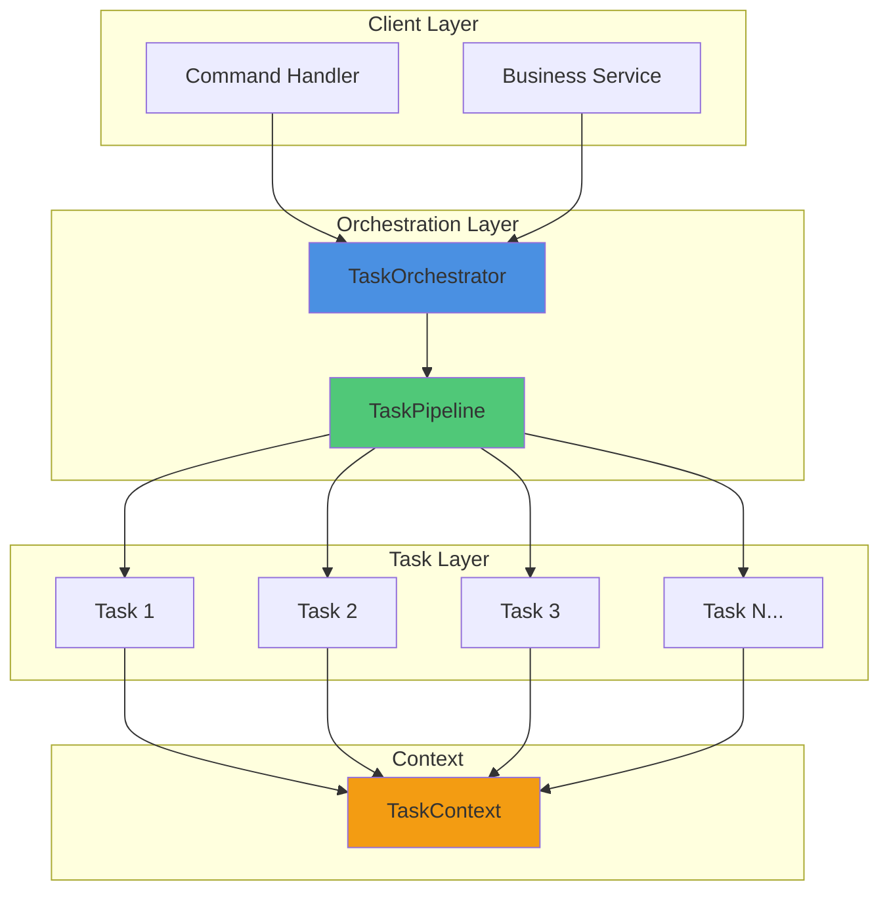
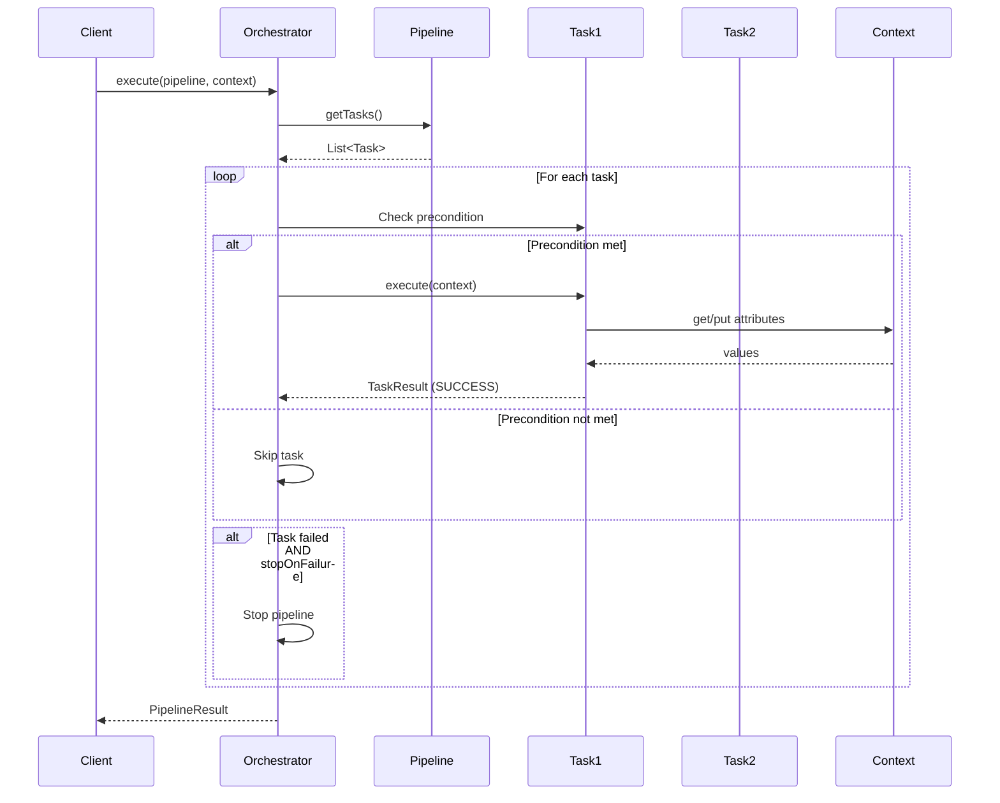
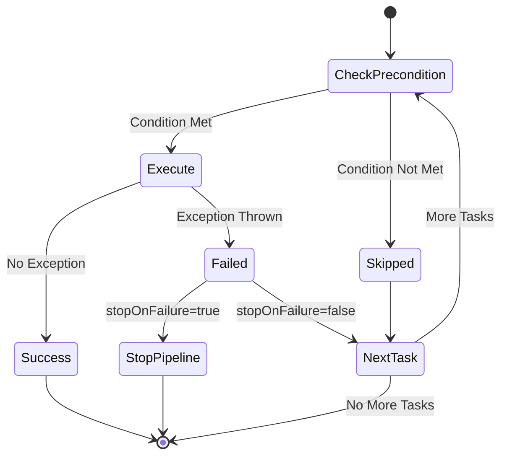
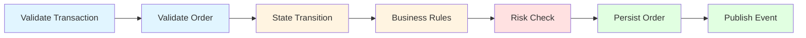

# Task Orchestration Framework Specification

## Overview

The Task Orchestration Framework provides a flexible, Spring-based architecture for executing sequences of tasks in a defined order. It enables developers to compose complex business logic from simple, reusable, testable task components.

## Design Principles

1. **Modularity**: Each task represents a single unit of work with clear responsibilities
2. **Reusability**: Tasks are Spring beans that can be composed into different pipelines
3. **Testability**: Tasks can be unit tested independently and pipelines can be integration tested
4. **Flexibility**: Support for conditional execution via predicates
5. **Observability**: Built-in logging and metrics integration
6. **Error Handling**: Comprehensive error handling with configurable failure strategies

## Architecture



## Core Components

### 1. Task Interface

The `Task<T>` interface defines the contract for all tasks in the framework.

```java
public interface Task<T extends TaskContext> {
    TaskResult execute(T context) throws TaskExecutionException;
    default String getName() { ... }
    default int getOrder() { ... }
}
```

**Key Features:**
- Generic type parameter for type-safe context handling
- `execute()` method performs the task logic
- `getName()` provides task identification for logging
- `getOrder()` determines execution priority (lower values execute first)

### 2. ConditionalTask Interface

Extends `Task` to support precondition-based execution.

```java
public interface ConditionalTask<T extends TaskContext> extends Task<T> {
    Predicate<T> getPrecondition();
    default boolean shouldExecute(T context) { ... }
    default String getSkipReason(T context) { ... }
}
```

**Key Features:**
- Predicate-based preconditions
- Automatic skip handling when precondition fails
- Custom skip reason messages

### 3. TaskContext

Central state container that flows through the pipeline.

```java
public class TaskContext {
    private final String contextId;
    private final Instant createdAt;
    private final Map<String, Object> attributes;
    private final Map<String, Object> metadata;
    
    public TaskContext put(String key, Object value) { ... }
    public <T> Optional<T> get(String key) { ... }
    // ... additional methods
}
```

**Key Features:**
- Type-safe attribute storage and retrieval
- Immutable context ID and timestamp
- Separate metadata for non-business data
- Method chaining for fluent API

**Extension Pattern:**
Domain-specific contexts can extend `TaskContext`:

```java
public class OrderTaskContext extends TaskContext {
    private Order order;
    private Transaction transaction;
    private Execution execution;
    // ... domain-specific fields
}
```

### 4. TaskResult

Encapsulates the outcome of task execution.

```java
public class TaskResult {
    public enum Status { SUCCESS, SKIPPED, FAILED, WARNING }
    
    private final Status status;
    private final String message;
    private final String taskName;
    private final List<String> warnings;
    private final List<String> errors;
    private final Exception exception;
}
```

**Factory Methods:**
- `TaskResult.success(taskName)`
- `TaskResult.success(taskName, message)`
- `TaskResult.failed(taskName, message)`
- `TaskResult.failed(taskName, exception)`
- `TaskResult.skipped(taskName, reason)`
- `TaskResult.warning(taskName, message)`

### 5. TaskPipeline

Defines a sequence of tasks to execute.

```java
public class TaskPipeline<T extends TaskContext> {
    private final String name;
    private final List<Task<T>> tasks;
    private boolean stopOnFailure;
    private boolean sortByOrder;
}
```

**Builder Pattern:**
```java
TaskPipeline<OrderTaskContext> pipeline = 
    TaskPipeline.<OrderTaskContext>builder("MyPipeline")
        .addTask(task1)
        .addTask(task2)
        .addTasks(List.of(task3, task4))
        .stopOnFailure(true)
        .sortByOrder(true)
        .build();
```

### 6. TaskOrchestrator

Executes pipelines and manages task lifecycle.

```java
@Component
public class TaskOrchestrator {
    public <T extends TaskContext> PipelineResult execute(
        TaskPipeline<T> pipeline, 
        T context
    ) { ... }
}
```

**PipelineResult:**
```java
public class PipelineResult {
    private final List<TaskResult> taskResults;
    private final boolean success;
    private final Duration executionTime;
    private final String pipelineName;
    
    public boolean hasFailures() { ... }
    public long getSuccessCount() { ... }
    // ... additional methods
}
```

## Execution Flow



## Task Execution Lifecycle



## Usage Patterns

### Pattern 1: Simple Sequential Pipeline

```java
@Service
public class OrderService {
    
    @Autowired
    private TaskOrchestrator orchestrator;
    
    @Autowired
    private ValidateOrderTask validateTask;
    
    @Autowired
    private PersistOrderTask persistTask;
    
    public void processOrder(OrderTaskContext context) {
        TaskPipeline<OrderTaskContext> pipeline = 
            TaskPipeline.<OrderTaskContext>builder("ProcessOrder")
                .addTask(validateTask)
                .addTask(persistTask)
                .stopOnFailure(true)
                .build();
        
        PipelineResult result = orchestrator.execute(pipeline, context);
        
        if (!result.isSuccess()) {
            // Handle failure
        }
    }
}
```

### Pattern 2: Conditional Task Execution

```java
@Component
public class ValidateInventoryTask implements ConditionalTask<OrderTaskContext> {
    
    @Override
    public TaskResult execute(OrderTaskContext context) {
        // Validation logic
        return TaskResult.success(getName());
    }
    
    @Override
    public Predicate<OrderTaskContext> getPrecondition() {
        return ctx -> ctx.getOrder().getSide() == Side.BUY;
    }
    
    @Override
    public String getSkipReason(OrderTaskContext context) {
        return "Inventory check only for BUY orders";
    }
}
```

### Pattern 3: Ordered Task Execution

```java
@Component
public class EarlyValidationTask implements Task<OrderTaskContext> {
    @Override
    public int getOrder() {
        return 100; // Execute early
    }
    
    @Override
    public TaskResult execute(OrderTaskContext context) {
        // Early validation
        return TaskResult.success(getName());
    }
}

@Component
public class LatePublishTask implements Task<OrderTaskContext> {
    @Override
    public int getOrder() {
        return 900; // Execute late
    }
    
    @Override
    public TaskResult execute(OrderTaskContext context) {
        // Publishing logic
        return TaskResult.success(getName());
    }
}

// In service
TaskPipeline<OrderTaskContext> pipeline = 
    TaskPipeline.<OrderTaskContext>builder("OrderedPipeline")
        .addTasks(lateTask, earlyTask) // Order doesn't matter
        .sortByOrder(true) // Will execute in order: early -> late
        .build();
```

### Pattern 4: Error Handling Strategies

**Stop on First Failure:**
```java
TaskPipeline<OrderTaskContext> pipeline = 
    TaskPipeline.<OrderTaskContext>builder("StrictPipeline")
        .addTasks(task1, task2, task3)
        .stopOnFailure(true) // Stop on first failure
        .build();
```

**Continue on Failure (Collect All Errors):**
```java
TaskPipeline<OrderTaskContext> pipeline = 
    TaskPipeline.<OrderTaskContext>builder("ResilientPipeline")
        .addTasks(task1, task2, task3)
        .stopOnFailure(false) // Execute all tasks
        .build();

PipelineResult result = orchestrator.execute(pipeline, context);

if (result.hasFailures()) {
    result.getTaskResults().stream()
        .filter(TaskResult::isFailed)
        .forEach(r -> log.error("Task failed: {}", r));
}
```

### Pattern 5: Dynamic Pipeline Construction

```java
@Service
public class DynamicOrderService {
    
    public PipelineResult processOrder(OrderTaskContext context, OrderType type) {
        TaskPipeline.Builder<OrderTaskContext> builder = 
            TaskPipeline.builder("DynamicPipeline");
        
        // Always validate
        builder.addTask(validateTask);
        
        // Conditional tasks based on order type
        if (type == OrderType.MARKET) {
            builder.addTask(marketOrderTask);
        } else if (type == OrderType.LIMIT) {
            builder.addTask(limitOrderTask);
        }
        
        // Always persist and publish
        builder.addTasks(persistTask, publishTask);
        
        TaskPipeline<OrderTaskContext> pipeline = builder.build();
        return orchestrator.execute(pipeline, context);
    }
}
```

## Integration with OMS

### Command Handler Integration

```java
@Component
public class OrderCreateCommandHandler {
    
    @Autowired
    private TaskOrchestrator orchestrator;
    
    @Autowired
    private OrderProcessingOrchestrationService orchestrationService;
    
    public TxInfo handle(OrderCreateCmd cmd) {
        // Create context from command
        OrderTaskContext context = new OrderTaskContext();
        context.setTransaction(convertToTransaction(cmd));
        context.setOrder(convertToOrder(cmd));
        
        // Execute pipeline
        PipelineResult result = orchestrationService.processNewOrder(context);
        
        // Convert to response
        return convertToTxInfo(result, context);
    }
}
```

### OMS Task Examples

The framework includes several OMS-specific task implementations:

1. **ValidateTransactionTask**: Validates transaction data
2. **ValidateOrderTask**: Validates order fields (conditional)
3. **StateTransitionTask**: Manages order state transitions (conditional)
4. **PersistOrderTask**: Persists order to database (conditional)
5. **PublishEventTask**: Publishes order events (conditional)

### Example OMS Pipeline



## Context Passing Patterns

### Attribute Storage

```java
// Store computed values
context.put("calculatedPrice", price);
context.put("riskScore", riskScore);
context.put("validationPassed", true);

// Retrieve in later tasks
Optional<BigDecimal> price = context.get("calculatedPrice");
boolean validated = context.getOrDefault("validationPassed", false);
```

### Metadata Usage

```java
// Store metadata (not modified by tasks)
context.putMetadata("correlationId", correlationId);
context.putMetadata("userId", userId);
context.putMetadata("requestTime", Instant.now());

// Retrieve for logging/auditing
Optional<String> correlationId = context.getMetadata("correlationId");
```

## Error Handling

### Task-Level Error Handling

```java
@Override
public TaskResult execute(OrderTaskContext context) throws TaskExecutionException {
    try {
        // Task logic
        return TaskResult.success(getName());
    } catch (ValidationException e) {
        // Return failed result (soft error)
        return TaskResult.failed(getName(), e.getMessage());
    } catch (CriticalException e) {
        // Throw exception (hard error, stops pipeline)
        throw new TaskExecutionException(getName(), "Critical failure", e);
    }
}
```

### Pipeline-Level Error Handling

```java
PipelineResult result = orchestrator.execute(pipeline, context);

if (result.hasFailures()) {
    log.error("Pipeline failed: {}", result.getPipelineName());
    
    result.getTaskResults().stream()
        .filter(TaskResult::isFailed)
        .forEach(taskResult -> {
            log.error("Failed task: {}", taskResult.getTaskName());
            log.error("Error: {}", taskResult.getMessage());
            taskResult.getException().ifPresent(e -> 
                log.error("Exception", e)
            );
        });
}
```

## Testing Strategies

### Unit Testing Tasks

```java
@Test
public void testValidateOrderTask_Success() {
    // Given
    ValidateOrderTask task = new ValidateOrderTask();
    OrderTaskContext context = new OrderTaskContext();
    context.setOrder(createValidOrder());
    
    // When
    TaskResult result = task.execute(context);
    
    // Then
    assertTrue(result.isSuccess());
    assertEquals("ValidateOrderTask", result.getTaskName());
}

@Test
public void testValidateOrderTask_MissingSymbol() {
    // Given
    ValidateOrderTask task = new ValidateOrderTask();
    OrderTaskContext context = new OrderTaskContext();
    context.setOrder(createOrderWithoutSymbol());
    
    // When
    TaskResult result = task.execute(context);
    
    // Then
    assertTrue(result.isFailed());
    assertTrue(result.getMessage().contains("Symbol"));
}
```

### Integration Testing Pipelines

```java
@SpringBootTest
@ActiveProfiles("test")
public class OrderPipelineIntegrationTest {
    
    @Autowired
    private TaskOrchestrator orchestrator;
    
    @Autowired
    private ValidateOrderTask validateTask;
    
    @Autowired
    private PersistOrderTask persistTask;
    
    @Test
    public void testCompleteOrderPipeline() {
        // Given
        OrderTaskContext context = createTestContext();
        TaskPipeline<OrderTaskContext> pipeline = 
            TaskPipeline.<OrderTaskContext>builder("TestPipeline")
                .addTask(validateTask)
                .addTask(persistTask)
                .build();
        
        // When
        PipelineResult result = orchestrator.execute(pipeline, context);
        
        // Then
        assertTrue(result.isSuccess());
        assertEquals(2, result.getSuccessCount());
        assertEquals(0, result.getFailedCount());
    }
}
```

### Mocking Tasks

```java
@Test
public void testPipelineWithMockedTasks() {
    // Given
    Task<OrderTaskContext> mockTask = Mockito.mock(Task.class);
    when(mockTask.getName()).thenReturn("MockTask");
    when(mockTask.execute(any())).thenReturn(TaskResult.success("MockTask"));
    
    OrderTaskContext context = new OrderTaskContext();
    TaskPipeline<OrderTaskContext> pipeline = 
        TaskPipeline.<OrderTaskContext>create("TestPipeline")
            .addTask(mockTask);
    
    // When
    PipelineResult result = orchestrator.execute(pipeline, context);
    
    // Then
    assertTrue(result.isSuccess());
    verify(mockTask, times(1)).execute(context);
}
```

## Performance Considerations

### Task Granularity

- **Fine-grained tasks**: Better reusability, more overhead
- **Coarse-grained tasks**: Better performance, less reusability
- **Recommendation**: Balance based on use case

### Context Size

- Keep context lightweight
- Use references to large objects rather than copies
- Consider clearing attributes after use if not needed downstream

### Pipeline Optimization

```java
// Avoid creating new pipelines on every execution
@Component
public class OrderService {
    
    private final TaskPipeline<OrderTaskContext> standardPipeline;
    
    @Autowired
    public OrderService(List<Task<OrderTaskContext>> tasks) {
        this.standardPipeline = TaskPipeline.<OrderTaskContext>builder("Standard")
            .addTasks(tasks)
            .sortByOrder(true)
            .build();
    }
    
    public PipelineResult process(OrderTaskContext context) {
        return orchestrator.execute(standardPipeline, context);
    }
}
```

## Observability

### Logging

The framework provides automatic logging at key points:
- Pipeline start/end
- Task execution start/end
- Task skip events
- Task failures

### Metrics

The `TaskOrchestrator` is annotated with `@Observed` for Micrometer integration:

```java
@Observed(name = "task.orchestrator.execute")
public <T extends TaskContext> PipelineResult execute(...)
```

**Available Metrics:**
- `task.orchestrator.execute` - Pipeline execution duration
- Pipeline success/failure counts
- Task-level metrics (if tasks are annotated)

### Custom Observability

```java
@Component
public class MonitoredTask implements Task<OrderTaskContext> {
    
    @Observed(name = "task.custom.execute")
    @Override
    public TaskResult execute(OrderTaskContext context) {
        // Task logic with automatic metrics
        return TaskResult.success(getName());
    }
}
```

## Best Practices

1. **Single Responsibility**: Each task should do one thing well
2. **Immutability**: Don't modify shared objects in context; create new ones
3. **Idempotency**: Tasks should be safe to retry
4. **Preconditions**: Use `ConditionalTask` for optional logic
5. **Error Messages**: Provide clear, actionable error messages
6. **Logging**: Log at appropriate levels (debug for start/end, info for key events)
7. **Testing**: Unit test tasks individually, integration test pipelines
8. **Ordering**: Use explicit `getOrder()` values for critical sequences
9. **Context Cleanup**: Remove temporary attributes when no longer needed
10. **Documentation**: Document task purposes and dependencies clearly

## Extension Points

### Custom Task Types

```java
public interface AsyncTask<T extends TaskContext> extends Task<T> {
    CompletableFuture<TaskResult> executeAsync(T context);
}
```

### Custom Result Types

```java
public class DetailedTaskResult extends TaskResult {
    private final Map<String, Object> metrics;
    private final Duration executionTime;
    // ... additional fields
}
```

### Pipeline Interceptors

```java
public interface PipelineInterceptor<T extends TaskContext> {
    void beforePipeline(TaskPipeline<T> pipeline, T context);
    void afterPipeline(TaskPipeline<T> pipeline, T context, PipelineResult result);
    void beforeTask(Task<T> task, T context);
    void afterTask(Task<T> task, T context, TaskResult result);
}
```

## Future Enhancements

1. **Parallel Task Execution**: Support for concurrent task execution
2. **Compensating Transactions**: Automatic rollback on failure
3. **Task Retry Policies**: Configurable retry with backoff
4. **Dynamic Task Registration**: Runtime task discovery
5. **Pipeline Visualization**: GraphQL/REST API for pipeline inspection
6. **Event Sourcing**: Task execution event logging
7. **Circuit Breaker**: Integration with resilience patterns
8. **Distributed Tracing**: Enhanced OpenTelemetry integration

## Conclusion

The Task Orchestration Framework provides a robust, flexible foundation for building complex business workflows in a maintainable, testable manner. By composing simple tasks into pipelines, developers can:

- Build complex logic from simple components
- Easily test individual tasks and complete workflows
- Adapt pipelines to changing requirements
- Monitor and observe workflow execution
- Handle errors consistently across the application

This framework is production-ready and can be extended to meet evolving business needs.

---

## Related Documents

- [Domain Model](domain-model_spec.md) — OrderTaskContext extends TaskContext for order processing workflows
- [State Machine Framework](state-machine-framework_spec.md) — StateTransitionTask for state validation in pipelines
- [Order Replace](../oms-concepts/order-replace.md) — Cancel/replace workflows using task orchestration
- [Order Grouping](../oms-concepts/order-grouping.md) — Group creation and allocation workflows using task pipelines
- [OMS State Store](oms-state-store.md) — PersistOrderTask implementation patterns for event sourcing
- [Task Orchestration Diagrams](../illustrations/task-orchestration-diagrams.md) — Visual architecture and sequence diagrams
