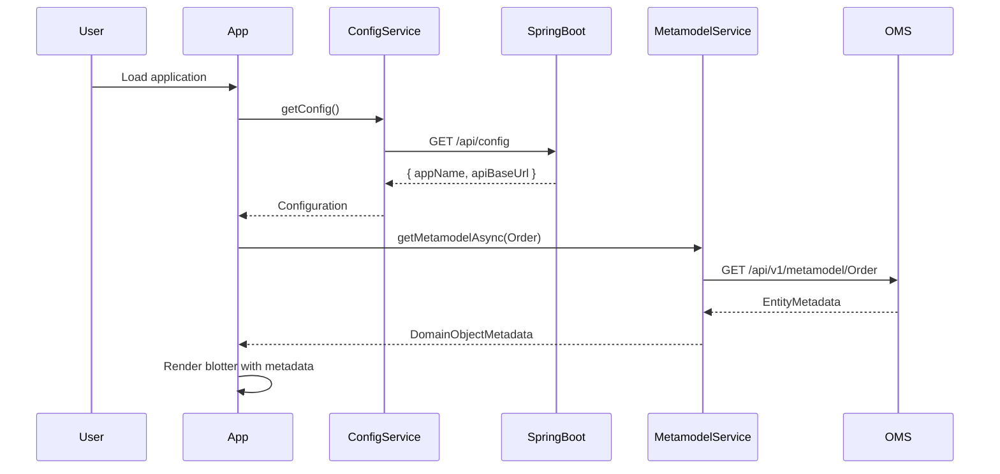
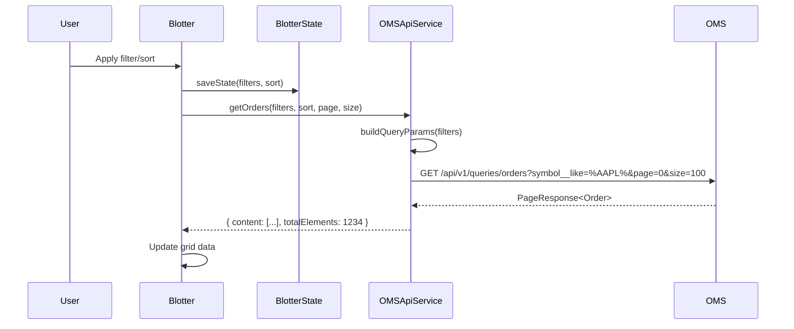
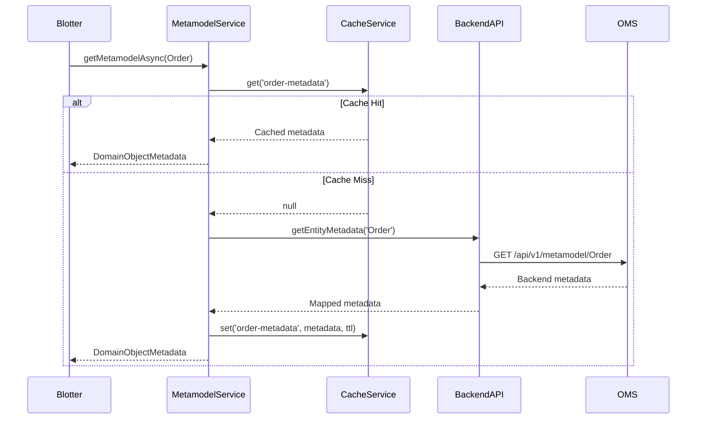
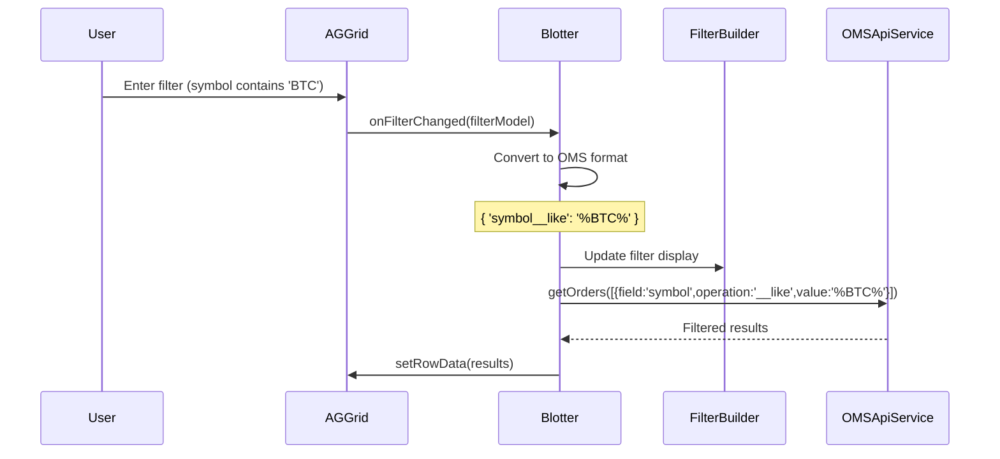
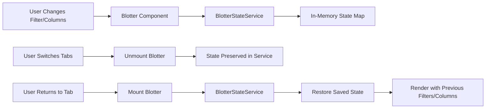

# User Interface Specification: OMS Admin Tool

## Overview

The OMS Admin Tool provides a web-based user interface for viewing and managing domain objects such as Orders, Quote Requests, Quotes, and Executions. The UI is built using **React 18.2** with **TypeScript** and leverages **AG Grid Community Edition** for advanced table rendering. The application is served by a **Spring Boot 3.5** microservice that provides static content hosting and a configuration API.

The UI connects to the Order Management System (OMS) backend via a REST API for querying domain objects and fetches metadata from the backend MetaModel service to dynamically configure table columns and filters.

## Architecture Components

### 1. Spring Boot Wrapper

The React application is packaged and served by a Spring Boot microservice (`ri-oms-ui`):

- **Purpose**: Provides a production-ready deployment container for the React SPA
- **Technology**: Spring Boot 3.5.x with Java 21
- **Key Components**:
  - `OmsUiApplication.java`: Main Spring Boot application entry point
  - `WebConfig.java`: Configures SPA routing support and CORS for development
  - `ConfigController.java`: Provides runtime configuration to the React frontend
  - `HealthController.java`: Health check endpoints for monitoring

**Configuration Endpoint** (`/api/config`):

```json
{
  "appName": "OMS Admin Tool",
  "apiBaseUrl": "http://localhost:9001"
}
```

This allows the React app to dynamically discover the OMS backend URL based on the deployment environment (local, Kubernetes, etc.).

### 2. Frontend React Application

Built with modern React patterns using functional components and hooks:

- **React 18.2**: Latest stable version with concurrent features
- **TypeScript**: Type-safe component and service development
- **AG Grid Community**: High-performance data grid with filtering, sorting, and virtual scrolling
- **React Router**: Not currently used (single-page with tab navigation)
- **SCSS**: Component-scoped styling

### 3. Backend Integration Services

**MetaModel Service Integration**:

- Fetches entity metadata from OMS backend (`/api/v1/metamodel`)
- Provides field definitions, types, constraints, and display options
- Supports both synchronous (cached) and asynchronous (backend) data fetching
- Falls back to hardcoded metamodel if backend is unavailable

**Query API Integration**:

- Connects to OMS Query Service (`/api/v1/queries`)
- Supports dynamic filtering with multiple operators
- Server-side pagination and sorting
- Filter operators: `equals`, `like`, `gt`, `gte`, `lt`, `lte`, `between`, `in`, `starts`, `ends`, `contains`

## Key Features

- **Blotter Display**: Tabular view (blotter) for Orders, Quote Requests, Quotes, and Executions
- **Dynamic Filtering**: Users can apply filters on any column with server-side filtering via Query API
- **Metamodel-driven Table**: Table columns generated from backend metamodel with automatic type handling
- **Configurable Columns**: Users can select which attributes to display with state persistence
- **State Persistence**: Filter, column, and sort preferences saved per domain object type
- **Paging and Sorting**: Server-side pagination with configurable page sizes (default 100)
- **Auto-refresh**: Optional automatic data refresh with configurable intervals
- **REST Integration**: All data fetched via REST calls with dynamic query generation
- **OAuth Token Support**: Users can configure OAuth bearer tokens for authenticated requests
- **Complex Field Support**: Expandable detail panels for nested objects (parties, accounts)

## UI Components

### 1. Main Application Shell (`App.tsx`)

The main application component provides:

- **Header**: Acme Capital logo, application title (dynamically configured), and OAuth authorization button
- **Tab Navigation**: Switchable tabs for different domain objects (Orders, Quotes, Quote Requests, Executions)
- **Feature Flags**: Configurable tab visibility via `FEATURE_FLAGS` constant
- **Authorization Status**: Visual indicator showing OAuth token status
- **Footer**: Branding and copyright information

**Tab Configuration**:

```typescript
const FEATURE_FLAGS = {
  QUOTES_ENABLED: false,        // Set to true to enable Quotes blotter
  QUOTE_REQUESTS_ENABLED: false // Set to true to enable Quote Requests blotter
};
```

Currently, only Orders and Executions blotters are enabled by default.

### 2. Blotter Component (`Blotter.tsx`)

The core data grid component with the following features:

**State Management**:

- `data`: Current page of domain objects
- `loading`: Loading indicator state
- `error`: Error message display
- `totalCount`: Total records available (for pagination)
- `currentPage`: Current page number (1-based)
- `pageSize`: Records per page (default 100)
- `filters`: Active filter conditions
- `sortModel`: Active sort configuration
- `visibleColumns`: Currently displayed columns

**Grid Configuration**:

- AG Grid with server-side data model
- Custom cell renderers for different data types (date, number, boolean, enum, object)
- Automatic column sizing with min/max width constraints
- Pinned columns for key fields (id, clOrdId)
- Filter synchronization with backend query API
- Sort synchronization with backend query API

**Event Handlers**:

- `onGridReady`: Initializes grid API reference
- `onFilterChanged`: Converts AG Grid filters to OMS query format
- `onSortChanged`: Updates sort model for backend queries
- `onRowDataUpdated`: Debug logging for data updates

### 3. Filter Builder (`FilterBuilder.tsx`)

Advanced filter UI for constructing complex queries:

- **Rule-based Filtering**: Add/remove multiple filter rules
- **Field Selection**: Dropdown of all filterable fields
- **Operator Selection**: Dynamic operators based on field type
- **Value Inputs**: Type-appropriate input controls (text, number, date, enum)
- **Range Support**: Special handling for `between` operator with two value inputs
- **Date Handling**: Automatic UTC/local time conversion for date filters
- **Apply/Clear Actions**: Apply filters to grid or clear all filters

**Filter Rule Structure**:

```typescript
interface FilterRule {
  id: string;
  field: string;      // Field name from metamodel
  operator: string;   // '', '__like', '__gt', '__gte', '__lt', '__lte', '__between', etc.
  value: any;         // Primary value
  value2?: any;       // Secondary value for range operators
}
```

### 4. Column Selector (`ColumnSelector.tsx`)

Column visibility and ordering management:

- **Checkbox List**: All available fields with selection state
- **Field Type Indicators**: Shows field type (string, number, date, etc.)
- **Complex Object Badges**: Special indicators for nested objects
- **Bulk Actions**: Select All, Select None, Default Columns buttons
- **Apply/Cancel**: Apply column changes or cancel without saving

### 5. Authorization Modal (`AuthorizeModal.tsx`)

OAuth token management interface:

- **Token Input**: Secure text input for OAuth bearer token
- **Save Token**: Stores token in `AuthTokenService` singleton
- **Clear Token**: Removes stored token
- **Persistence**: Token state maintained across page refreshes
- **Visual Indicator**: Header button shows authorization status

### 6. Specialized Blotters

Domain-specific blotter components that configure the base `Blotter` component:

- `OrderBlotter.tsx`: Orders view with default page size 100
- `QuoteBlotter.tsx`: Quotes view (feature-flagged)
- `QuoteRequestBlotter.tsx`: Quote requests view (feature-flagged)
- `ExecutionBlotter.tsx`: Executions view

### 7. Detail Panel (`DetailPanel.tsx`)

Expandable row detail for viewing complex nested objects:

- **Master-Detail Pattern**: Click to expand row and show nested data
- **JSON Display**: Formatted JSON view of complex objects (parties, accounts)
- **Syntax Highlighting**: Color-coded JSON for readability
- **Collapsible**: Click again to collapse detail view

## Service Architecture

The frontend uses a layered service architecture with clear separation of concerns:

### 1. MetaModel Service (`MetamodelService.ts`)

**Purpose**: Provides domain object metadata for dynamic UI generation

**Key Features**:

- Singleton pattern for global access
- Dual-mode operation: synchronous (cached) and asynchronous (backend)
- Fallback to static metamodel if backend unavailable
- Caching layer via `MetamodelCacheService`

**Core Methods**:

```typescript
getMetamodel(domainObject: DomainObjectType): DomainObjectMetadata
getMetamodelAsync(domainObject: DomainObjectType): Promise<DomainObjectMetadata>
getField(domainObject, fieldName): FieldMetadata
getFilterableFields(domainObject): FieldMetadata[]
getSortableFields(domainObject): FieldMetadata[]
refreshCache(): Promise<void>
```

**Metadata Structure**:

```typescript
interface DomainObjectMetadata {
  name: string;              // Entity name
  displayName: string;       // Human-readable name
  fields: FieldMetadata[];   // All field definitions
  defaultColumns: string[];  // Default visible columns
  defaultSort?: string;      // Default sort (e.g., "sendingTime,DESC")
  primaryKey: string;        // Primary key field name
}

interface FieldMetadata {
  name: string;
  displayName: string;
  type: 'string' | 'number' | 'date' | 'boolean' | 'enum' | 'object';
  required: boolean;
  enumValues?: { value: string; label: string }[];
  filterOperations?: string[];
  sortable?: boolean;
  filterable?: boolean;
  width?: number;
  minWidth?: number;
  maxWidth?: number;
  isComplexObject?: boolean;    // True for nested objects
  complexObjectType?: string;   // Type name for nested objects
}
```

### 2. Backend MetaModel API Service (`BackendMetamodelApiService.ts`)

**Purpose**: Communicates with OMS backend MetaModel API

**Endpoints**:

- `GET /api/v1/metamodel`: Get all entity metadata
- `GET /api/v1/metamodel/{entityName}`: Get specific entity metadata
- `GET /api/v1/metamodel/entities`: List all available entities
- `GET /api/v1/metamodel/health`: Health check

**Integration Pattern**:

```typescript
// Singleton with dynamic configuration from ConfigService
const service = await BackendMetamodelApiService.getInstance();
const metadata = await service.getEntityMetadata('Order');
```

### 3. MetaModel Mapping Service (`MetamodelMappingService.ts`)

**Purpose**: Converts between backend and frontend metamodel formats

**Responsibilities**:

- Maps backend entity names to frontend `DomainObjectType` enum
- Transforms backend field definitions to frontend `FieldMetadata`
- Handles type conversions and default values

### 4. MetaModel Cache Service (`MetamodelCacheService.ts`)

**Purpose**: In-memory caching for metamodel data

**Features**:

- TTL-based expiration (default 5 minutes)
- Cache hit/miss tracking
- Cache statistics for monitoring
- Automatic cleanup of expired entries

**Usage**:

```typescript
const cacheService = MetamodelCacheService.getInstance();
cacheService.set('order-metadata', metadata, 300000); // 5 minutes
const cached = cacheService.get<DomainObjectMetadata>('order-metadata');
```

### 5. OMS API Service (`OMSApiService.ts`)

**Purpose**: Query domain objects from OMS backend

**Endpoints**:

- `GET /api/v1/queries/orders`: Query orders
- `GET /api/v1/queries/orders/{id}`: Get order by ID
- `GET /api/v1/queries/quotes`: Query quotes
- `GET /api/v1/queries/quoteRequests`: Query quote requests
- `GET /api/v1/queries/executions`: Query executions

**Filter Conversion**:

```typescript
interface FilterCondition {
  field: string;
  operation: string;  // '', '__like', '__gt', '__gte', '__lt', '__lte', '__between', etc.
  value: any;
}

// Builds query parameters from filters
private buildQueryParams(filters: FilterCondition[], sort?, page?, size?): QueryParams
```

**Helper Methods**:

```typescript
OMSApiService.equals(field, value)
OMSApiService.like(field, pattern)
OMSApiService.greaterThan(field, value)
OMSApiService.between(field, min, max)
// ... and more
```

### 6. Blotter State Service (`BlotterStateService.ts`)

**Purpose**: Persist user preferences per domain object type

**State Snapshot**:

```typescript
interface BlotterStateSnapshot {
  filters: { [key: string]: any };
  visibleColumns: string[];
  sortModel: any[];
  pageSize: number;
  currentPage: number;
}
```

**Features**:

- In-memory state persistence (survives tab switches)
- State change listeners for reactive updates
- Per-domain-object state isolation
- No backend persistence (state lost on page refresh)

**Usage Pattern**:

```typescript
const stateService = BlotterStateService.getInstance();

// Save state when it changes
stateService.saveState(domainObject, {
  filters: {...},
  visibleColumns: [...],
  sortModel: [...],
  pageSize: 100,
  currentPage: 1
});

// Restore state when component mounts
const savedState = stateService.getState(domainObject);
if (savedState) {
  setState(savedState);
}
```

### 7. Column Config Service (`ColumnConfigService.ts`)

**Purpose**: Generate AG Grid column definitions from metamodel

**Key Methods**:

```typescript
getColumnConfig(domainObject, visibleColumns?): ColumnConfig
getAllColumnConfig(domainObject): ColumnConfig
getGroupedColumnConfig(domainObject): ColumnConfig  // Grouped by category
```

**Column Definition Features**:

- Type-specific cell renderers (date, number, boolean, enum, object)
- Automatic filter type selection based on field type
- Min/max width constraints
- Pinned columns for key fields
- Custom comparators for sorting

**Cell Renderers**:

- **Date Renderer**: Formats ISO timestamps to localized date/time
- **Number Renderer**: Adds thousand separators
- **Boolean Renderer**: Shows ✓ or ✗
- **Enum Renderer**: Displays human-readable labels
- **Object Renderer**: Custom component for nested objects

### 8. Config Service (`ConfigService.ts`)

**Purpose**: Fetch runtime configuration from Spring Boot backend

**Configuration**:

```typescript
interface AppConfig {
  appName: string;      // Application title
  apiBaseUrl: string;   // OMS backend base URL
}
```

**Discovery Pattern**:

```typescript
// Automatically detects context path (/ri-oms/ in production)
const config = await ConfigService.getConfig();
// Falls back to development defaults if backend unavailable
```

### 9. Auth Token Service (`AuthTokenService.ts`)

**Purpose**: Manage OAuth bearer token for API authentication

**Features**:

- Singleton pattern
- In-memory token storage
- Token change listeners for reactive UI updates
- Automatic injection into API requests via `ApiClient`

**Usage**:

```typescript
const authService = AuthTokenService.getInstance();
authService.setToken('bearer-token-here');
authService.hasToken(); // true/false
authService.addTokenChangeListener((token) => { /* update UI */ });
```

### 10. API Client (`ApiClient.ts`)

**Purpose**: Low-level HTTP client with common features

**Features**:

- Configurable base URL, timeout, and retry logic
- Automatic OAuth token injection from `AuthTokenService`
- Error handling and response parsing
- Request/response interceptors

## Data Flow Diagrams

### 1. Application Initialization



### 2. Data Query Flow



### 3. Metamodel Caching Flow



### 4. Filter Application Flow



### 5. State Persistence Flow



## Layout Specifications

### Overall Page Structure

```
Header (Fixed, 60px)
├── Navigation Tabs (50px)
│   └── Toolbar / Controls (60px)
│       └── Data Grid (Flexible, scrollable)
│           └── Pagination (50px)
└── Footer (Fixed, 40px)
```

### Responsive Behavior

- **Desktop Layout**: Full-width table with horizontal scrolling
- **Column Layout**: Left-to-right, with fixed left columns (id, clOrdId)
- **Table Scroll**: Horizontal scroll bar for overflow columns
- **Vertical Scroll**: Grid body scrolls independently with fixed header

### Color Scheme

- **Header Background**: White/light
- **Navigation Underline**: Red (active tab)
- **Button Style**: Orange/amber (Authorize), neutral for other buttons
- **Table**: Alternating row colors (white/light gray)
- **Text**: Black on white background

## UI Wireframe Mockups

### Main Blotter Screen (Detailed Layout)

```text
┌─────────────────────────────────────────────────────────────────────────────┐
│                          HEADER / BANNER SECTION                            │
│  ┌──────────────┐                                                           │
│  │  Acme Capital│  OMS Admin Tool                             🔒 Authorize  │
│  └──────────────┘                                             [Button]      │
└─────────────────────────────────────────────────────────────────────────────┘
┌─────────────────────────────────────────────────────────────────────────────┐
│                      NAVIGATION TABS SECTION                                │
│  [Orders]  [Executions]                                                     │
│  ──────────────────────────                                                 │
│  (Active tab = Orders with underline)                                       │
└─────────────────────────────────────────────────────────────────────────────┘
┌─────────────────────────────────────────────────────────────────────────────┐
│                      TOOLBAR / CONTROLS SECTION                             │
│  Orders  19 records                                                         │
│                                   [Filters] [Columns] [Refresh] [Auto-Size] │
│                                                              ☐ Auto-refresh │
└─────────────────────────────────────────────────────────────────────────────┘
┌─────────────────────────────────────────────────────────────────────────────┐
│                      DATA GRID / TABLE SECTION                              │
│  ┌────┬───────────┬────────┬──────┬──────────┬──────────┬─────────┬────────┐│
│  │ id │ clOrdId   │ symbol │ side │ orderQty │ ordType  │ordStatus│currency││
│  ├────┼───────────┼────────┼──────┼──────────┼──────────┼─────────┼────────┤│
│  │ 1  │ QUERY-... │ JPM    │ SELL │  100     │ LIMIT    │ NEW     │ USD    ││
│  ├────┼───────────┼────────┼──────┼──────────┼──────────┼─────────┼────────┤│
│  │ 2  │ QUERY-... │ T      │ BUY  │  250     │ LIMIT    │ NEW     │ USD    ││
│  ├────┼───────────┼────────┼──────┼──────────┼──────────┼─────────┼────────┤│
│  │ 3  │ QUERY-... │ JPM    │ BUY  │  150     │ LIMIT    │ NEW     │ USD    ││
│  │ ...│ ...       │ ...    │ ...  │ ...      │ ...      │ ...     │ ...    ││
│  └────┴───────────┴────────┴──────┴──────────┴──────────┴─────────┴────────┘│
│  (Scrollable horizontally - more columns to right: sendingTime, etc.)       │
└─────────────────────────────────────────────────────────────────────────────┘
┌─────────────────────────────────────────────────────────────────────────────┐
│                      PAGINATION SECTION                                     │
│  Page 1 of 1 (19 of 19 records)                                             │
│  [First] [Previous] [1] [Next] [Last]        Rows per page: [100 ▼]         │
│  ◄────────────── Horizontal Scroll Bar ──────────────────► ►                │
└─────────────────────────────────────────────────────────────────────────────┘
┌─────────────────────────────────────────────────────────────────────────────┐
│                          FOOTER SECTION                                     │
│  [Acme Capital]  © 2025 Acme Capital Cloud OMS Reference Implementation     │
└─────────────────────────────────────────────────────────────────────────────┘
```

**Component Breakdown**:

#### 1. Header / Banner Section

**Location**: Top of page
**Height**: ~60px

| Element | Description | Alignment |
|---------|-------------|-----------|
| Acme Capital Logo | Small Acme Capital branding image | Left |
| App Title | "OMS Admin Tool" heading (H1) | Left (next to logo) |
| Authorize Button | Login/Authorization button with lock icon | Right |

#### 2. Navigation Tabs Section

**Location**: Below header
**Height**: ~50px

| Element | Description |
|---------|-------------|
| Orders Tab | Primary navigation tab (currently active - underlined in red) |
| Executions Tab | Secondary navigation tab |

**Behavior**: Clicking tabs switches between Orders and Executions views.

#### 3. Toolbar / Controls Section

**Location**: Below navigation tabs
**Height**: ~60px

| Element | Type | Description | Position |
|---------|------|-------------|----------|
| "Orders" Label | Text | Section label | Left |
| "19 records" | Text | Record count display | Left |
| Filters Button | Button | Opens filter panel | Right |
| Columns Button | Button | Configure visible columns | Right |
| Refresh Button | Button | Manually refresh data | Right |
| Auto-Size Button | Button | Auto-fit column widths | Right |
| Auto-refresh Checkbox | Checkbox | Enable auto-refresh mode | Right |

#### 4. Data Grid / Table Section

**Location**: Main content area
**Height**: ~500px (scrollable)

**Visible Columns**:

| Column | Type | Description |
|--------|------|-------------|
| id | String | Unique order identifier |
| clOrdId | String | Client order ID |
| symbol | String | Stock ticker symbol (JPM, T, JJX, etc.) |
| side | Enum | BUY or SELL |
| orderQty | Number | Order quantity |
| ordType | String | Order type (LIMIT, MARKET) |
| ordStatus | String | Order status (NEW, FILLED, etc.) |
| currency | String | Currency code (USD) |
| sendingTime | Timestamp | Order sending time |

**Features**:

- Horizontal scrolling to reveal additional columns
- Sortable columns (click headers to sort)
- Row selection with alternating row colors for readability
- Expandable rows for nested data (parties, accounts)

#### 5. Pagination Section

**Location**: Bottom of table
**Height**: ~50px

| Element | Type | Description |
|---------|------|-------------|
| Page Info | Text | "Page 1 of 1 (19 of 19 records)" |
| First Button | Button | Jump to first page |
| Previous Button | Button | Go to previous page |
| Page Number | Text/Input | Current page indicator |
| Next Button | Button | Go to next page |
| Last Button | Button | Jump to last page |
| Rows per Page | Dropdown | Select page size (default: 100) |
| Scroll Bar | Control | Horizontal scroll for table |

#### 6. Footer Section

**Location**: Bottom of page
**Height**: ~40px

| Element | Description |
|---------|-------------|
| Acme Capital Logo | Small footer branding |
| Copyright Text | "© 2025 Acme Capital Cloud OMS Reference Implementation" |

### Interactive Elements

**Buttons**:

1. **🔒 Authorize Button** - Opens authentication modal
2. **Filters** - Opens filter configuration panel
3. **Columns** - Opens column visibility selector
4. **Refresh** - Reloads data from API
5. **Auto-Size** - Adjusts column widths
6. **Pagination Buttons** - Navigate between pages

**Dropdowns**:

- **Rows per page** - Select: 10, 25, 50, 100

**Tabs**:

- **Orders** - Current view
- **Executions** - Alternative view

**Checkbox**:

- **Auto-refresh** - Toggle automatic data refresh

### Filter Panel (Wireframe)

```text
+---------------------- Filters ----------------------+
| Field      | Operator | Value                      |
|------------+----------+----------------------------|
| [symbol ▼] | [like ▼] | [BTC                    ] |
| [side   ▼] | [=    ▼] | [BUY ▼
...
```

---

## Related Documents

- [Domain Model](../oms-framework/domain-model_spec.md) — Domain objects displayed (Order, Execution, Quote, QuoteRequest)
- [State Query Store](../oms-framework/state-query-store_spec.md) — Query API consumed by UI for data retrieval
- [Streaming Architecture](../oms-concepts/streaming-architecture.md) — Real-time UI updates via WebSocket/RSocket streaming
- [Order State Indicator](../illustrations/order-state-indicator-spec.md) — Visual component for order status (4-bar indicator)
- [Order Allocation Diagrams](../illustrations/order_allocation_diagrams.md) — Reference for order allocation visualization patterns
