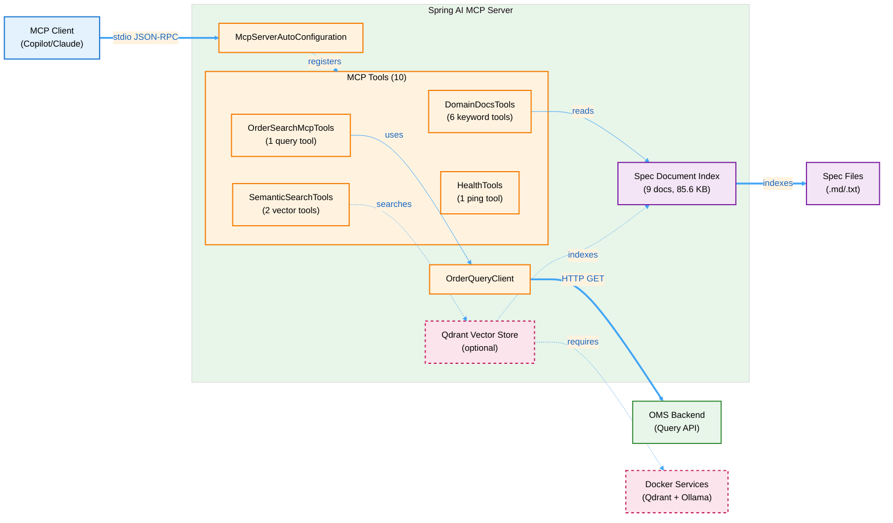

# Spring AI MCP Server

A **Model Context Protocol (MCP)** server built with Spring Boot and Spring AI, exposing both:
- **OMS (Order Management System) query capabilities** as MCP tools for AI assistants and clients
- **Knowledge server** features that make your domain specifications and documentation accessible to AI assistants for spec-driven development

---

## Table of Contents

1. [Overview](#overview)
2. [Why Model Context Protocol (MCP)?](#why-model-context-protocol-mcp)
3. [What is Spec-Driven Development?](#-what-is-spec-driven-development)
4. [Architecture](#architecture)
5. [Prerequisites](#prerequisites)
6. [Getting Started](#getting-started)
7. [Quick Start](#quick-start)
8. [Configuration](#configuration)
9. [Available Tools](#available-tools)
10. [Domain Knowledge Server](#domain-knowledge-server)
11. [Client Integration](#client-integration)
12. [Development](#development)
13. [Logging & Debugging](#logging--debugging)
14. [Troubleshooting](#troubleshooting)
15. [Documentation](#documentation)

---

## Overview

This project is a **knowledge-powered MCP server** that bridges your OMS specifications with AI-assisted development.

### Core Capabilities

**1. Domain Knowledge Server**
- Indexes 9 OMS specification documents (85+ KB of domain knowledge)
- Exposes 6 specialized MCP tools for reading, searching, and navigating specs
- Enables **spec-driven development** with GitHub Copilot and Claude
- Provides section-level navigation for large documents

**2. OMS Query Integration**
- Search OMS orders via `searchOrders` tool
- Typed filters with pagination and sorting
- Handles multiple response formats (Spring Data REST, HAL, plain JSON)

**3. Zero-Boilerplate Architecture**
- Spring AI `@Tool` annotations for automatic tool registration
- Runs over stdio for seamless MCP client integration
- Dual-mode: MCP server (stdio) or optional REST API

### The Value Proposition

**Traditional Approach:**
```
Developer → Searches for spec document
         → Opens in browser/editor
         → Reads and interprets
         → Writes code (hoping it matches)
         → Waits for code review to catch spec violations
```

**With MCP Knowledge Server:**
```
Developer → Asks Copilot: "@workspace Read the Order spec"
         → Copilot reads specs automatically
         → Generates spec-compliant code with references
         → Code review validates against cited specs
         → Specs become living documentation
```

---

## Why Model Context Protocol (MCP)?

MCP is an open protocol that lets AI assistants (like GitHub Copilot and Claude) access external tools and data sources.

### The Problem MCP Solves

**Without MCP:**
- AI assistants are limited to their training data
- Can't access your private specifications
- Can't query your systems
- Generate generic code, not domain-specific

**With MCP:**
- AI assistants can call your custom tools
- Access your specifications in real-time
- Query your data sources
- Generate code grounded in YOUR domain knowledge

---

## 🎯 What is Spec-Driven Development?

**Spec-Driven Development** is a methodology where your domain specifications become the single source of truth for development. Instead of specifications sitting in separate documents that developers rarely check, they become **active participants** in the coding process.

### How It Works with GitHub Copilot

With this MCP server, GitHub Copilot can:

1. **Read your specifications** directly from within your IDE
2. **Generate code** that follows your spec requirements
3. **Validate implementations** against specifications
4. **Answer questions** about your domain model using your own docs

### Example Workflow

```
Developer: "@workspace Using the OMS spec, create the Order entity class"

Copilot: [Reads specs/oms_spec.md and specs/domain-model_spec.md]
         [Generates Order.java with proper JPA annotations]
         [Includes Javadoc referencing specific spec sections]
         [Follows your exact naming conventions and patterns]
```

**Result:** Code that perfectly matches your specifications, with traceable references back to requirements.

### Why This Matters

- ✅ **Consistency** - All developers follow the same patterns
- ✅ **Onboarding** - New developers can query specs via Copilot
- ✅ **Quality** - Code reviews validate against specs automatically
- ✅ **Maintenance** - Specs stay synchronized with implementation
- ✅ **Documentation** - Living docs that actually get used

**👉 See the [Quick Start Guide](docs/QUICK_START_GUIDE.md) to try it in 5 minutes!**

---

This project is a **knowledge-powered MCP server** that bridges your OMS specifications with AI-assisted development.

### Core Capabilities

**1. Domain Knowledge Server**
- Indexes OMS specification documents
- Exposes specialized MCP tools for reading, searching, and navigating specs
- Enables **spec-driven development** with GitHub Copilot
- Provides section-level navigation for large documents

**2. OMS Query Integration**
- Search OMS orders via `searchOrders` tool
- Typed filters with pagination and sorting

**3. Spring AI based Architecture**
- Spring AI `@Tool` annotations for automatic tool registration
- Runs over stdio for seamless MCP client integration
- Dual-mode: MCP server (stdio) or optional REST API for local testing

### The Knowledge Server Difference

**Traditional Approach:**
```
Developer → Searches for spec document
         → Opens in browser/editor
         → Reads and interprets
         → Writes code (hoping it matches)
         → Waits for code review to catch spec violations
```

**With MCP Knowledge Server:**
```
Developer → Asks Copilot: "@workspace Read the Order spec"
         → Copilot reads specs automatically
         → Generates spec-compliant code with references
         → Code review validates against cited specs
         → Specs become living documentation
```

**👉 See the [Quick Start Guide](docs/QUICK_START_GUIDE.md) to try it in 5 minutes!**

---

## Architecture

### Components



### Key Classes

| Class | Purpose |
|-------|---------|
| [`SpringAiApplication`](src/main/java/org/example/spring_ai/SpringAiApplication.java) | Main Spring Boot application entry point |
| [`OrderSearchMcpTools`](src/main/java/org/example/spring_ai/oms/OrderSearchMcpTools.java) | MCP tool provider for OMS order queries |
| [`DomainDocsTools`](src/main/java/org/example/spring_ai/docs/DomainDocsTools.java) | **Knowledge server** - 6 tools for spec access |
| [`SemanticSearchTools`](src/main/java/org/example/spring_ai/vector/SemanticSearchTools.java) | **Semantic search** - 2 vector tools (optional) |
| [`OrderQueryClient`](src/main/java/org/example/spring_ai/oms/OrderQueryClient.java) | REST client for OMS API with response parsing |
| [`DemoOrderController`](src/main/java/org/example/spring_ai/oms/DemoOrderController.java) | Optional REST endpoint for local testing |
| [`McpConfig`](src/main/java/org/example/spring_ai/oms/McpConfig.java) | Explicit ToolCallbackProvider bean configuration |
| [`HealthTools`](src/main/java/org/example/spring_ai/tools/HealthTools.java) | Simple ping/pong tool for connectivity testing |

---

## Prerequisites

- **Java 21+** 
- **Gradle 8+** (wrapper included)
- **PowerShell** (Windows) or **Bash** (Linux/Mac)
- **OMS Backend** on `http://localhost:8090` (configurable)
- **MCP Client** (VS Code with MCP extension or Claude Desktop)

---

## Getting Started

### 🚀 Quick Start (5 Minutes)

#### 1. Build and Run

**Windows:**
```powershell
.\run-mcp.ps1
```

**Linux/Mac:**
```bash
./run-mcp.sh
```

This builds the project (skipping tests) and launches with stdio transport.

#### 2. Verify Connection

The server starts in stdio mode, logs to `logs/spring-ai.log`, and auto-registers tools.

#### 3. Test with Copilot

Try in VS Code:

```
@workspace What MCP tools are available?
@workspace List all sections in the OMS specification
@workspace Using the OMS spec, explain the Order entity structure
```

#### 4. VS Code Configuration

Create `.vscode/mcp.json`:

```jsonc
{
  "servers": {
    "oms-mcp-server": {
      "type": "stdio",
      "command": "powershell.exe",
      "args": ["-ExecutionPolicy", "Bypass", "-File", "${workspaceFolder}\\run-mcp.ps1"],
      "env": {
        "SPRING_PROFILES_ACTIVE": "mcp",
        "MCP_TRANSPORT": "stdio"
      }
    }
  }
}
```

**📖 Next Steps:**
- [Tool Usage Examples](docs/TOOL_USAGE_EXAMPLES.md) - All 10 tools with examples
- [Quick Start Guide](docs/QUICK_START_GUIDE.md) - Detailed walkthrough
- [Copilot Prompts Library](docs/COPILOT_PROMPTS_LIBRARY.md) - 50+ prompts

---

## Configuration

### Application Profiles

- **`mcp`** - Stdio transport with file logging (default)
- **`local`** - Local development with debug logging

### Key Properties

```yaml
spring:
  application:
    name: spring-ai
  main:
    web-application-type: none
    banner-mode: off

oms:
  base-url: http://localhost:8090

mcp:
  transport: stdio
```

### Environment Variables

| Variable | Default | Purpose |
|----------|---------|---------|
| `MCP_TRANSPORT` | `stdio` | Transport mode |
| `SPRING_PROFILES_ACTIVE` | `mcp` | Active profile |

---

## Available Tools

The server exposes **10 MCP tools** across 4 categories:

### 1. Domain Knowledge (6 tools)

| Tool | Description |
|------|-------------|
| `listDomainDocs` | List all spec documents |
| `readDomainDoc` | Read document with pagination |
| `searchDomainDocs` | Keyword search across docs |
| `listDocSections` | Get document TOC |
| `readDocSection` | Read specific section |
| `searchDocSections` | Search within sections |

### 2. Semantic Search (2 tools - Optional)

Requires Docker setup. See [Semantic Search](#semantic-search-setup).

| Tool | Description |
|------|-------------|
| `semanticSearchDocs` | AI-powered meaning-based search |
| `getVectorStoreInfo` | Check vector DB status |

**Benefits:** Natural language queries, understands synonyms  
**Trade-offs:** Requires Docker, slower (~200-500ms vs <50ms)

### 3. OMS Query (1 tool)

**`searchOrders`** - Query OMS with typed filters, pagination, and sorting

**Key Filters:** `orderId`, `symbol`, `side`, `ordType`, `state`, `price`, `orderQty`, time ranges

**Example:**
```
@workspace Find BUY orders for INTC with price > 20
```

### 4. Health Check (1 tool)

**`ping`** - Returns "pong" to verify connectivity

**📖 Complete documentation:** [TOOL_USAGE_EXAMPLES.md](docs/TOOL_USAGE_EXAMPLES.md)

---

## Domain Knowledge Server

The knowledge server transforms static specifications into an **active knowledge base** for AI assistants.

### What It Provides

**For Developers:**
- Ask Copilot questions about your domain model
- Generate spec-compliant code with references
- Validate implementations against requirements
- Get instant answers in your IDE

**For Teams:**
- Consistent code patterns
- Faster onboarding
- Reduced spec drift
- Living documentation

### How It Works

**1. Automatic Indexing**

On startup, scans configured directories for `.md`, `.txt`, `.adoc` files (9 docs, 85.6 KB total).

**2. MCP Tools**

Exposes 6 keyword-based tools + 2 optional semantic search tools (see [Available Tools](#available-tools)).

**3. AI Integration**

```
You: "@workspace Search specs for 'state machine'"

→ Copilot calls searchDocSections(query="state machine")
→ Server returns top matching sections
→ Copilot synthesizes answer with spec references
```

### Using with Copilot

**Discover:**
```
@workspace What domain specs are available?
@workspace List sections in the OMS specification
```

**Generate:**
```
@workspace Using the OMS spec, create the Order entity with spec references
```

**Validate:**
```
@workspace Compare OrderService.java against the CQRS spec
```

### Configuration

Default location: `/home/tbaderts/data/workspace/oms/specs`

To customize:
```yaml
domain:
  docs:
    paths: /path/to/specs,/another/path
```

**📖 Complete guides:**
- [Copilot Integration Guide](docs/COPILOT_KNOWLEDGE_INTEGRATION_GUIDE.md)
- [Prompts Library](docs/COPILOT_PROMPTS_LIBRARY.md) - 50+ prompts
- [Spec-Driven Demo](docs/SPEC_DRIVEN_DEMO.md)

---

## Semantic Search Setup

Optional vector-based search using AI embeddings for meaning-based retrieval.

### Why Semantic Search?

**Keyword (Default):** Fast (<50ms), zero setup, exact terms  
**Semantic (Optional):** Understands meaning, finds synonyms, requires Docker (~200-500ms)

Example: Query "How do we handle transaction failures?" finds rollback procedures, error recovery, compensation strategies, fault tolerance patterns.

### Quick Setup

**Prerequisites:** Docker, 4GB RAM

**1. Start Services:**
```powershell
.\setup-semantic-search.ps1  # Windows
./setup-semantic-search.sh   # Linux/Mac
```

**2. Enable in config:**
```yaml
vector:
  store:
    enabled: true
```

**3. Build and run:**
```powershell
.\gradlew.bat bootRun
```

**📖 Detailed guide:** [README_SEMANTIC_SEARCH.md](docs/README_SEMANTIC_SEARCH.md)

---

## Client Integration

### VS Code

Create `.vscode/mcp.json`:
```jsonc
{
  "servers": {
    "oms-mcp-server": {
      "type": "stdio",
      "command": "powershell.exe",
      "args": ["-ExecutionPolicy", "Bypass", "-File", "${workspaceFolder}\\run-mcp.ps1"]
    }
  }
}
```

### Claude Desktop

Add to `claude_desktop_config.json`:
```json
{
  "mcpServers": {
    "oms-mcp-server": {
      "command": "powershell.exe",
      "args": ["-ExecutionPolicy", "Bypass", "-File", "C:\\path\\to\\run-mcp.ps1"]
    }
  }
}
```

---

## Development

### Adding New Tools

Create a `@Component` class with `@Tool` methods:
```java
@Component
public class MyTools {
    @Tool(name = "myTool", description = "Does something useful")
    public String myTool(String param) {
        return "result";
    }
}
```

Spring AI auto-discovers and registers tools.

### Building

```powershell
.\gradlew clean build          # Full build with tests
.\gradlew bootJar -x test      # Fast build (skip tests)
```

### Local Testing (REST mode)

```powershell
.\gradlew bootRun --args='--spring.main.web-application-type=servlet --server.port=8091'
```

Test endpoint:
```powershell
Invoke-RestMethod -Uri 'http://localhost:8091/api/demo/orders'
```

---

## Logging & Debugging

All logs go to `logs/spring-ai.log` (no console output to keep stdio clean).

### Request/Response Logging

`OrderQueryClient` logs request URI with query parameters and raw response body.

### MCP Protocol Debugging

```powershell
$env:LOGGING_LEVEL_IO_MODELCONTEXTPROTOCOL = "TRACE"
.\run-mcp.ps1
```

---

## Troubleshooting

### "content size is 0 but logs show data"

Response format mismatch. Check `OrderQueryClient.search()` parsing logic matches your OMS format (Spring Data REST, HAL, or plain array).

### "Connection refused to localhost:8090"

Start OMS backend on port 8090 or update `oms.base-url` in `application.yml`.

### "No tools registered"

Verify `@Component` annotation on tool classes and package structure under `org.example.spring_ai`.

### "Protocol version mismatch"

Informational only. Server negotiates down to supported version.

---

## Documentation

### 📚 Complete Guides

**Getting Started:**
- [Quick Start Guide](docs/QUICK_START_GUIDE.md) - 5 minutes to get started
- [Tool Usage Examples](docs/TOOL_USAGE_EXAMPLES.md) - All 10 tools with examples

**Using the Knowledge Server:**
- [Copilot Integration Guide](docs/COPILOT_KNOWLEDGE_INTEGRATION_GUIDE.md) - Complete workflow
- [Prompts Library](docs/COPILOT_PROMPTS_LIBRARY.md) - 50+ ready-to-use prompts
- [Spec-Driven Demo](docs/SPEC_DRIVEN_DEMO.md) - Real working examples

**Configuration & Setup:**
- [MCP Setup Guide](docs/MCP.md) - Configure for Copilot and Claude
- [Semantic Search Setup](docs/README_SEMANTIC_SEARCH.md) - Vector search with Qdrant
- [Quick Reference](docs/QUICK_REFERENCE.md) - MCP tools cheat sheet

### 💡 Spec-Driven Development Pattern

1. **Ask Copilot to read specs:** `@workspace Search specs for "[TOPIC]"`
2. **Generate/analyze code:** `@workspace Based on the spec, generate [CODE]`
3. **Validate:** `@workspace Does this match spec requirements?`

---

## Additional Resources

- [Spring AI Docs](https://docs.spring.io/spring-ai/reference/)
- [Model Context Protocol Spec](https://spec.modelcontextprotocol.io/)
- [MCP TypeScript SDK](https://github.com/modelcontextprotocol/typescript-sdk)

---

**Last Updated:** October 11, 2025
