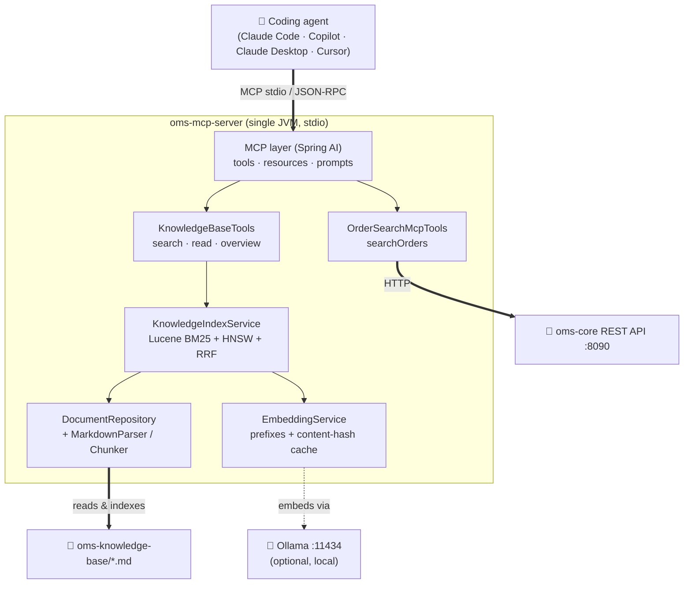
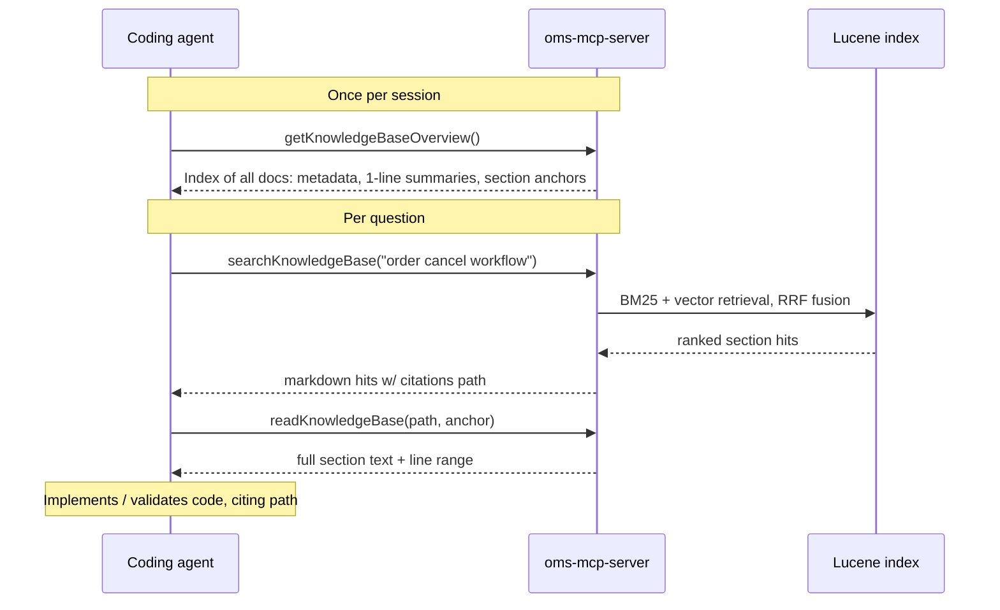
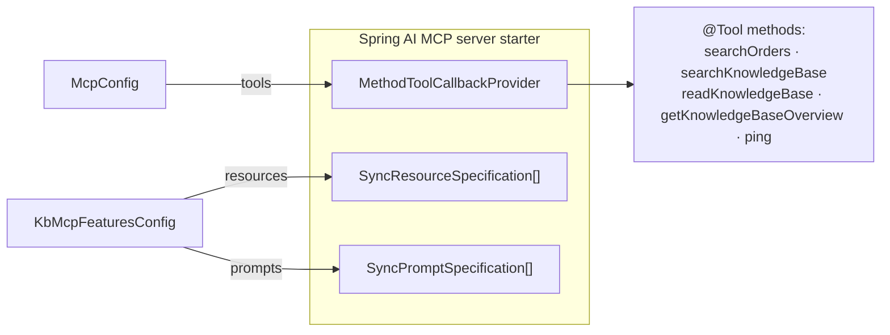

# OMS MCP Server — Architecture

**How the server works, and how an agentic coding agent uses it.**

**Status:** Current · **Last Updated:** 2026-06-16 · **Category:** framework

> This document describes the *implemented* system. For the reasoning behind the
> design (why BM25, why RRF, why no Qdrant, platform trade-offs) and the
> remaining roadmap, see [ARCHITECTURE_IMPROVEMENTS_SPEC.md](ARCHITECTURE_IMPROVEMENTS_SPEC.md).

---

## 1. What this server is

`oms-mcp-server` is a [Model Context Protocol](https://modelcontextprotocol.io)
server that makes the OMS **knowledge base** (`oms-knowledge-base/*.md` —
specifications, domain concepts, architecture and methodology docs) and the
running **OMS backend** addressable by coding agents (Claude Code, GitHub
Copilot agent mode, Claude Desktop, Cursor).

It is a **thin adapter**, not a knowledge store of its own:

- The source of truth stays in the markdown files on disk.
- The OMS data stays in oms-core behind its REST API.
- The server adds a fast, citable retrieval layer and exposes it over MCP.

Everything runs **in one JVM process with no external services required**: the
search index is embedded (Apache Lucene), keyword search always works, and
semantic search joins in automatically when a local Ollama is present.

### Technology

| | |
|---|---|
| Runtime | Java 25, Spring Boot 4.1, Spring AI 2.0 |
| MCP | `spring-ai-starter-mcp-server`, stdio transport, JSON-RPC |
| Search | Apache Lucene 10.2 (BM25 + HNSW vectors), in-memory index |
| Embeddings | Ollama (local), default `mxbai-embed-large` (1024-dim) — optional |
| Build | Gradle, OpenAPI generator for the OMS query client |

---

## 2. The big picture



Three things cross the process boundary:

1. **The agent ↔ server** speak MCP over stdio. The agent spawns the server as
   a subprocess, discovers its capabilities, and calls them.
2. **The server ↔ knowledge base** is plain file I/O at startup (and on demand).
3. **The server ↔ Ollama / oms-core** are optional outbound calls; the server is
   useful without either.

---

## 3. How an agent actually uses it

Frontier coding agents are *agentic searchers*: they do not fire one query and
accept five chunks — they iterate the same loop they use on source code
(*glob → grep → read*), here re-shaped for specs:

```
orient ──► search ──► read the cited section ──► cite & act ──► (repeat)
```



The contract that makes the loop tight is the **citation**. Every search hit
carries a stable `path#anchor` (plus a heading breadcrumb and source line
range). That citation is a live link:

- the agent can **quote it authoritatively** in code comments, PR descriptions
  and review notes, and
- the *same* `path#anchor` is the argument to `readKnowledgeBase`, so any hit is
  exactly one call away from its full context.

This is why the server returns **section hits with citations**, not anonymous
token-window chunks: a chunk with no address is a dead end; a cited section is a
navigable node.

### The three knowledge tools

| Tool | When the agent calls it | Returns |
|---|---|---|
| `getKnowledgeBaseOverview()` | Once, at the start of a session, for orientation. | Every document grouped by area, with version/status/category, a one-line summary, its H2 section anchors, and index stats (doc/section counts, search mode, freshness). ~2–4K tokens. |
| `searchKnowledgeBase(query, topK?, category?, status?)` | For any "where do the specs say…" question. | Markdown list of the top section hits, each with `path#anchor` citation, breadcrumb, line range, status, and a ~400-char excerpt. Hybrid by default; states its mode and how many further matches exist. |
| `readKnowledgeBase(path, anchor?, offset?, limit?)` | To read a cited section (or a whole doc) in full before relying on it. | The exact section text with its line range, **or** the whole document plus a section outline; `offset`/`limit` paginate long docs by character. |

Design choices that matter for agents:

- **No retrieval knobs.** There is deliberately no `keywordWeight`,
  `semanticWeight`, or `similarityThreshold`. Agents should ask questions, not
  tune a search engine; the server picks the strategy.
- **Markdown, not JSON.** Tools return strings rendered as markdown — models
  parse a compact cited list more reliably than nested records, and it renders
  well in client UIs.
- **In-band next-action hints.** Search responses end with
  *"To read any result in full: `readKnowledgeBase(path, anchor)`"*; empty
  results suggest reformulations and point at `getKnowledgeBaseOverview()`.
- **Honest mode reporting.** Each search says whether it ran *hybrid* or
  *BM25-only*, so the agent (and the human reading the trace) knows what
  produced the ranking.

### Beyond tools: resources and prompts

MCP exposes three capability types; this server uses all three.

- **Resources** — every KB document is published as `kb://<path>`
  (e.g. `kb://oms-knowledge-base/oms-framework/domain-model_spec.md`). Clients
  like Claude Code/Desktop let a user **attach a whole spec to the
  conversation** with no tool round-trip — ideal when working inside one spec
  for a while.
- **Prompts** — two reusable, parameterised workflows encode the team's
  spec-driven method so any client can discover them:
  - `implement-from-spec(spec, feature)` — read the spec, restate its
    constraints with citations, write tests first, implement traceably, then
    report spec gaps.
  - `validate-against-spec(file, spec)` — compare code to the governing spec
    section by section and report findings as *severity · location · citation ·
    fix*, including what is already compliant.

### The OMS query tool

`searchOrders(filters?, page?, size?, sort?)` is a typed, thin client over
oms-core's `/search` REST API (typed enums for `side`/`ordType`/`state`/
`cancelState`, range filters for price/qty/time, pagination, sorting). It lets
an agent ground answers in live order data alongside the specs. It shares no
state with the knowledge index and is unaffected by retrieval changes.

---

## 4. Inside the retrieval engine

### 4.1 The unit of retrieval: the section chunk

Documents are split by **markdown structure**, not by a fixed token window
(`SectionChunker` + `MarkdownParser` + `MarkdownAnchors`):

- One chunk per heading, covering the text up to the next heading of any level.
- Each chunk carries everything a citation needs (`SectionChunk`): `path`,
  GitHub-style `anchor`, a full `breadcrumb` (`doc > H1 > H2 > …`), the section
  `title`/`level`, 1-based `startLine`/`endLine`, and the document's
  `category`/`status`/`version` metadata.
- **Tiny sections** (< `min-section-chars`, default 200) merge into a neighbour,
  the larger of the two keeping the citation identity.
- **Oversized sections** (> `max-section-chars`, default 6000) split at blank
  lines **outside fenced code blocks**; continuation parts keep the section's
  anchor and get a `[breadcrumb (cont.)]` prefix.

The result: keyword search, vector search, and `readKnowledgeBase` all address
the *same* unit, which is exactly what makes fusion and citations coherent.

### 4.2 Indexing (at startup)

`KnowledgeIndexService.rebuild()` runs on `ApplicationReadyEvent`:

1. `DocumentRepository` walks the configured roots and reads every doc.
2. `SectionChunker` turns each doc into section chunks.
3. `EmbeddingService` embeds the chunk texts (if embeddings are enabled and
   Ollama is reachable), serving unchanged chunks from a disk cache.
4. Chunks are written to an in-memory Lucene index (`ByteBuffersDirectory`):
   - analysed text fields `body` and `title` (EnglishAnalyzer: tokenization,
     stemming, stopwords) for BM25,
   - a `KnnFloatVectorField` (cosine) when a vector is present,
   - `category`/`status` keyword fields for filter push-down,
   - stored fields (path, anchor, breadcrumb, text, line range) for rendering.
5. The new index is published as an immutable `Snapshot` and the previous one is
   closed. Rebuild is `synchronized` and swaps atomically, so reads never see a
   half-built index. For the current KB this completes in well under a second.

### 4.3 Querying (hybrid + RRF)

`searchKnowledgeBase` → `KnowledgeIndexService.search()`:

```
        query
          │
   ┌──────┴───────┐
   ▼              ▼
 BM25          vector (HNSW, cosine)
 body+title    query embedded with the
 title boost   model's query prefix
 ×2            (skipped if embeddings off)
   │              │
   └──────┬───────┘
          ▼
 Reciprocal Rank Fusion   score(d) = Σ 1 / (k + rank_r(d)),  k = 60
          ▼
 de-duplicate by citation (best chunk per section)
          ▼
 apply category/status filters · sort · take topK
```

Why **Reciprocal Rank Fusion** rather than a weighted score sum: BM25 scores
(unbounded) and cosine similarities (0–1) are not comparable, and any weighting
is arbitrary. RRF fuses by **rank**, so only ordering matters — robust to
outliers, nothing to tune. Each retriever contributes `candidates = max(50,
topK×10)` results before fusion, so the fused list has depth to work with.

Defaults: `topK = 5` (max 20), excerpts ≈ 400 chars, title-hit boost ×2.

### 4.4 Embeddings: optional, cached, graceful

`EmbeddingService` wraps the auto-configured Ollama `EmbeddingModel`:

- **Instruction prefixes.** Retrieval-tuned models are trained with distinct
  query vs. document prefixes and underperform without them; the prefixes are
  configurable per model (`knowledge.index.embeddings.query-prefix` /
  `document-prefix`). The default `mxbai-embed-large` uses a query prefix and no
  document prefix.
- **Content-hash disk cache** (`.kb-index/embedding-cache-<model>.json`). The
  cache key is `SHA-256(model · prefix · text)`, so a restart only embeds new or
  changed sections, and switching models transparently re-embeds.
- **Graceful degradation.** If embeddings are disabled or Ollama is
  unreachable, indexing and search fall back to **BM25-only** automatically and
  permanently for that run — search keeps working, and every response reports
  the `BM25 keyword only` mode.

---

## 5. MCP wiring



- Tools are plain methods annotated `@Tool` on Spring `@Component`s, collected by
  `MethodToolCallbackProvider` in `McpConfig`. Parameter names survive
  compilation (the `-parameters` javac flag) so the MCP schema is meaningful.
- Resources and prompts are registered as beans in `KbMcpFeaturesConfig`.
- The contact surface with Spring AI is intentionally small — MCP transport and
  `@Tool` registration only. All retrieval logic is framework-agnostic
  (Lucene + a thin embedding client), which keeps the door open to a future
  port (see the improvements spec, §7).

**Adding a tool:** annotate a method with `@Tool` on a `@Component`, then list
that component in `McpConfig.tools(...)`.

---

## 6. Configuration & operations

All settings live in `src/main/resources/application.yml`:

```yaml
domain:
  docs:
    paths: ${DOMAIN_DOCS_PATHS:../oms-knowledge-base}   # comma-separated KB roots

knowledge:
  index:
    cache-dir: .kb-index          # embedding cache (gitignored)
    min-section-chars: 200        # merge smaller sections with a neighbour
    max-section-chars: 6000       # split larger sections at paragraph boundaries
    embeddings:
      enabled: true               # false = BM25-only, no Ollama needed
      query-prefix: "Represent this sentence for searching relevant passages: "
      document-prefix: ""
      batch-size: 16

spring:
  ai:
    ollama:
      base-url: http://localhost:11434
      embedding:
        options:
          model: mxbai-embed-large

oms:
  base-url: http://localhost:8090  # oms-core, for searchOrders
```

**Changing the embedding model** also means setting the matching prefixes:

| Model | query-prefix | document-prefix |
|---|---|---|
| `mxbai-embed-large` (default) | `Represent this sentence for searching relevant passages: ` | _(none)_ |
| `nomic-embed-text` | `search_query: ` | `search_document: ` |
| `bge-m3` | _(none)_ | _(none)_ |
| `snowflake-arctic-embed2` | `query: ` | _(none)_ |

### Run profiles

| Profile | Web server | Purpose |
|---|---|---|
| _(default)_ | none | MCP server over stdio. What agents launch. |
| `local` | reactive (:8091) | Adds the KB Explorer REST API (`/api/kb/**`) + debug logging for the `oms-kb-explorer` web app. |
| `dev` | reactive | Web server enabled for ad-hoc local development. |

### Operational model & limits

- **Stateless across restarts** except the embedding cache. The index is rebuilt
  from disk each start; nothing else is persisted.
- **The index is a startup snapshot.** Editing a knowledge-base file while the
  server is running does **not** re-index it automatically — there is no file
  watcher and no re-index tool yet; restart to pick up doc changes. (`rebuild()`
  exists and is concurrency-safe, but nothing triggers it after startup.)
- **MCP resources are also a startup snapshot**, enumerated once from the KB.
- **No auth / multi-tenant model.** It is a developer-machine tool spawned per
  session over stdio; it trusts its local environment.

---

## 7. Quality: measured, not asserted

Retrieval quality is pinned by an **evaluation harness** (`RetrievalEvalTest`,
tagged `@Tag("eval")`): 25 golden queries against the real knowledge base,
computing document-level **recall@5** and **MRR** for BM25-only retrieval (so CI
needs no Ollama). The build fails if recall@5 drops below the pinned baseline
(0.90).

> Latest run (2026-06-10, BM25-only): **recall@5 = 1.000, MRR = 0.903**.

Any change to retrieval (analyzer, chunking, fusion, embedding model, prefixes)
should re-run the eval and move the baseline — up on improvement, never silently
down. Golden queries live in
`src/test/resources/retrieval-evals/golden-queries.yaml`.

---

## 8. Code map

| Package | Responsibility |
|---|---|
| `org.example.mcp` | Spring Boot entry point. |
| `org.example.mcp.kb` | The 3 knowledge tools (`KnowledgeBaseTools`); MCP resources + prompts (`KbMcpFeaturesConfig`). |
| `org.example.mcp.index` | Lucene index + hybrid search + RRF (`KnowledgeIndexService`), chunking (`SectionChunker`, `SectionChunk`), embeddings (`EmbeddingService`), config (`KnowledgeIndexProperties`). |
| `org.example.mcp.docs` | Document discovery & I/O (`DocumentRepository`), markdown parsing (`MarkdownParser`), anchors (`MarkdownAnchors`). |
| `org.example.mcp.oms` | OMS query tool (`OrderSearchMcpTools`), REST client, `McpConfig` tool registration. |
| `org.example.mcp.tools` | `HealthTools` (`ping`). |
| `org.example.mcp.kbexplorer` | REST API for the KB Explorer UI (`local` profile only). |

---

## 9. Design principles in one breath

1. **Agent-facing first.** Few powerful tools, citation-centric results, markdown
   responses, in-band guidance. The retrieval internals serve that, not the
   reverse.
2. **Embedded and local by default.** No Docker, no vector DB, no service to
   operate; nothing leaves the machine unless cloud embeddings are explicitly
   opted into.
3. **Graceful, honest degradation.** Lose Ollama and search keeps working as
   BM25 and says so.
4. **Measured.** No retrieval claim ships without an eval number behind it.
5. **Sized for growth.** The same design (Lucene index, incremental embedding
   cache, eval harness) is the blueprint for a 200+ specification corpus, not
   just today's knowledge base.

See [ARCHITECTURE_IMPROVEMENTS_SPEC.md](ARCHITECTURE_IMPROVEMENTS_SPEC.md) for
the full rationale, alternatives considered, and the open roadmap.
