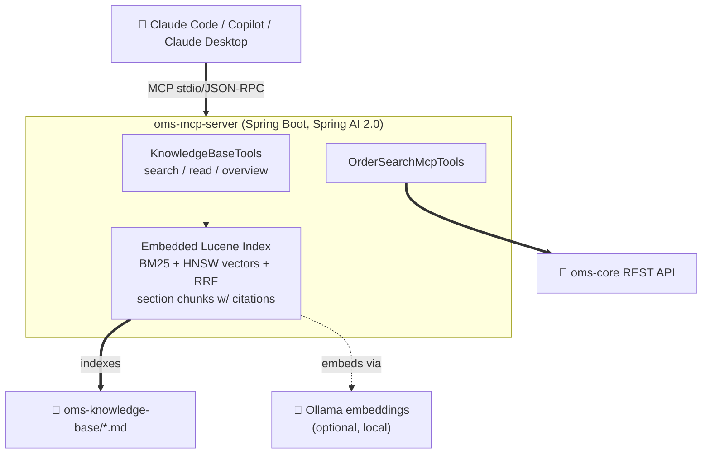

# MCP Server Documentation

Documentation index for the OMS MCP Knowledge Server.

---

## Start Here

1. **[Architecture](ARCHITECTURE.md)** — how the server works and how a coding agent uses it (the 3-tool loop, citations, retrieval engine, MCP wiring)
2. **[Quick Start Guide](QUICK_START_GUIDE.md)** — get the server running and do your first spec-driven task in 5 minutes
3. **[Quick Reference](QUICK_REFERENCE.md)** — one-page cheat sheet

## Setup & Integration

- **[MCP Setup Guide](MCP.md)** — client configuration (Claude Code, GitHub Copilot, Claude Desktop) and troubleshooting
- **[Copilot Knowledge Integration Guide](COPILOT_KNOWLEDGE_INTEGRATION_GUIDE.md)** — spec-driven prompt patterns for Copilot/agent workflows

## Design & Roadmap

- **[Architecture Improvements Spec](ARCHITECTURE_IMPROVEMENTS_SPEC.md)** — why the current design (BM25, RRF, embedded Lucene, no Qdrant), alternatives considered, platform trade-offs, and the open roadmap

---

## Tool Overview

The server exposes **5 MCP tools**, plus resources and prompts.

### Knowledge Base (3)

| Tool | Purpose |
|---|---|
| `getKnowledgeBaseOverview()` | Index of all docs: metadata, summaries, section anchors. Call once per session. |
| `searchKnowledgeBase(query, topK?, category?, status?)` | Hybrid search (BM25 + semantic + RRF). Returns markdown with `path#anchor` citations. |
| `readKnowledgeBase(path, anchor?, offset?, limit?)` | Read a whole doc (with outline) or one cited section. |

### OMS Query (1)
- `searchOrders(filters?, page?, size?, sort?)` — query the OMS backend with typed filters, pagination, sorting.

### Health (1)
- `ping()` — connectivity test.

In addition, every knowledge base document is available as an MCP **resource**
(`kb://<path>`), and two MCP **prompts** (`implement-from-spec`,
`validate-against-spec`) encode the spec-driven workflow.

---

## Architecture at a glance

No Docker, no external search service: keyword search always works; semantic
search joins in automatically when Ollama is running (embeddings are cached on
disk, only changed sections are re-embedded). Full detail in
**[ARCHITECTURE.md](ARCHITECTURE.md)**.

---

## Retrieval Quality

Retrieval is **measured**: `RetrievalEvalTest` runs 25 golden queries against
the real knowledge base on every build and fails on recall regression.

Latest (2026-06-10, BM25-only): **recall@5 = 1.000, MRR = 0.903**.

---

**Start here:** [Architecture](ARCHITECTURE.md) → [Quick Start Guide](QUICK_START_GUIDE.md)
