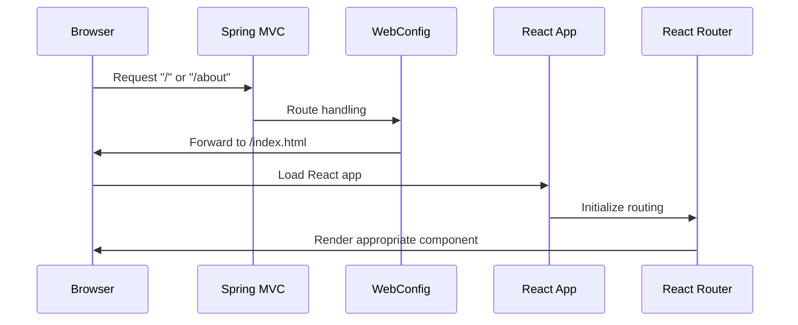
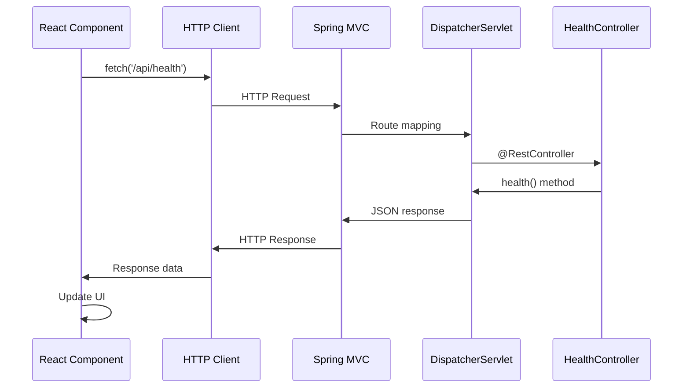

# OMS UI Architecture

## Overview

The OMS UI microservice follows a modern architecture pattern where a Spring Boot application serves a React single-page application (SPA). This document describes the architectural decisions, patterns, and best practices used in this service.

## Architecture Diagram

```mermaid
graph TD
    subgraph Browser["🌐 Browser"]
        subgraph ReactApp["React Application"]
            HomePage["📄 Home Page"]
            AboutPage["📄 About Page"]
            OtherPages["📄 Other Pages"]
            
            ReactRouter["🔀 React Router"]
            HTTPClient["🌐 HTTP Client<br/>(fetch API)"]
            
            HomePage --> ReactRouter
            AboutPage --> ReactRouter
            OtherPages --> ReactRouter
            ReactRouter --> HTTPClient
        end
    end
    
    subgraph SpringBoot["☕ Spring Boot Application"]
        subgraph SpringMVC["Spring MVC Layer"]
            StaticHandler["📁 Static Content<br/>Handler"]
            RestControllers["🎯 REST Controllers<br/>(/api/*)"]
            WebConfig["⚙️ WebConfig<br/>(Route Mapping)"]
            
            StaticHandler --> WebConfig
            RestControllers --> WebConfig
        end
        
        ServiceLayer["💼 Service Layer<br/>(Business Logic - Future)"]
        Actuator["📊 Spring Boot Actuator<br/>(Health, Metrics, Monitoring)"]
        
        SpringMVC --> ServiceLayer
        SpringMVC --> Actuator
    end
    
    HTTPClient -->|HTTP/REST| SpringMVC
    
    classDef browserStyle fill:#e1f5fe,stroke:#01579b,stroke-width:2px
    classDef springStyle fill:#f3e5f5,stroke:#4a148c,stroke-width:2px
    classDef componentStyle fill:#fff3e0,stroke:#e65100,stroke-width:1px
    
    class Browser browserStyle
    class SpringBoot springStyle
    class ReactApp,HomePage,AboutPage,OtherPages,ReactRouter,HTTPClient,SpringMVC,StaticHandler,RestControllers,WebConfig,ServiceLayer,Actuator componentStyle
```



## Build Pipeline

```mermaid
graph TD
    Start([🏁 Gradle Build]) --> npmInstall
    
    npmInstall["📦 1. npmInstall<br/>Install React dependencies"]
    npmBuild["🔨 2. npmBuild<br/>Build React app (production)<br/>• Transpile JSX<br/>• Minify JavaScript<br/>• Optimize assets"]
    copyReactBuild["📁 3. copyReactBuild<br/>Copy build/ to resources/static/"]
    compileJava["☕ 4. compileJava<br/>Compile Spring Boot Java code"]
    processResources["📋 5. processResources<br/>Include static resources in build"]
    bootJar["📦 6. bootJar<br/>Create executable JAR with:<br/>• Spring Boot application<br/>• React static files<br/>• All dependencies"]
    
    End([🎯 oms-ui-0.0.1-SNAPSHOT.jar])
    
    npmInstall --> npmBuild
    npmBuild --> copyReactBuild
    copyReactBuild --> compileJava
    compileJava --> processResources
    processResources --> bootJar
    bootJar --> End
    
    classDef processStyle fill:#e8f5e8,stroke:#2e7d32,stroke-width:2px
    classDef startEndStyle fill:#fff3e0,stroke:#f57c00,stroke-width:2px
    
    class npmInstall,npmBuild,copyReactBuild,compileJava,processResources,bootJar processStyle
    class Start,End startEndStyle
```



## Request Flow

### Static Content Request (React Routes)



### API Request



## Key Components

### Frontend (React)

#### Entry Point
- **index.js**: Renders the root React component
- **App.js**: Main component with routing setup

#### Routing
- **React Router**: Handles client-side navigation
- Routes defined in `App.js`
- Browser history API for clean URLs

#### Pages
- **Home.js**: Landing page with health check
- **About.js**: Information about the application

#### Styling
- CSS modules approach
- Global styles in `index.css`
- Component styles in `App.css`

### Backend (Spring Boot)

#### Main Application
- **OmsUiApplication.java**: Entry point with `@SpringBootApplication`

#### Configuration
- **WebConfig.java**: 
  - Implements `WebMvcConfigurer`
  - Configures route forwarding for SPA
  - Ensures React Router works with direct URL access

#### Controllers
- **HealthController.java**: 
  - REST endpoint for health checks
  - Example of API implementation

#### Application Configuration
- **application.yml**:
  - Server port configuration
  - Compression settings
  - Actuator endpoints
  - Logging configuration

## Design Patterns

### Frontend Patterns

1. **Component-Based Architecture**
   - Reusable UI components
   - Single responsibility principle
   - Props for data flow

2. **Client-Side Routing**
   - React Router for navigation
   - Lazy loading (future enhancement)
   - Protected routes (future enhancement)

3. **State Management**
   - Local component state with hooks
   - Context API for global state (future)
   - Redux for complex state (future)

### Backend Patterns

1. **MVC Pattern**
   - Model: Domain objects
   - View: Static React content
   - Controller: REST endpoints

2. **Dependency Injection**
   - Spring's IoC container
   - Constructor injection preferred
   - Loose coupling

3. **Configuration Management**
   - Externalized configuration
   - Profile-based settings
   - Environment variables

## Security Considerations

### Current State
- No authentication (to be implemented)
- CORS disabled by default
- Compression enabled for performance

### Future Enhancements
1. **Authentication**
   - Spring Security integration
   - JWT token-based auth
   - OAuth2/OIDC support

2. **Authorization**
   - Role-based access control
   - Method-level security
   - Route guards in React

3. **Security Headers**
   - CSP (Content Security Policy)
   - HTTPS enforcement
   - XSS protection

## Performance Optimizations

### Build Time
- Node.js Gradle plugin caches dependencies
- Incremental builds when possible
- Parallel task execution

### Runtime
- **Compression**: gzip for all text content
- **Caching**: Static resources with cache headers
- **Minification**: React production build
- **Code Splitting**: (future enhancement)
- **Lazy Loading**: (future enhancement)

### Bundle Size
- Current React bundle: ~150KB (gzipped)
- Spring Boot JAR: ~20MB
- Room for optimization with tree-shaking

## Monitoring and Observability

### Spring Boot Actuator
- `/actuator/health` - Health status
- `/actuator/info` - Application info
- `/actuator/metrics` - Performance metrics
- `/actuator/prometheus` - Prometheus format

### Logging
- SLF4J with Logback
- Structured logging (JSON format)
- Log levels configurable per package

### Future Monitoring
- Distributed tracing (Sleuth/Zipkin)
- Application Performance Monitoring (APM)
- Error tracking (Sentry)

## Deployment Strategies

### Containerization
```dockerfile
FROM eclipse-temurin:21-jre-alpine
COPY build/libs/oms-ui-*.jar app.jar
ENTRYPOINT ["java", "-jar", "app.jar"]
```

### Kubernetes
- StatefulSet or Deployment
- Service for load balancing
- Ingress for external access
- ConfigMap for configuration
- Secrets for sensitive data

### Cloud Platforms
- **AWS**: Elastic Beanstalk, ECS, EKS
- **Azure**: App Service, Container Instances, AKS
- **GCP**: App Engine, Cloud Run, GKE

## Testing Strategy

### Frontend Tests
- **Unit Tests**: Jest + React Testing Library
- **Component Tests**: Isolated component testing
- **Integration Tests**: Multiple components together
- **E2E Tests**: Cypress/Playwright (future)

### Backend Tests
- **Unit Tests**: JUnit 5
- **Integration Tests**: `@SpringBootTest`
- **API Tests**: MockMvc
- **Contract Tests**: Spring Cloud Contract (future)

## Scalability Considerations

### Horizontal Scaling
- Stateless application design
- Session management (Redis for future)
- Load balancer friendly

### Vertical Scaling
- JVM tuning options
- Memory management
- Thread pool configuration

### Caching
- Browser caching for static assets
- Server-side caching (future)
- CDN for static content (future)

## Development Workflow

### Local Development
1. Run React dev server (port 3000)
2. Run Spring Boot (port 8080)
3. Proxy API requests from React to Spring Boot

### Production Build
1. Single Gradle build command
2. Automated integration of React build
3. Self-contained executable JAR

## Best Practices

### Code Organization
- Clear separation of concerns
- Package by feature (future)
- Consistent naming conventions

### Configuration
- Externalize all environment-specific config
- Use profiles for different environments
- Never commit secrets

### Error Handling
- Global error handler in React
- Spring `@ControllerAdvice` for API errors
- User-friendly error messages

### Documentation
- README for getting started
- ARCHITECTURE for design decisions
- API documentation (Swagger/OpenAPI future)

## Future Architecture Enhancements

1. **API Gateway Pattern**
   - Centralized routing
   - Rate limiting
   - API versioning

2. **Microservices Communication**
   - REST client for other services
   - Message queues (RabbitMQ/Kafka)
   - Service discovery (Eureka)

3. **Database Integration**
   - Spring Data JPA
   - Database migrations (Flyway/Liquibase)
   - Connection pooling

4. **Caching Layer**
   - Redis for session management
   - Application-level caching
   - HTTP caching strategies

5. **Event-Driven Architecture**
   - WebSocket support
   - Server-Sent Events (SSE)
   - Real-time updates

## Conclusion

This architecture provides a solid foundation for building modern web applications with:
- Clear separation between frontend and backend
- Unified build process
- Production-ready deployment
- Room for growth and enhancement

The design prioritizes simplicity while maintaining flexibility for future requirements.
