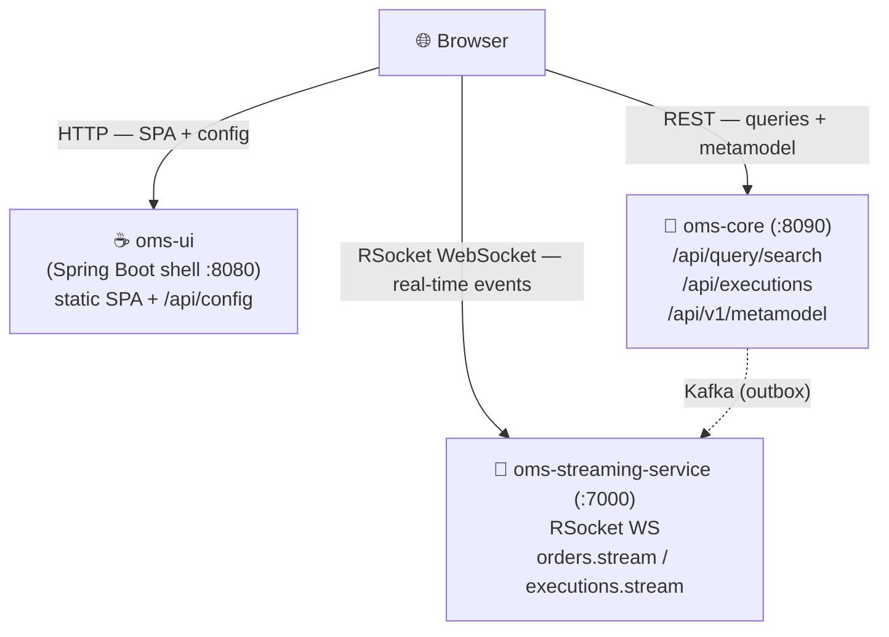
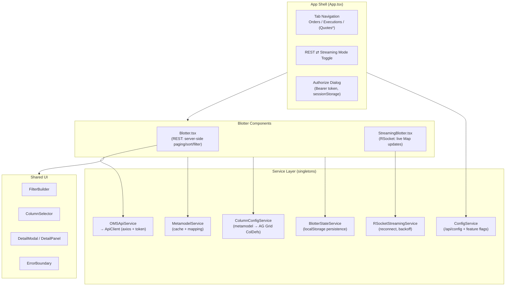
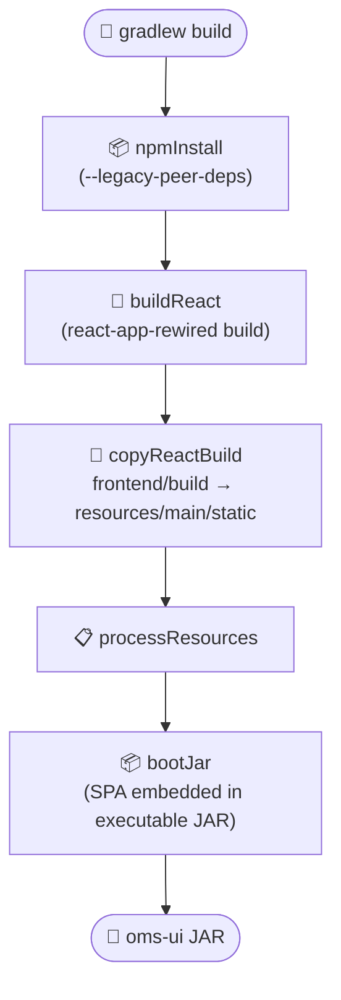
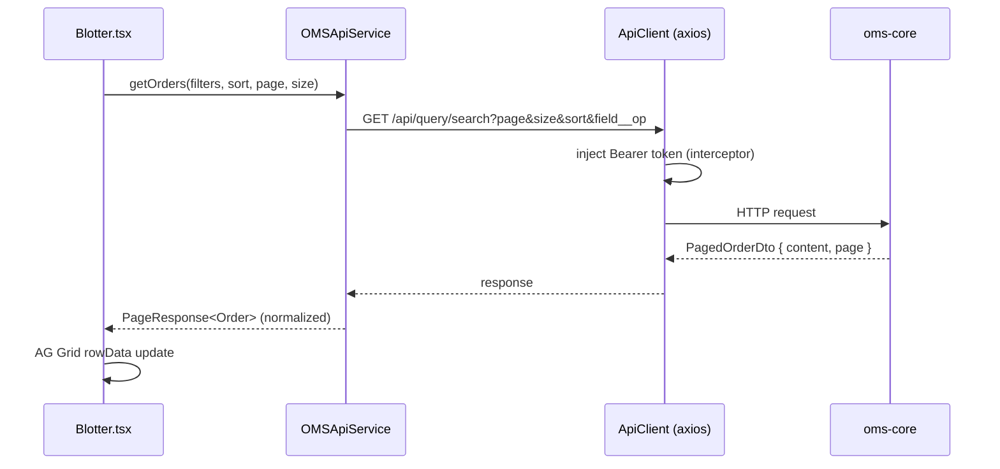
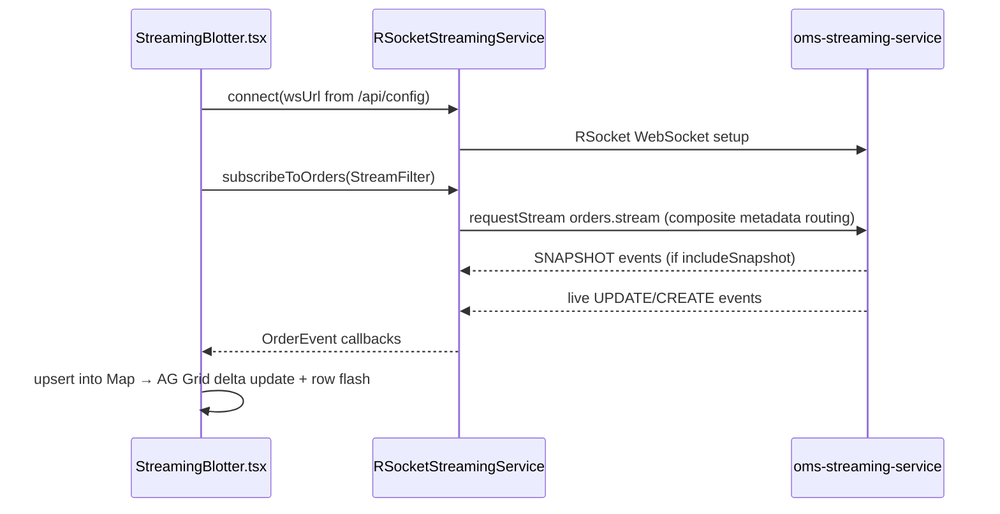

# OMS UI Architecture

## Overview

The OMS UI microservice serves the **OMS Admin Tool**, a metamodel-driven blotter SPA. The architecture splits cleanly into:

- A **thin Spring Boot shell** that serves static content, provides runtime configuration, and supports SPA deep links.
- A **React 19 + TypeScript frontend** organized as components → services → types, built around AG Grid and two data-access strategies (REST and RSocket streaming).

The shell never proxies business data. The browser talks directly to `oms-core` (REST) and `oms-streaming-service` (RSocket WebSocket), with endpoint URLs injected at runtime via `/api/config`.

## System Context

## Frontend Architecture

### Metamodel-driven grids

Column definitions are not hardcoded. On blotter initialization:

1. `MetamodelService` fetches entity metadata from `oms-core /api/v1/metamodel/{entity}` (via `BackendMetamodelApiService`).
2. `MetamodelMappingService` maps the backend format to the frontend `DomainObjectMetadata`.
3. `MetamodelCacheService` caches it (5-minute TTL).
4. `ColumnConfigService` converts field metadata into AG Grid `ColDef`s (headers, filters, widths, enum renderers).

Adding a field to the backend entity automatically makes it available as a blotter column.

### Dual data modes

| | REST mode (`Blotter.tsx`) | Streaming mode (`StreamingBlotter.tsx`, default) |
|---|---|---|
| Source | `oms-core /api/query/search`, `/api/executions` | `oms-streaming-service` RSocket WS |
| Pagination | Server-side (page/size params) | Snapshot + live events (client-side `Map` keyed by ID) |
| Filtering | Query params (`field__op=value`) | Server-side `StreamFilter` (EQ/LIKE/GT/…, AND/OR) |
| Updates | Manual refresh / 30s auto-refresh | Real-time, with row flash on change |
| State | Shared via `BlotterStateService` (same key per domain object) | Shared via `BlotterStateService` |

Both blotters share filter conversion helpers (`services/filterUtils.ts`) so persisted state round-trips identically when switching modes.

### State & persistence

- **Auth token** — `AuthTokenService`, backed by `sessionStorage` (survives refreshes within the tab).
- **Blotter preferences** (filters, visible columns, sort, page) — `BlotterStateService`, backed by `localStorage` (survives restarts), keyed per domain object.
- **Runtime config & feature flags** — `ConfigService` fetches `/api/config` once; feature flags (quotes, quote-requests, streaming) control tabs and the mode toggle without a rebuild.

## Backend Architecture

The Spring Boot layer is intentionally minimal:

- `WebConfig` — forwards `/` and non-file paths to `index.html` so SPA deep links work.
- `ConfigController` — `GET /api/config` returns `appName`, `apiBaseUrl`, `streamingUrl`, and `features` from `oms.*` properties (env-var overridable).
- `HealthController` + Actuator — health/metrics endpoints.

## Build Pipeline

`config-overrides.js` adds the `Buffer` webpack polyfill required by the rsocket libraries.

## Request Flows

### REST blotter query

### Streaming blotter subscription

## Error Handling & Resilience

- **ErrorBoundary** wraps the app so render/streaming failures degrade gracefully with a reload option.
- **RSocket reconnection** — exponential backoff (capped), connection-state listeners update the blotter status indicator.
- **Config fallback** — if `/api/config` is unreachable (dev server standalone), `ConfigService` falls back to development defaults.
- **Page-shape normalization** — `OMSApiService` normalizes both `PagedOrderDto` and raw Spring `Page` responses to one UI shape.

## Testing

- **Frontend** — Jest + React Testing Library. Unit tests cover filter conversion (`filterUtils`), token persistence (`AuthTokenService`), blotter state persistence (`BlotterStateService`), REST endpoint usage and page normalization (`OMSApiService`), and stream filter conversion (`RSocketStreamingService`).
- **Backend** — Spring Boot context smoke test (`OmsUiApplicationTests`).

## Known Trade-offs / Future Work

- **CRA toolchain** (`react-scripts` + `react-app-rewired`) is deprecated; migration to Vite is recommended (sibling modules already use Vite).
- **rsocket libraries** are pre-release (`0.0.29-alpha.0`) and require Buffer polyfills.
- In production the browser calls `oms-core` directly using `apiBaseUrl`, which requires CORS on `oms-core` (dev hides this behind the CRA proxy).
- Quotes / Quote Requests blotters are placeholders behind feature flags.
